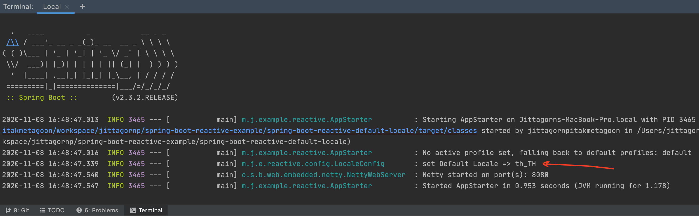
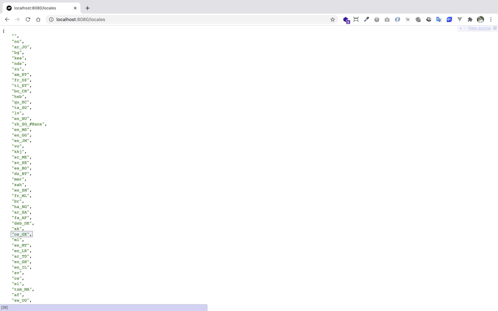
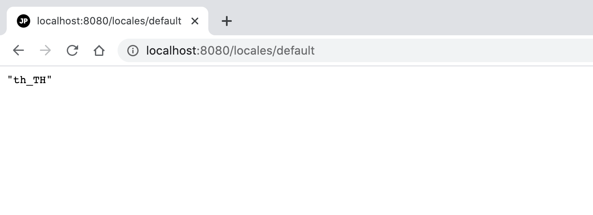

# spring-boot-reactive-default-locale

> ตัวอย่างการเขียน Spring-boot Reactive Default Locale 


# Prerequisites

- มีความเข้าใจเรื่อง Internationalization (i18n) และ Localization (L10n) 
   - ถ้าไม่เข้าใจสามารถเรียนรู้ได้จาก [สรุปสั้น ๆ เรื่อง Internationalization (i18n) และ Localization (L10n)](https://www.jittagornp.me/blog/short-summary-of-i18n-L10n/)

# 1. เพิ่ม Dependencies และ Plugins 

pom.xml 
``` xml
...
<parent>
    <groupId>org.springframework.boot</groupId>
    <artifactId>spring-boot-starter-parent</artifactId>
    <version>2.3.2.RELEASE</version>
</parent>

<dependencies>
    <dependency>
        <groupId>org.springframework.boot</groupId>
        <artifactId>spring-boot-starter-webflux</artifactId>
    </dependency>

    <dependency>
        <groupId>org.projectlombok</groupId>
        <artifactId>lombok</artifactId>
        <scope>provided</scope>
    </dependency>
</dependencies>

<build>
    <plugins>
        <plugin>
            <groupId>org.springframework.boot</groupId>
            <artifactId>spring-boot-maven-plugin</artifactId>
            <executions>        
                <execution>            
                    <id>build-info</id>            
                    <goals>                
                        <goal>build-info</goal>            
                    </goals>        
                    <configuration>                
                        <additionalProperties>                    
                            <java.version>${java.version}</java.version>                                   
                        </additionalProperties>            
                    </configuration>        
                </execution>    
            </executions>
        </plugin>
    </plugins>
</build>
...
```

# 2. เขียน Main Class 

``` java
@SpringBootApplication
@ComponentScan(basePackages = {"me.jittagornp"})
public class AppStarter {

    public static void main(String[] args) {
        SpringApplication.run(AppStarter.class, args);
    }

}
```

# 3. Config Default Locale 

สร้าง Java Class Config ขึ้นมา แล้วกำหนด Locale ตามที่ต้องการ

```java
@Slf4j
@Configuration
public class LocaleConfig {

    @PostConstruct
    public void setDefaultLocale(){

        Locale.setDefault(Locale.forLanguageTag("th-TH"));

        log.info("set Default Locale => {}", Locale.getDefault());

    }

}
```

**คำอธิบาย**

- กำหนดให้ Java ใช้ Default Locale เป็น `th-TH`

# 4. เขียน Controller
``` java
@RestController
@RequestMapping("/locales")
public class LocaleController {

    @GetMapping
    public Flux<Locale> getAvailableLocales(){
        return Flux.fromIterable(Arrays.asList(Locale.getAvailableLocales()));
    }

    @GetMapping("/default")
    public Mono<Locale> getDefault() {
        return Mono.just(Locale.getDefault());
    }

}
```

# 5. Build Code
cd ไปที่ root ของ project จากนั้น  
``` sh
$ mvn clean package
```

# 6. Run 
``` sh 
$ mvn spring-boot:run
```

 

# 7. เข้าใช้งาน

เปิด browser แล้วเข้า [http://localhost:8080/locales](http://localhost:8080/locales)



Default Time Zone



