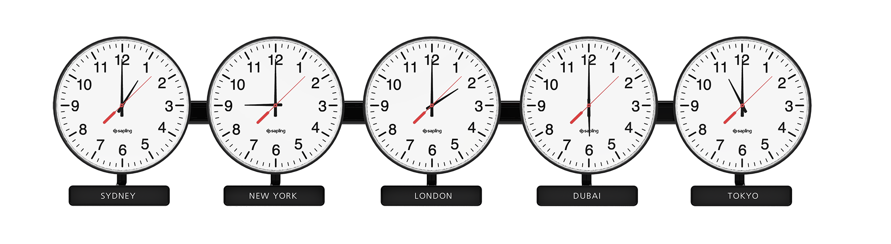
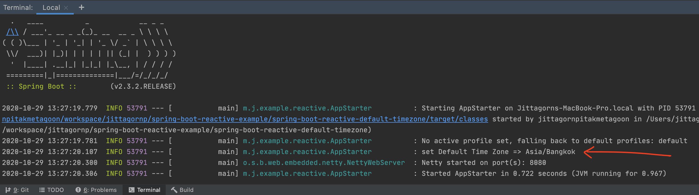
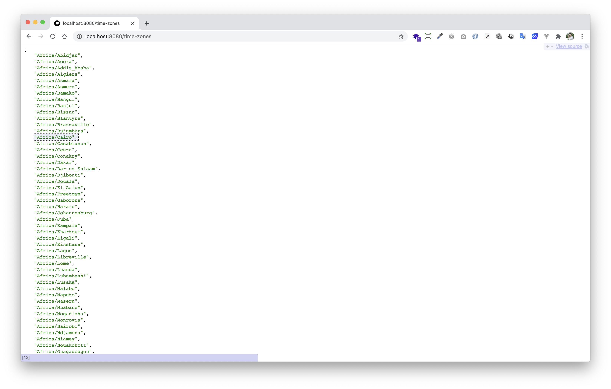
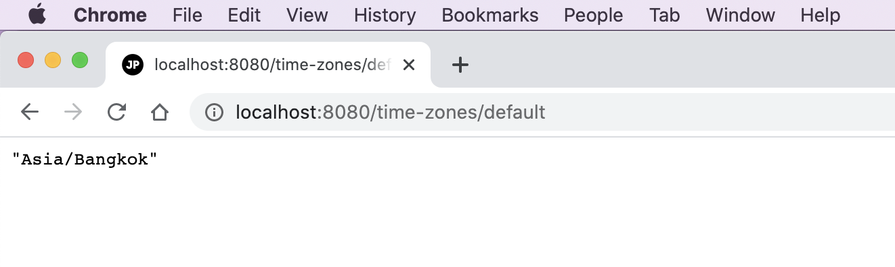

# spring-boot-reactive-default-timezone

> ตัวอย่างการเขียน Spring-boot Reactive Default Time Zone 



# Prerequisites

- มีความเข้าใจเรื่อง Time Zone 
   - ถ้าไม่เข้าใจสามารถเรียนรู้ได้จาก [สรุปสั้น ๆ เรื่องเขตเวลา (Time Zone) และไขข้อสงสัยว่าทำไมเวลาประเทศไทยถึงเป็น UTC+7](https://www.jittagornp.me/blog/short-summary-of-time-zone/)
   - ถ้าใครใช้ Server เป็น Ubuntu สามารถดูตัวอย่างการ Set Time Zone ได้จาก [ตั้งค่า Time Zone สำหรับ Ubuntu 20.04 LTS](https://www.jittagornp.me/blog/set-timezone-for-ubuntu20.04/)

# 1. เพิ่ม Dependencies และ Plugins 

pom.xml 
``` xml
...
<parent>
    <groupId>org.springframework.boot</groupId>
    <artifactId>spring-boot-starter-parent</artifactId>
    <version>2.3.2.RELEASE</version>
</parent>

<dependencies>
    <dependency>
        <groupId>org.springframework.boot</groupId>
        <artifactId>spring-boot-starter-webflux</artifactId>
    </dependency>

    <dependency>
        <groupId>org.projectlombok</groupId>
        <artifactId>lombok</artifactId>
        <scope>provided</scope>
    </dependency>
</dependencies>

<build>
    <plugins>
        <plugin>
            <groupId>org.springframework.boot</groupId>
            <artifactId>spring-boot-maven-plugin</artifactId>
            <executions>        
                <execution>            
                    <id>build-info</id>            
                    <goals>                
                        <goal>build-info</goal>            
                    </goals>        
                    <configuration>                
                        <additionalProperties>                    
                            <java.version>${java.version}</java.version>                                   
                        </additionalProperties>            
                    </configuration>        
                </execution>    
            </executions>
        </plugin>
    </plugins>
</build>
...
```

# 2. เขียน Main Class 

``` java
@SpringBootApplication
@ComponentScan(basePackages = {"me.jittagornp"})
public class AppStarter {

    public static void main(String[] args) {
        SpringApplication.run(AppStarter.class, args);
    }

}
```

# 3. Config Default Time Zone

สร้าง Java Class Config ขึ้นมา แล้วกำหนด Time Zone ตามที่ต้องการ

```java
@Slf4j
@Configuration
public class TimeZoneConfig {

    @PostConstruct
    public void setDefaultTimeZone(){

        TimeZone.setDefault(TimeZone.getTimeZone("Asia/Bangkok"));

        log.info("set Default Time Zone => {}", TimeZone.getDefault().getID());

    }

}
```

**คำอธิบาย**

- โดยปกติ `TimeZone.getDefault()` จะทำการอ่านค่า Time Zone มาจากเครื่อง 
  - ถ้าเครื่องเรา Default Time Zone เป็น `UTC` แล้ว `TimeZone.getDefault()` ก็จะได้ `UTC` เช่นเดียวกัน 
  - ถ้าเครื่องเรา Default Time Zone เป็น `Asia/Bangkok` แล้ว `TimeZone.getDefault()` ก็จะได้ `Asia/Bangkok` เช่นเดียวกัน   
  - เพราะฉะนั้น ต้องระวังเวลาเอา App ไป Deploy ให้เช็คเสมอว่าเครื่องนั้น Default Time Zone เป็นอะไร 
- เพื่อป้องกันข้อผิดพลาดอีกชั้น เราสามารถ Set Time Zone App เองได้โดยการใช้ `TimeZone.setDefault(...)`
- กำหนดให้ Java (8+ DateTime) ใช้ Default Time Zone เป็น `Asia/Bangkok`  หรือ `UTC+7`

# 4. เขียน Controller
``` java
@RestController
@RequestMapping("/time-zones")
public class TimeZoneController {

    @GetMapping
    public Flux<TimeZone> getAvailableTimeZones(){
        return Flux.fromIterable(Arrays.asList(TimeZone.getAvailableIDs()))
                .map(TimeZone::getTimeZone);
    }

    @GetMapping("/default")
    public Mono<TimeZone> getDefault() {
        return Mono.just(TimeZone.getDefault());
    }

    @GetMapping("/current-datetime")
    public Mono<DTO> currentDateTime(){
        return Mono.just(
                DTO.builder()
                        .instant(Instant.now())
                        .localDate(LocalDate.now())
                        .localDateTime(LocalDateTime.now())
                        .offsetDateTime(OffsetDateTime.now())
                        .offsetTime(OffsetTime.now())
                        .zonedDateTime(ZonedDateTime.now())
                        .build()
        );
    }

    @Data
    @Builder
    public static class DTO {

        private Instant instant;

        private LocalDate localDate;

        private LocalDateTime localDateTime;

        private OffsetDateTime offsetDateTime;

        private OffsetTime offsetTime;

        private ZonedDateTime zonedDateTime;

    }

}
```

# 5. Build Code
cd ไปที่ root ของ project จากนั้น  
``` sh
$ mvn clean package
```

# 6. Run 
``` sh 
$ mvn spring-boot:run
```



# 7. เข้าใช้งาน

เปิด browser แล้วเข้า [http://localhost:8080/times-zones](http://localhost:8080/times-zones)



Default Time Zone




# ตัวอย่าง Current Date Time

> GET [http://localhost:8080/time-zones/current-datetime](http://localhost:8080/time-zones/current-datetime)

Time Zone = `UTC`

```json
{
    "instant": "2020-10-29T07:06:21.179857Z",
    "localDate": "2020-10-29",
    "localDateTime": "2020-10-29T07:06:21.179935",
    "offsetDateTime": "2020-10-29T07:06:21.179983Z",
    "offsetTime": "07:06:21.180089Z",
    "zonedDateTime": "2020-10-29T07:06:21.180115Z"
}
```

Time Zone = `Asia/Bangkok` (UTC+7)

```json
{
    "instant": "2020-10-29T07:03:07.954985Z",
    "localDate": "2020-10-29",
    "localDateTime": "2020-10-29T14:03:07.957173",
    "offsetDateTime": "2020-10-29T14:03:07.957225+07:00",
    "offsetTime": "14:03:07.957357+07:00",
    "zonedDateTime": "2020-10-29T14:03:07.957389+07:00"
}
```

Time Zone = `Asia/Singapore` (UTC+8)

```json
{
    "instant": "2020-10-29T07:09:33.056406Z",
    "localDate": "2020-10-29",
    "localDateTime": "2020-10-29T15:09:33.058546",
    "offsetDateTime": "2020-10-29T15:09:33.058584+08:00",
    "offsetTime": "15:09:33.058701+08:00",
    "zonedDateTime": "2020-10-29T15:09:33.058729+08:00"
}
```