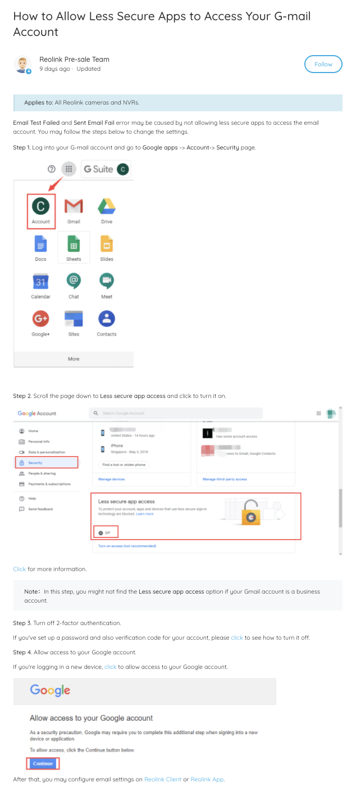
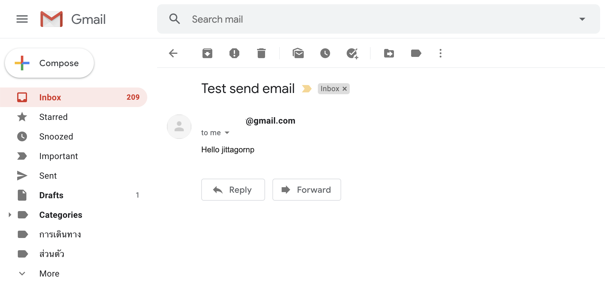

# spring-boot-reactive-gmail

> ตัวอย่างการเขียน Spring-boot Reactive Gmail

# Prerequisites

ให้ตั้งค่าบัญชีผู้ใช้ (Gmail ที่จะเอามาส่ง mail) เพื่อเปิดให้ Apps ที่มีความปลอดภัยน้อย (ซึ่งก็คือ App เรา) สามารถ Login ด้วย Gmail และ Password ได้ดังนี้ 



Reference : [https://support.reolink.com/hc/en-us/articles/360003525833-How-to-Allow-Less-Secure-Apps-to-Access-Your-G-mail-Account](https://support.reolink.com/hc/en-us/articles/360003525833-How-to-Allow-Less-Secure-Apps-to-Access-Your-G-mail-Account)

# 1. เพิ่ม Dependencies และ Plugins 

pom.xml 
``` xml
...
<parent>
    <groupId>org.springframework.boot</groupId>
    <artifactId>spring-boot-starter-parent</artifactId>
    <version>2.3.2.RELEASE</version>
</parent>

<dependencies>
    <dependency>
        <groupId>org.springframework.boot</groupId>
        <artifactId>spring-boot-starter-webflux</artifactId>
    </dependency>

    <dependency>
        <groupId>org.springframework.boot</groupId>
        <artifactId>spring-boot-starter-mail</artifactId>
    </dependency>

    <dependency>
        <groupId>org.projectlombok</groupId>
        <artifactId>lombok</artifactId>
        <scope>provided</scope>
    </dependency>
</dependencies>

<build>
    <plugins>
        <plugin>
            <groupId>org.springframework.boot</groupId>
            <artifactId>spring-boot-maven-plugin</artifactId>
            <executions>        
                <execution>            
                    <id>build-info</id>            
                    <goals>                
                        <goal>build-info</goal>            
                    </goals>        
                    <configuration>                
                        <additionalProperties>                    
                            <java.version>${java.version}</java.version>                                   
                        </additionalProperties>            
                    </configuration>        
                </execution>    
            </executions>
        </plugin>
    </plugins>
</build>
...
```

# 2. เขียน Main Class 

``` java
@SpringBootApplication
@ComponentScan(basePackages = {"me.jittagornp"})
public class AppStarter {

    public static void main(String[] args) {
        SpringApplication.run(AppStarter.class, args);
    }

}
```

# 3. กำหนด Config

classpath:application.properties

```properties
#------------------------------------- Gmail -----------------------------------
spring.mail.host=smtp.gmail.com
spring.mail.port=587
spring.mail.username=<YOUR_GMAIL>
spring.mail.password=<YOUR_GMAIL_PASSWORD>

# Other properties
spring.mail.properties.mail.smtp.auth=true
spring.mail.properties.mail.smtp.connectiontimeout=5000
spring.mail.properties.mail.smtp.timeout=5000
spring.mail.properties.mail.smtp.writetimeout=5000

# TLS , port 587
spring.mail.properties.mail.smtp.starttls.enable=true

# SSL, post 465
#spring.mail.properties.mail.smtp.socketFactory.port = 465
#spring.mail.properties.mail.smtp.socketFactory.class = javax.net.ssl.SSLSocketFactory
```

**หมายเหตุ**

- อย่าลืมเปลี่ยนค่าตรง `<YOUR_GMAIL>` และ `<YOUR_GMAIL_PASSWORD>` เป็น gmail และรหัสผ่านตัวเอง 

# 4. เขียน Service 

สำหรับส่ง Email 

### ประกาศ interface

```java
public interface MailSenderService {

    Mono<Void> sendEmail(final Message message);

    @Data
    @Builder
    public static class Message {

        private String subject;

        private String to;

        private String body;

    }

}
```

Implement interface

```java
@Slf4j
@Service
@RequiredArgsConstructor
public class GmailSenderService implements MailSenderService {

    private final JavaMailSender javaMailSender;

    @Override
    public Mono<Void> sendEmail(final Message message) {
        return Mono.fromRunnable(() -> {
            try {
                final MimeMessage msg = javaMailSender.createMimeMessage();

                // true = multipart message
                final MimeMessageHelper helper = new MimeMessageHelper(msg, true);
                helper.setTo(message.getTo());

                helper.setSubject(message.getSubject());

                // true = text/html
                helper.setText(message.getBody(), true);

                javaMailSender.send(msg);
            } catch (Exception e) {
                log.warn("sendEmail error => ", e);
                throw new MailSenderException(e);
            }
        })
                .subscribeOn(Schedulers.boundedElastic())
                .then();
    }
}
```

**คำอธิบาย**

- ใช้ `JavaMailSender` ในการส่ง email 
- `JavaMailSender` จะใช้ configuration ตามที่ได้ config ไว้ใน `application.properties`
- ตรง subscribeOn ทำไม Scheduler ถึงใช้เป็นแบบ boundedElastic ลองอ่านจากลิงค์นี้ดูครับ [https://projectreactor.io/docs/core/release/reference/#faq.wrap-blocking](https://projectreactor.io/docs/core/release/reference/#faq.wrap-blocking)

# 5. เขียน Controller

เพื่อลองส่ง email 
``` java
@RestController
@RequestMapping("/mail")
@RequiredArgsConstructor
public class TestMailController {

    private final MailSenderService mailSenderService;

    @GetMapping("/send")
    public Mono<Void> sendMail(){
        return mailSenderService.sendEmail(
                MailSenderService.Message.builder()
                        .subject("Test send email")
                        .to("jittagornp@gmail.com")
                        .body("Hello jittagornp")
                        .build()
        );
    }

}
```

# 6. Build Code
cd ไปที่ root ของ project จากนั้น  
``` sh
$ mvn clean package
```

# 7. Run 
``` sh 
$ mvn spring-boot:run
```

# 8. เข้าใช้งาน

เปิด browser แล้วเข้า [http://localhost:8080/mail/send](http://localhost:8080/mail/send)
  
ผลลัพธ์ 



# หมายเหตุ

ถ้าส่ง Mail ไม่ได้ ให้ตรวจสอบการตั้งค่าบัญชีตามรูปด้านบน ว่าตั้งค่าถูกต้องหรือไม่ แล้วลองดูใหม่อีกครั้ง 
