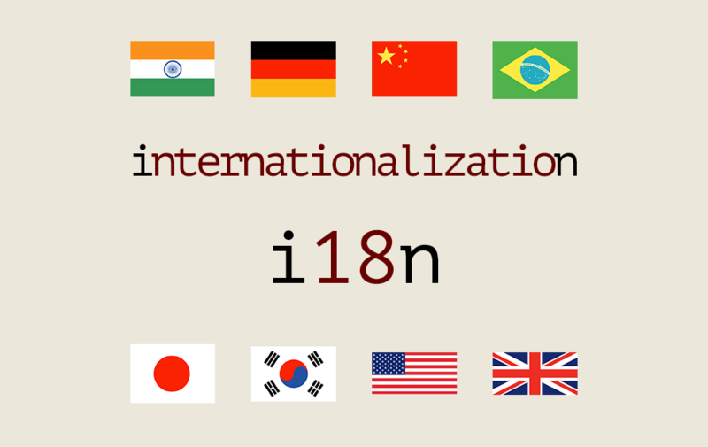
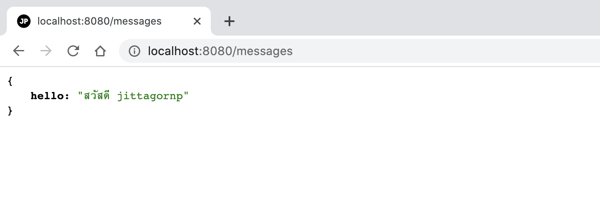
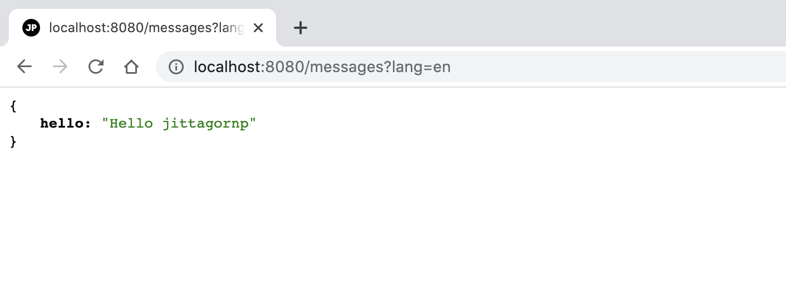
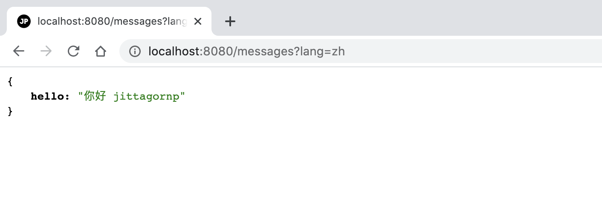
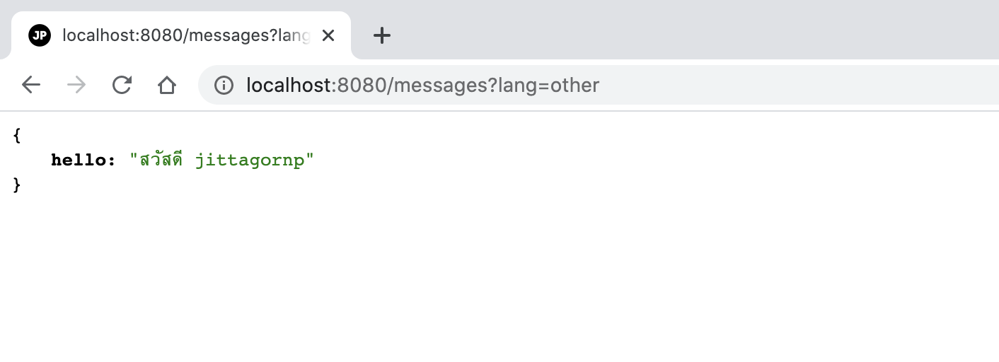

# spring-boot-reactive-i18n

> ตัวอย่างการทำ Spring-boot Reactive ให้รองรับหลายภาษา (i18n) 



# Prerequisites

- มีความเข้าใจเรื่อง Internationalization (i18n) และ Localization (L10n) 
   - ถ้าไม่เข้าใจสามารถเรียนรู้ได้จาก [สรุปสั้น ๆ เรื่อง Internationalization (i18n) และ Localization (L10n)](https://www.jittagornp.me/blog/short-summary-of-i18n-L10n/)

# 1. เพิ่ม Dependencies และ Plugins  

pom.xml 
``` xml
...
<parent>
    <groupId>org.springframework.boot</groupId>
    <artifactId>spring-boot-starter-parent</artifactId>
    <version>2.3.2.RELEASE</version>
</parent>

<dependencies>
    <dependency>
        <groupId>org.springframework.boot</groupId>
        <artifactId>spring-boot-starter-webflux</artifactId>
    </dependency>

    <dependency>
        <groupId>org.projectlombok</groupId>
        <artifactId>lombok</artifactId>
        <scope>provided</scope>
    </dependency>
</dependencies>

<build>
    <plugins>
        <plugin>
            <groupId>org.springframework.boot</groupId>
            <artifactId>spring-boot-maven-plugin</artifactId>
            <executions>        
                <execution>            
                    <id>build-info</id>            
                    <goals>                
                        <goal>build-info</goal>            
                    </goals>        
                    <configuration>                
                        <additionalProperties>                    
                            <java.version>${java.version}</java.version>                                   
                        </additionalProperties>            
                    </configuration>        
                </execution>    
            </executions>
        </plugin>
    </plugins>
</build>
...
```

# 2. เขียน Main Class 

``` java
@SpringBootApplication
@ComponentScan(basePackages = {"me.jittagornp"})
public class AppStarter {

    public static void main(String[] args) {
        SpringApplication.run(AppStarter.class, args);
    }

}
```

# 3. Config Default Locale 

สร้าง Java Class Config ขึ้นมา แล้วกำหนด Locale ตามที่ต้องการ

```java
@Slf4j
@Configuration
public class LocaleConfig {

    @PostConstruct
    public void setDefaultLocale(){

        Locale.setDefault(Locale.forLanguageTag("th-TH"));

        log.info("set Default Locale => {}", Locale.getDefault());

    }

}
```

# 4. สร้าง Resource Bundle messages

เป็น Properties File เพื่อกำหนดเป็นข้อความแปลสำหรับแต่ละภาษา โดยเราจะเอาไว้ที่ `/src/main/resources/i18n/`
  
**ภาษาไทย (Default)** - messages.properties
```properties
hello=สวัสดี {0}
```

**ภาษาอังกฤษ** - messages_en.properties
```properties
hello=Hello {0}
```

**ภาษาจีน** - messages_zh.properties
```properties
hello=你好 {0}
```

**ข้อสังเกต**

- สังเกตว่า นอกจาก Default (ภาษาไทย) แล้ว File messages อื่น ๆ จะตามด้วย `_` แล้วเป็น Language Code 
- ขอย้ำว่าให้ใช้เป็น Language Code     

# 5. เขียน LocaleContextResolver 

เพื่อทำการเปลี่ยนภาษา (Switch Locale) ตามเงื่อนไขที่ต้องการ

```java
public static class CustomLocaleContextResolver implements LocaleContextResolver {

    private static final String LANGUAGE_PARAMETER_NAME = "lang";

    private Locale getRequestLocale(final ServerWebExchange exchange) {
        final ServerHttpRequest request = exchange.getRequest();
        final String lang = request.getQueryParams().getFirst(LANGUAGE_PARAMETER_NAME);
        if (hasText(lang)) {
            return Locale.forLanguageTag(lang);
        }

        return request.getHeaders()
                .getAcceptLanguageAsLocales()
                .stream()
                .findFirst()
                .orElse(Locale.getDefault());
    }

    @Override
    public LocaleContext resolveLocaleContext(final ServerWebExchange exchange) {
        return new SimpleLocaleContext(getRequestLocale(exchange));
    }

    @Override
    public void setLocaleContext(final ServerWebExchange exchange, final LocaleContext localeContext) {
        //Unused
    }
}
```

**คำอธิบาย**

จาก Code ด้านบน ใช้การตัดสินใจเพื่อเปลี่ยนภาษาดังนี้ 
1. ใช้ Query string parameter `lang` ในการกำหนดภาษา ซึ่งสามารถส่งมาเป็น Language Code หรือ Language Tag ก็ได้ 
2. ถ้าไม่ได้ส่ง Params `lang` มา ให้อ่านค่าภาษาจาก Http Header `Accept-Language` ซึ่งเป็น Header ที่เอาไว้บอกว่า ณ ตอนนั้น Client (Browser) Support หรือใช้ Locale อะไร   
3. ถ้าไม่มี Params `lang` หรือ Header `Accept-Language` ให้ใช้ Default Locale (Language) ตามที่กำหนดไว้

# 6. เขียน i18nConfig 

เพื่อกำหนดที่อยู่ของ messages และเรียกใช้ `LocaleContextResolver` ที่เขียนขึ้นมา

```java
@Configuration
public class i18nConfig {

    @Bean
    public MessageSource messageSource() {
        final ResourceBundleMessageSource messageSource = new ResourceBundleMessageSource();
        messageSource.setBasenames("i18n/messages");
        messageSource.setDefaultEncoding("UTF-8");
        return messageSource;
    }

    @Bean
    @Primary
    public LocaleContextResolver customLocaleContextResolver() {
        return new CustomLocaleContextResolver();
    }
    
    ...
}
``` 

# 7. เขียน Message Service

เพื่อให้ใช้ MessageSource ง่ายขึ้น
  
ประกาศ interface

```java
public interface MessageService {

    String getMessage(final ServerWebExchange exchange, final String propertyName, final Object...params);

    String getMessage(final Locale locale, final String propertyName, final Object...params);

}
```

implement interface

```java
@Component
@RequiredArgsConstructor
public class MessageServiceImpl implements MessageService {

    private final MessageSource messageSource;

    private final LocaleContextResolver localeContextResolver;

    @Override
    public String getMessage(final ServerWebExchange exchange, final String propertyName, final Object... params) {
        final LocaleContext localeContext = localeContextResolver.resolveLocaleContext(exchange);
        final Locale locale = localeContext.getLocale();
        return getMessage(locale, propertyName, params);
    }

    @Override
    public String getMessage(final Locale locale, final String propertyName, final Object... params) {
        return messageSource.getMessage(propertyName, params, locale);
    }
}
``` 

**หมายเหตุ**

- เรียกใช้ `MessageSource` และ `LocaleContextResolver` 

# 8. เขียน Controller
``` java
@RestController
@RequestMapping("/messages")
@RequiredArgsConstructor
public class MessageController {

    private final MessageService messageService;

    @GetMapping
    public Mono<Message> getMessage(final ServerWebExchange exchange) {
        return Mono.fromCallable(() -> {
            return Message.builder()
                    .hello(messageService.getMessage(exchange, "hello", "jittagornp"))
                    .build();
        });
    }

    @Data
    @Builder 
    public static class Message {

        private String hello;

    }

}
```

# 9. Build Code
cd ไปที่ root ของ project จากนั้น  
``` sh
$ mvn clean package
```

# 10. Run 
``` sh 
$ mvn spring-boot:run
```

# 11. เข้าใช้งาน

เปิด browser แล้วเข้า [http://localhost:8080/messages](http://localhost:8080/messages)


ภาษาไทย (Default)



ภาษาอังกฤษ (`lang=en`)



ภาษาจีน (`lang=zh`)



ภาษาอื่น ๆ (`lang=other`)



จะเข้าภาษาไทย (Default) เพราะไม่ตรงกับ messages_xx.properties ใด ๆ

