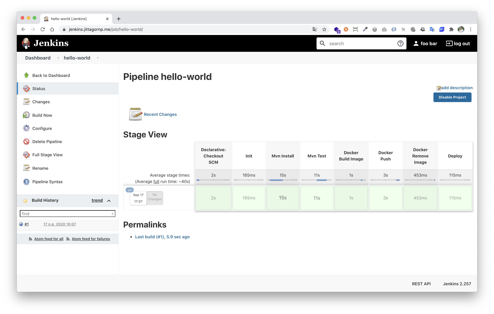
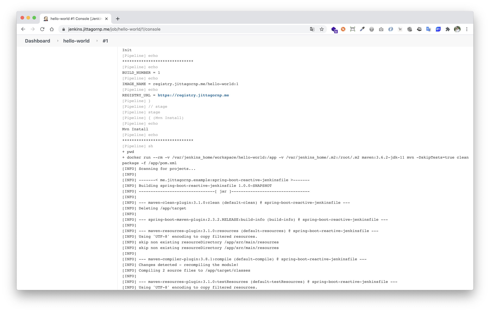

# spring-boot-reactive-jenkinsfile

> ตัวอย่างการเขียน Spring-boot Reactive Jenkinsfile

# Prerequisites

- มี Jenkins อยู่แล้ว ถ้าไม่มี สามารถติดตั้งได้ตามนี้ [ติดตั้ง Jenkins JDK 11 ด้วย Docker บน Ubuntu 18.04](https://www.jittagornp.me/blog/install-docker-jenkins-jdk-11-on-ubuntu-18.04/?series=jenkins)
- มี Docker Registry อยู่แล้ว ถ้าไม่มี สามารถติดตั้งได้ตามนี้ [การทำ Docker Registry ขึ้นมาใช้งานเอง](https://www.jittagornp.me/blog/install-docker-registry/?series=docker)

# 1. เพิ่ม Dependencies และ Plugins 

pom.xml 
``` xml
...
<parent>
    <groupId>org.springframework.boot</groupId>
    <artifactId>spring-boot-starter-parent</artifactId>
    <version>2.3.2.RELEASE</version>
</parent>

<dependencies>
    <dependency>
        <groupId>org.springframework.boot</groupId>
        <artifactId>spring-boot-starter-webflux</artifactId>
    </dependency>
</dependencies>

<build>
    <plugins>
        <plugin>
            <groupId>org.springframework.boot</groupId>
            <artifactId>spring-boot-maven-plugin</artifactId>
            <executions>        
                <execution>            
                    <id>build-info</id>            
                    <goals>                
                        <goal>build-info</goal>            
                    </goals>        
                    <configuration>                
                        <additionalProperties>                    
                            <java.version>${java.version}</java.version>                                   
                        </additionalProperties>            
                    </configuration>        
                </execution>    
            </executions>
        </plugin>
    </plugins>
</build>
...
```

# 2. เขียน Main Class 

``` java
@SpringBootApplication
@ComponentScan(basePackages = {"me.jittagornp"})
public class AppStarter {

    public static void main(String[] args) {
        SpringApplication.run(AppStarter.class, args);
    }

}
```

# 3. เขียน Controller
``` java
@RestController
public class HomeController {

    @GetMapping({"", "/"})
    public Mono<String> hello() {
        return Mono.just("Hello world.");
    }
}
```

# 4. เขียน Dockerfile

ไว้ที่ root ของ project /Dockerfile 
```dockerfile
FROM openjdk:11-jre-slim
EXPOSE 8080
ADD target/*.jar /app.jar
ENTRYPOINT java $JAVA_OPTS -jar /app.jar
```

ถ้าใครไม่แม่นเรื่อง Dockerfile สามารถอ่านได้จาก Slide นี้ [พื้นฐาน Docker](https://docs.google.com/presentation/d/1NXArkIDFIJMmcvXY63cc5z7jIsbx8SDZqt76RqeuGwU/edit?usp=sharing)

# 5. เขียน Jenkinsfile

ไว้ที่ root ของ project /Jenkinsfile 
```jenkins
pipeline {

    agent any

    environment {
        IMAGE_NAME = "registry.jittagornp.me/hello-world:${env.BUILD_NUMBER}"
        REGISTRY_URL = "https://registry.jittagornp.me"
        REGISTRY_USERNAME = "foo"
        REGISTRY_PASSWORD = "bar"
    }

    stages {

        stage("Init") {
            steps {
                echo "Init"
                echo "******************************"
                ...
            }
        }

        stage("Mvn Install") {
            steps {
                echo "Mvn Install"
                echo "******************************"
                sh 'docker run --rm -v $(pwd):/app -v ~/.m2:/root/.m2 maven:3.6.2-jdk-11 mvn -DskipTests=true clean package -f /app/pom.xml'
            }
        }

        stage("Mvn Test") {
            steps {
                echo "Mvn Test"
                echo "******************************"
                sh 'docker run --rm -v $(pwd):/app -v ~/.m2:/root/.m2 maven:3.6.2-jdk-11 mvn test -f /app/pom.xml'
            }
        }

        ...
    }
}
``` 

ถ้าใครไม่แม่นเรื่อง Jenkinsfile สามารถอ่านได้จากบทความนี้ [พื้นฐานการเขียน Jenkins Pipeline](https://www.jittagornp.me/blog/jenkins-pipeline/?series=jenkins)

### หมายเหตุ

- Username/Password Registry จากตัวอย่างเป็นการ FIXED ค่าใส่ตัวแปร Environment ให้ดูง่าย ๆ แต่ตอนใช้งานจริงอาจจะเก็บค่าไว้ใน Jenkins Credentials แล้วค่อยอ่านค่ามาใช้งานแทนก็ได้ 

# 6. Push Code ไปไว้ที่ Git Remote Repository (Git Hosting)

เช่น GitHub, GitLab, etc.

# 7. สร้าง Jenkins Pipeline เพื่อทดสอบ Jenkinsfile



Output




