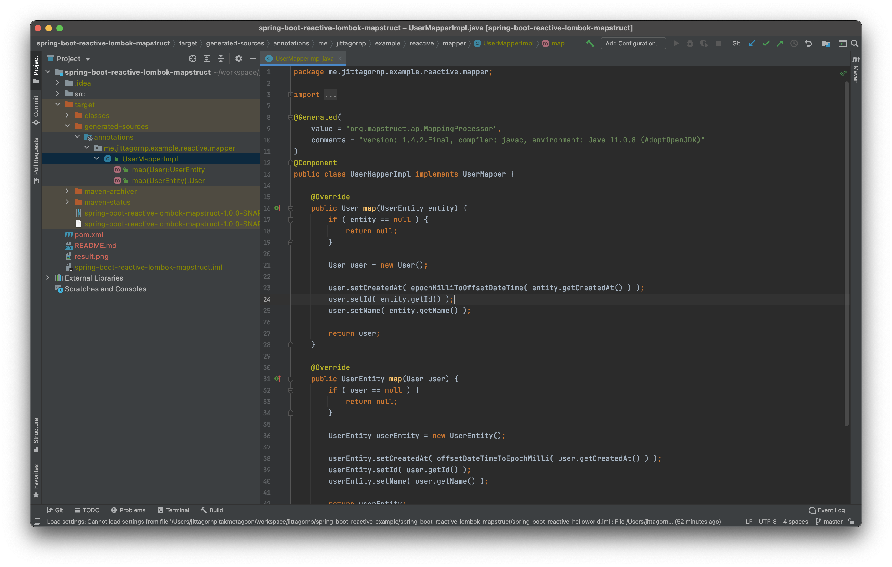
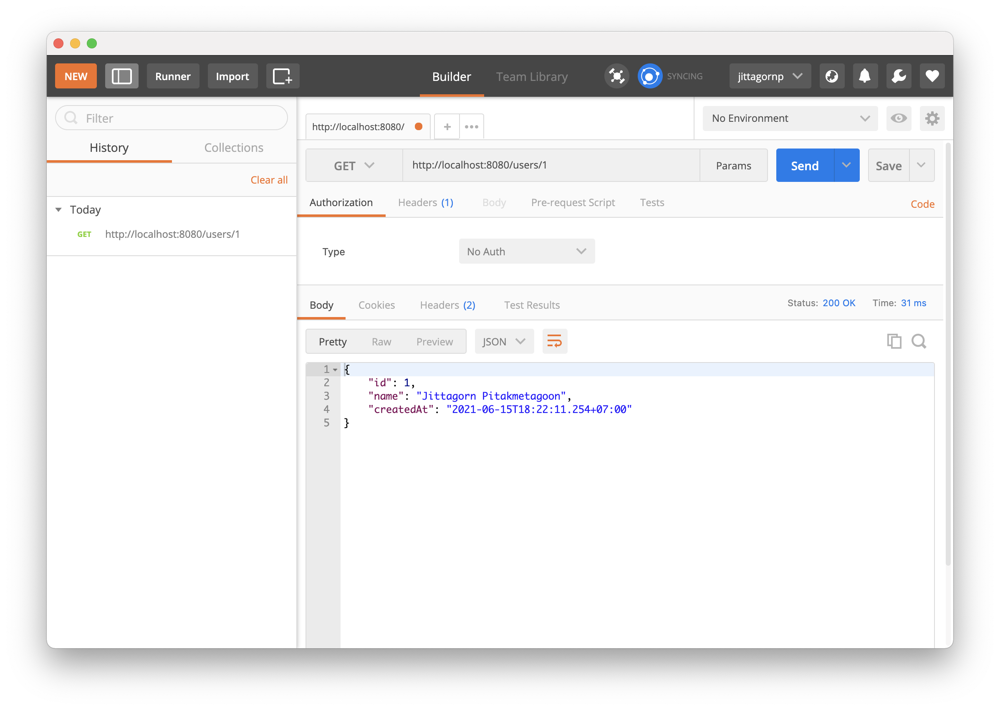
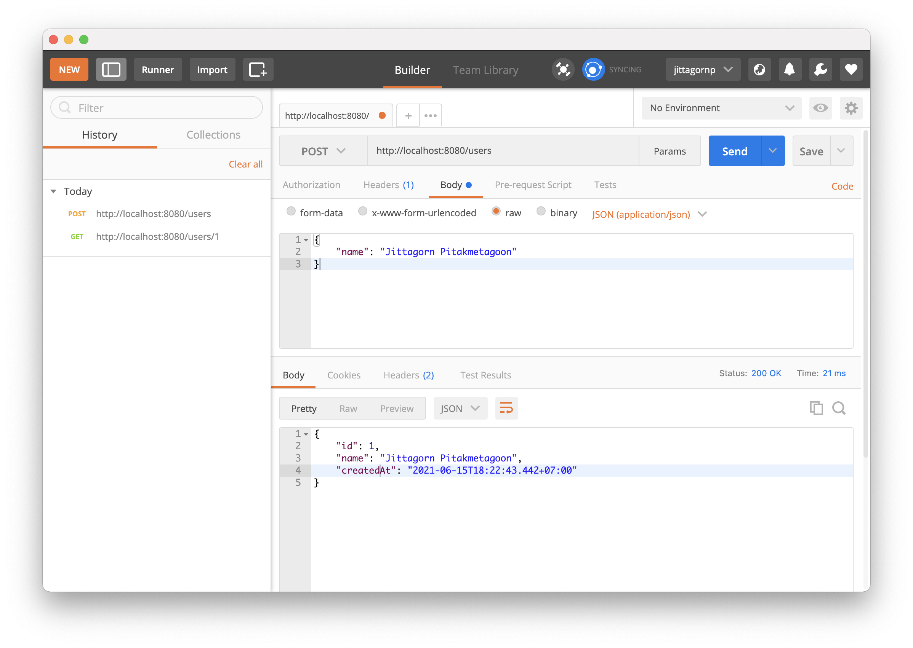

# spring-boot-reactive-lombok-mapstruct

> ตัวอย่างการเขียน Spring-boot Reactive + Lombok + MapStruct

# 1. เพิ่ม Dependencies และ Plugins 

pom.xml 
``` xml
...
<properties>
    ...
    <org.mapstruct.version>1.4.2.Final</org.mapstruct.version>
    <org.projectlombok.version>1.18.20</org.projectlombok.version>
</properties>
    
<parent>
    <groupId>org.springframework.boot</groupId>
    <artifactId>spring-boot-starter-parent</artifactId>
    <version>2.3.2.RELEASE</version>
</parent>

<dependencies>
    <dependency>
        <groupId>org.springframework.boot</groupId>
        <artifactId>spring-boot-starter-webflux</artifactId>
    </dependency>

    <dependency>
        <groupId>org.projectlombok</groupId>
        <artifactId>lombok</artifactId>
        <version>${org.projectlombok.version}</version>
        <type>jar</type>
    </dependency>

    <dependency>
        <groupId>org.mapstruct</groupId>
        <artifactId>mapstruct</artifactId>
        <version>${org.mapstruct.version}</version>
    </dependency>
</dependencies>

<build>
    <plugins>
        <plugin>
            <groupId>org.apache.maven.plugins</groupId>
            <artifactId>maven-compiler-plugin</artifactId>
            <configuration>
                <release>11</release>
                <annotationProcessorPaths>
                    <path>
                        <groupId>org.projectlombok</groupId>
                        <artifactId>lombok</artifactId>
                        <version>${org.projectlombok.version}</version>
                    </path>
                    <path>
                        <groupId>org.mapstruct</groupId>
                        <artifactId>mapstruct-processor</artifactId>
                        <version>${org.mapstruct.version}</version>
                    </path>
                    <!-- other annotation processors -->
                </annotationProcessorPaths>
                <compilerArgs>
                    <arg>-Amapstruct.suppressGeneratorTimestamp=true</arg>
                    <arg>-Amapstruct.defaultComponentModel=spring</arg>
                </compilerArgs>
            </configuration>
        </plugin>

        ...
    </plugins>
</build>
...
```

**Dependencies**  

- Lombok เป็น Dependency สำหรับใช้เป็นตัว Generate code ทำให้เราไม่ต้องเขียน Code บางอย่างเองทั้งหมด เช่น Code ในส่วนของ Getter, Setter, Constructor, Log และอื่น ๆ
- MapStruct เป็น Dependency สำหรับใช้ในการ Map หรือ Copy attributes ของ class ที่เหมือน ๆ กัน ทำให้เราไม่ต้องเขียน Code เหล่านี้เองทั้งหมด

**Plugins**  

ให้เพิ่ม Plugin `maven-compiler-plugin` และ Config ตามด้านบนเข้าไปใน pom.xml  
หน้าที่ของ Plugin ตัวนี้คือ ทำหน้าที่ในการ Generate code ตอน Compile ตาม Lombok/MapStruct ที่เราเขียนไว้ 

**หมายเหตุ**  

สังเกตว่า เราทำการย้าย Dependency version ไปไว้ใน Property ชื่อ `org.mapstruct.version` และ `org.projectlombok.version` แทนการกำหนดค่าตรง ๆ

# 2. เขียน Main Class 

``` java
@SpringBootApplication
@ComponentScan(basePackages = {"me.jittagornp"})
public class AppStarter {

    public static void main(String[] args) {
        SpringApplication.run(AppStarter.class, args);
    }

}
```

# 3. เขียน Entity และ Model (DTO) 

ที่จำเป็นต้องใช้
  
UserEntity.java  
```java
@Data
@Builder
@AllArgsConstructor
@NoArgsConstructor
public class UserEntity {

    private Long id;

    private String name;

    private Long createdAt; /** Not same type **/

}
```
User.java
```java
@Data
@Builder
@AllArgsConstructor
@NoArgsConstructor
public class User {

    private Long id;

    private String name;

    private OffsetDateTime createdAt; /** Not same type **/

}
```

สังเกตว่า Attribute `createdAt` มี Type ทีไม่เหมือนกัน

# 4. เขียน Mapper 

สำหรับทำการ map ข้อมูลระหว่าง Entity และ Model 

```java
@Mapper
public interface UserMapper {

    @Mapping(source = "createdAt", target = "createdAt", qualifiedByName = "epochMilliToOffsetDateTime")
    User map(final UserEntity entity);

    @Mapping(source = "createdAt", target = "createdAt", qualifiedByName = "offsetDateTimeToEpochMilli")
    UserEntity map(final User user);

    @Named("offsetDateTimeToEpochMilli")
    default Long offsetDateTimeToEpochMilli(final OffsetDateTime offsetDateTime) {
        try {
            return offsetDateTime.toInstant().toEpochMilli();
        } catch (Exception e) {
            return null;
        }
    }

    @Named("epochMilliToOffsetDateTime")
    default OffsetDateTime epochMilliToOffsetDateTime(final Long epochMilli) {
        try {
            final Instant instant = Instant.ofEpochMilli(epochMilli);
            return OffsetDateTime.ofInstant(instant, ZoneId.systemDefault());
        } catch (Exception e) {
            return null;
        }
    }

}
```

- เนื่องจาก Type `createdAt` มันไม่เหมือนกัน เราเลยต้องเขียน Method convert ขึ้นมาตามตัว Code ด้านบน
- ส่วน Attribute อื่น ๆ ที่ชื่อและ Type เหมือนกันหมด ก็ไม่ต้องมี `@Mapping` อะไร

# 5. เขียน Logic เพื่อเรียกใช้ Mapper 

เช่น เรียกผ่าน Service   

UserService.java
```java
public interface UserService {

    Mono<User> findById(final Long id);

    Mono<User> create(final User user);

}
```

UserServiceImpl.java

```java
@Slf4j
@Service
@RequiredArgsConstructor
public class UserServiceImpl implements UserService {

    private final UserMapper userMapper;

    @Override
    public Mono<User> findById(final Long id) {
        return Mono.fromCallable(() -> {
            //Do something
            final UserEntity entity = UserEntity.builder()
                    .id(id)
                    .name("Jittagorn Pitakmetagoon")
                    .createdAt(System.currentTimeMillis())
                    .build();
            log.debug("entity => {}", entity);
            return entity;
        }).map(userMapper::map);
    }

    @Override
    public Mono<User> create(final User user) {
        return Mono.fromCallable(() -> {
            final UserEntity entity = userMapper.map(user);
            entity.setId(1L);
            entity.setCreatedAt(System.currentTimeMillis());

            log.debug("entity => {}", entity);
            //Do something
            return entity;
        }).map(userMapper::map);
    }
}
```

# 6. เขียน Controller

เพื่อเรียกใช้ Service อีกที 

``` java
@RestController
@RequestMapping("/users")
@RequiredArgsConstructor
public class UserController {

    private final UserService userService;

    @PostMapping
    public Mono<User> create(@RequestBody final User user) {
        return userService.create(user);
    }

    @GetMapping("/{id}")
    public Mono<User> findById(@PathVariable("id") final Long id) {
        return userService.findById(id);
    }
}
```

# 7. Build Code
cd ไปที่ root ของ project จากนั้น  
``` sh
$ mvn clean package
```

หลังจากที่เรา Run คำสั่งด้านบนเสร็จ ลองเข้าไปดูที่ Folder `/target/generated-sources/annotations` เราจะเห็น Code ที่ MapStruct Generate ไว้ให้ ซึ่งก็เป็น Logic การ Copy attributes ต่าง ๆ โดยที่เราไม่ต้องเขียนส่วนนี้เอง  



# 8. Run 
``` sh 
$ mvn spring-boot:run
```

# 9. ทดสอบ




