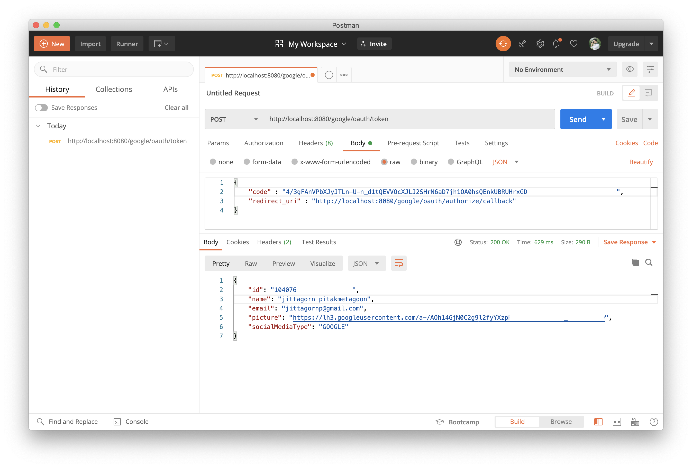
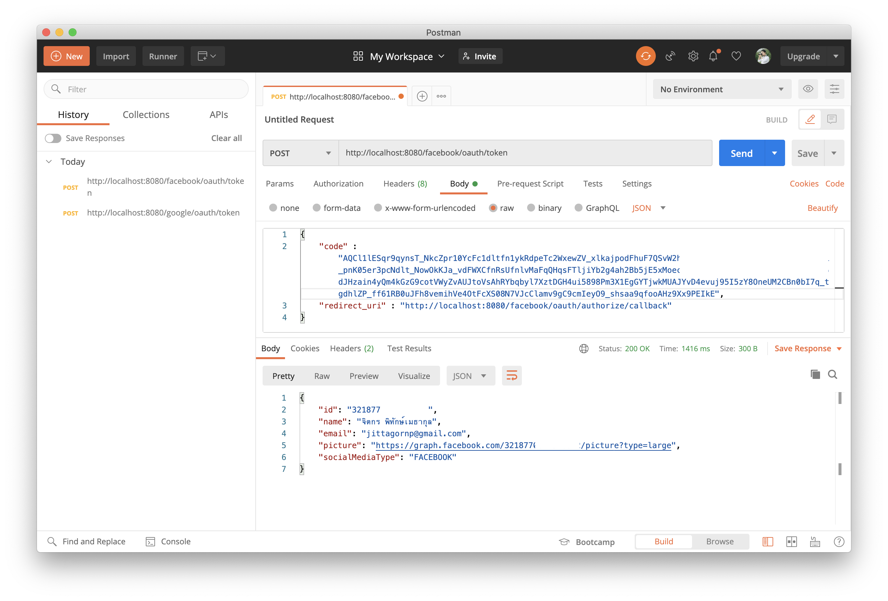

# spring-boot-reactive-oauth-client

> ตัวอย่างการเขียน Spring-boot Reactive OAuth Client 

# 1. เพิ่ม Dependencies และ Plugins 

pom.xml 
``` xml
...
<parent>
    <groupId>org.springframework.boot</groupId>
    <artifactId>spring-boot-starter-parent</artifactId>
    <version>2.3.2.RELEASE</version>
</parent>

<dependencies>
    <dependency>
        <groupId>org.springframework.boot</groupId>
        <artifactId>spring-boot-starter-webflux</artifactId>
    </dependency>
    
    <dependency>
        <groupId>org.projectlombok</groupId>
        <artifactId>lombok</artifactId>
        <scope>provided</scope>
    </dependency>
</dependencies>

<build>
    <plugins>
        <plugin>
            <groupId>org.springframework.boot</groupId>
            <artifactId>spring-boot-maven-plugin</artifactId>
            <executions>        
                <execution>            
                    <id>build-info</id>            
                    <goals>                
                        <goal>build-info</goal>            
                    </goals>        
                    <configuration>                
                        <additionalProperties>                    
                            <java.version>${java.version}</java.version>                                   
                        </additionalProperties>            
                    </configuration>        
                </execution>    
            </executions>
        </plugin>
    </plugins>
</build>
...
```

# 2. เขียน Main Class 

``` java
@SpringBootApplication
@ComponentScan(basePackages = {"me.jittagornp"})
public class AppStarter {

    public static void main(String[] args) {
        SpringApplication.run(AppStarter.class, args);
    }

}
```

# 3. เขียน Controller
``` java
@RestController
public class IndexController {

    @GetMapping({"", "/"})
    public Mono<String> hello() {
        return Mono.just("OAuth Client.");
    }
}
```

# 4. เขียน Code สำหรับเชื่อมต่อ OAuth 
```java
@Slf4j
public abstract class OAuthControllerAdapter {

    protected abstract OAuthClient getOAuthClient();

    protected abstract String getAuthorizationCodeEndpoint();

    protected abstract String getAccessTokenEndpoint();

    protected abstract String getUserInfoEndpoint();

    protected abstract OAuthUserInfo mapUserInfo(final Map<String, Object> userInfo);
    
    ...
    ...
}

@Slf4j
@RestController
@RequestMapping("/google/oauth")
public class GoogleOAuthController extends OAuthControllerAdapter {

    @Override
    protected OAuthClient getOAuthClient() {
        return OAuthClient.builder()
                .clientId("3355xxxxxxxxxxx-xxxxxxxxxxxxxxxxxxxxxxxxxxxx.apps.googleusercontent.com")
                .clientSecret("D9pnYkQxxxxxxxxxxxxxxxxxx")
                .scope("profile email")
                .build();
    }
    ...
}

@Slf4j
@RestController
@RequestMapping("/facebook/oauth")
public class FacebookOAuthController extends OAuthControllerAdapter {

    @Override
    protected OAuthClient getOAuthClient() {
        return OAuthClient.builder()
                .clientId("314846xxxxxxxxxxxxxxxxxx")
                .clientSecret("647a877e6d5d9xxxxxxxxxxxxxxxxxxxxxxxxxxxxxxxxxxxx")
                .scope("email")
                .build();
    }
    ...
}    
```

### หมายเหตุ 

อย่าลืมแก้ค่า `clientId` กับ `clientSecret` ก่อน Run Code 

# 5. Build Code
cd ไปที่ root ของ project จากนั้น  
``` sh
$ mvn clean package
```

# 6. Run 
``` sh 
$ mvn spring-boot:run
```

# 7. เข้าใช้งาน

เปิด browser แล้วเข้า [http://localhost:8080](http://localhost:8080)

# 8. ทดสอบ


### Google 

ให้ไปที่ url นี้

- [http://localhost:8080/google/oauth/authorize?redirect_uri=http://localhost:8080/google/oauth/authorize/callback](http://localhost:8080/google/oauth/authorize?redirect_uri=http://localhost:8080/google/oauth/authorize/callback)

เมื่อได้ authorization code มาแล้วให้ นำ code มาขอ access_token ที่ url นี้ 



### Facebook

ให้ไปที่ URL นี้ 
- [http://localhost:8080/facebook/oauth/authorize?redirect_uri=http://localhost:8080/facebook/oauth/authorize/callback](http://localhost:8080/facebook/oauth/authorize?redirect_uri=http://localhost:8080/facebook/oauth/authorize/callback)

เมื่อได้ authorization code มาแล้วให้ นำ code มาขอ access_token ที่ url นี้ 



