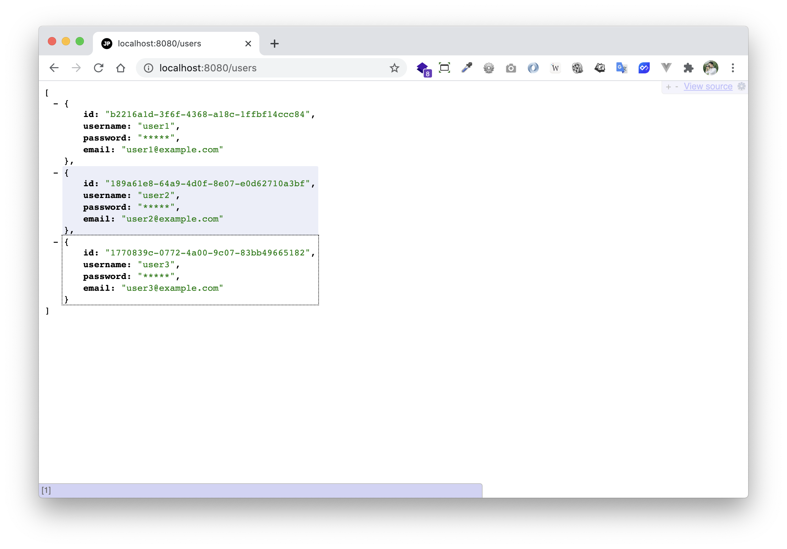
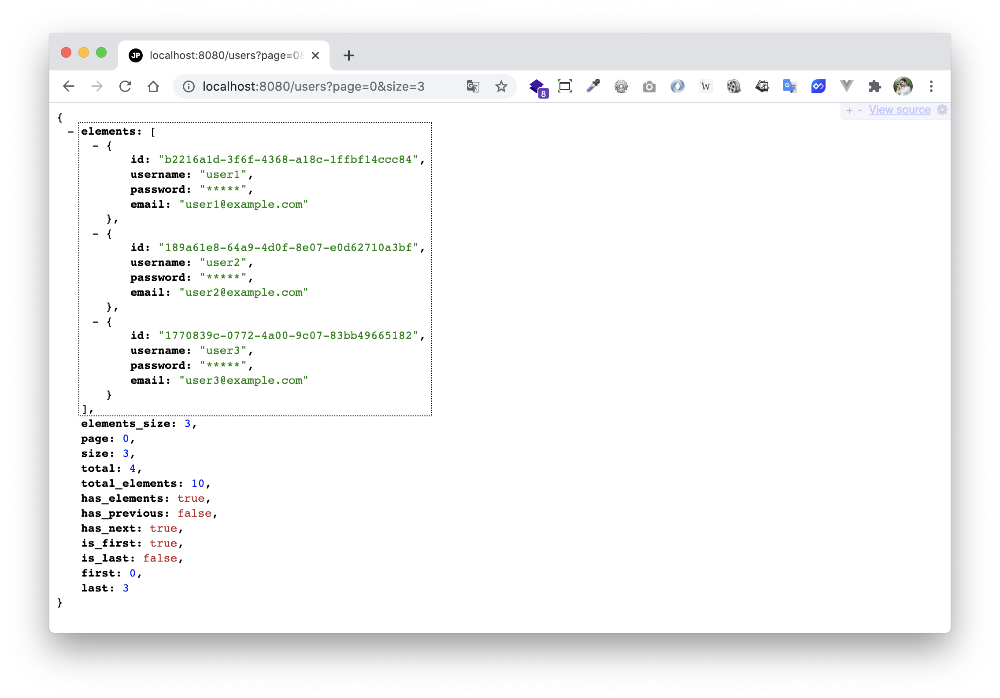

# spring-boot-reactive-pagination

> ตัวอย่างการทำ Pagination สำหรับ Spring-boot Reactive 


# Prerequisites

- การทำ Pagination ในตัวอย่างนี้ ทำเพื่อ Support Spring-data เป็นหลัก ออกแบบเอง โดยยึดการออกแบบตามเอกสารฉบับนี้ [https://developers.pamarin.com/docs/v1/pagination](https://developers.pamarin.com/docs/v1/pagination) แนะนำให้อ่านเอกสารก่อน แล้วจะเข้าใจว่าทำไมถึงเขียน Code แบบนี้ 

# เคลียร์ประเด็น

เผื่อบางคนสงสัยว่า จริงๆ แล้ว Spring-data มี Defualt Pagination Format มาให้เลยนี่นา ทำไมไม่ใช้ ทำเองทำไม
  
เหตุผลส่วนตัวครับ 
  
1. ผมไม่ชอบชื่อ parameter และรูปแบบ parameters รวมถึง response format ที่ spring ทำมาให้ เลยทำเอง 😅 แต่ก็ยังใช้ pattern เดิมบางส่วนของ spring อยู่

2. ไม่อยากยึดติดกับรูปแบบของ spring เพราะในอนาคต อาจจะไม่ได้เขียน spring หรือภาษา java แล้วก็ได้ เลยพยายามคิดเป็น format กลาง ๆ (โดยเอาข้อดีของ spring มาใช้) เพื่อที่ว่า ไม่ว่าจะเขียนโปรแกรมด้วยภาษาโปรแกรมมิ่งอะไรก็ตาม ก็จะใช้ format นี้ กับถ้าเราทำงานร่วมกับคนอื่นที่ไม่ได้เขียน java หรือ spring จะได้เป็นข้อตกลงร่วมกันโดยไม่ Fixed จนเกินไป

3. ต้องการความยืดหยุ่นมากกว่าที่ Spring ทำได้ จากตัวอย่างจะเห็นว่า Pagination สามารถ return ได้ 2 แบบ คือแบบ Slice และแบบ Page กับต้องการให้ยืดหยุ่นกับ Business ในอนาคต คือบาง User อาจจะมีเครดิตในการ Get Data ต่อ Page ได้มากกว่า User ทั่วๆ ไป ตรงนี้เรา Custom เองจะง่ายกว่า 

4. Format นี้เป็น format ที่ทีมผมตกลงร่วมกันก่อนเริ่มเขียน Code หลายคนมาจากภาษาและ Framework อื่นๆ เลยไม่อยากให้คนอื่นต้องมาทำตามเรา เอาเป็นว่าคุยกันก่อนดีกว่า ว่าจะเอาแบบไหน สุดท้ายสรุปได้เป็นแบบนี้

เหตุผลคร่าวๆ ประมาณนี้

# 1. เพิ่ม Dependencies และ Plugins

pom.xml 
``` xml
...
<parent>
    <groupId>org.springframework.boot</groupId>
    <artifactId>spring-boot-starter-parent</artifactId>
    <version>2.3.2.RELEASE</version>
</parent>

<dependencies>
    <dependency>
        <groupId>org.springframework.boot</groupId>
        <artifactId>spring-boot-starter-webflux</artifactId>
    </dependency>
    
    <dependency>
        <groupId>org.projectlombok</groupId>
        <artifactId>lombok</artifactId>
        <scope>provided</scope>
    </dependency>

    <dependency>
        <groupId>org.springframework.data</groupId>
        <artifactId>spring-data-commons</artifactId>
        <version>2.2.6.RELEASE</version>
    </dependency>
</dependencies>

<build>
    <plugins>
        <plugin>
            <groupId>org.springframework.boot</groupId>
            <artifactId>spring-boot-maven-plugin</artifactId>
            <executions>        
                <execution>            
                    <id>build-info</id>            
                    <goals>                
                        <goal>build-info</goal>            
                    </goals>        
                    <configuration>                
                        <additionalProperties>                    
                            <java.version>${java.version}</java.version>                                   
                        </additionalProperties>            
                    </configuration>        
                </execution>    
            </executions>
        </plugin>
    </plugins>
</build>
...
```

**คำอธิบาย**

- `spring-data-commons` เป็น Dependency ที่ใช้สำหรับตัวอย่างนี้เท่านั้น 
- เวลาใช้งานจริง จะใช้ `spring-boot-starter-data` หรือ `spring-boot-starter-data-XXX` แทน เช่น ตัวอย่างนี้ [spring-boot-reactive-r2dbc-postgresql](../spring-boot-reactive-r2dbc-postgresql/) 

# 2. เขียน Main Class 

``` java
@SpringBootApplication
@ComponentScan(basePackages = {"me.jittagornp"})
public class AppStarter {

    public static void main(String[] args) {
        SpringApplication.run(AppStarter.class, args);
    }

}
```

# 3. เขียน Model  

เพื่อไว้รับ Pagination Request 
```java
@Data
@Builder
public class PaginationRequest {

    private long offset = 0;

    private int limit;

    private int page = -1;

    private int size;

    private Sort sort;

    private int defaultLimit = 20;

    private int defaultSize = 20;

    private int maxLimit = 100;

    private int maxSize = 100;

    ...
}
```

# 4. เขียน Converter 

เพื่อเอาไว้ Convert Request ไปใส่ Model ในข้อ 3 

ประกาศ Interface
```java
public interface QueryStringParameterToPaginationRequestConverter {

    PaginationRequest convert(final MultiValueMap<String, String> queryParams);

}
```

Implement Interface
```java

@Slf4j
@Component
public class QueryStringParameterToPaginationRequestConverterImpl implements QueryStringParameterToPaginationRequestConverter {

    private static final int DEFAULT_LIMIT = 20;
    private static final int DEFAULT_SIZE = 20;
    private static final int MAX_LIMIT = 100;
    private static final int MAX_SIZE = 100;

    @Override
    public PaginationRequest convert(final MultiValueMap<String, String> queryParams) {
        final long offset = parseLong(queryParams, "offset", 0L);
        final int limit = parseInt(queryParams, "limit", DEFAULT_LIMIT);
        final int page = parseInt(queryParams, "page", -1);
        final int size = parseInt(queryParams, "size", DEFAULT_SIZE);
        final Sort sort = convertToSort(queryParams.getFirst("sort"));
        return PaginationRequest.builder()
                .offset(offset)
                .limit(limit)
                .page(page)
                .size(size)
                .sort(sort)
                .defaultLimit(DEFAULT_LIMIT)
                .defaultSize(DEFAULT_SIZE)
                .maxLimit(MAX_LIMIT)
                .maxSize(MAX_SIZE)
                .build();
    }

    ...
}
```

# 5. Config Resolver 

เพื่อให้ Spring ใช้ Converter ที่เขียนไว้  
  
โดยเราจะเอา Converter ที่เราเขียนไว้ ไปใช้งานในรูปแบบของ `MethodArgumentResolver` เพื่อให้ Spring ทำการแปลง Http Request Query String ตาม Logic ที่เราเขียนไปใส่เป็น Method Argument ให้

```java
@Slf4j
@Configuration
public class WebConfig implements WebFluxConfigurer {

    @Override
    public void configureArgumentResolvers(final ArgumentResolverConfigurer configurer) {
        configurer.addCustomResolver(new ReactivePaginationRequestMethodArgumentResolver());
    }

    public static class ReactivePaginationRequestMethodArgumentResolver implements HandlerMethodArgumentResolver {

        private final QueryStringParameterToPaginationRequestConverter converter = new QueryStringParameterToPaginationRequestConverterImpl();

        @Override
        public boolean supportsParameter(final MethodParameter methodParameter) {
            return PaginationRequest.class.equals(methodParameter.getParameterType());
        }

        @Override
        public Mono<Object> resolveArgument(
                final MethodParameter methodParameter,
                final BindingContext bindingContext,
                final ServerWebExchange serverWebExchange
        ) {
            return Mono.just(converter.convert(serverWebExchange.getRequest().getQueryParams()));
        }
    }

}
```

# 6. Config Jackson  

เพื่อ Custom Page Response
   
เขียน PageJsonSerializer 
```java
public class PageJsonSerializer extends JsonSerializer<Page> {

    @Override
    public void serialize(
            final Page page,
            final JsonGenerator generator,
            final SerializerProvider serializerProvider
    ) throws IOException {
        generator.writeStartObject();
        generator.writeObjectField("elements", page.getContent());
        generator.writeObjectField("elements_size", page.getNumberOfElements());
        generator.writeObjectField("page", page.getNumber());
        generator.writeObjectField("size", page.getSize());
        generator.writeObjectField("total", page.getTotalPages());
        generator.writeObjectField("total_elements", page.getTotalElements());
        generator.writeObjectField("has_elements", page.hasContent());
        generator.writeObjectField("has_previous", page.hasPrevious());
        generator.writeObjectField("has_next", page.hasNext());
        generator.writeObjectField("is_first", page.isFirst());
        generator.writeObjectField("is_last", page.isLast());
        generator.writeObjectField("first", 0);
        generator.writeObjectField("last", (page.getTotalPages() == 0) ? 0 : (page.getTotalPages() - 1));
        generator.writeEndObject();
    }

}
```

เขียน Jackson Config

```java
@Configuration
public class JacksonConfig implements Jackson2ObjectMapperBuilderCustomizer {

    @Override
    public void customize(final Jackson2ObjectMapperBuilder jacksonObjectMapperBuilder) {
        jacksonObjectMapperBuilder
                .serializerByType(Page.class, new PageJsonSerializer());
    }

}
```

# 7. เขียน Controller
``` java
@Slf4j
@RestController
@RequestMapping("/users")
public class UserController {

    ...   

    @GetMapping
    public Mono findAll(final PaginationRequest paginationRequest) {
        if (paginationRequest.isPageRequest()) {
            final Pageable pageable = paginationRequest.toPage();
            return fakePageFromDatabase(pageable);
        } else {
            final Pageable pageable = paginationRequest.toSlice();
            return fakeSliceFromDatabase(pageable);
        }
    }

    private Mono<Page<User>> fakePageFromDatabase(final Pageable pageable) {
        log.debug("Page *************************************");
        log.debug("offset => {}", pageable.getOffset());
        log.debug("limit => {}", pageable.getPageSize());
        log.debug("query from database ....");
        return Mono.just(new PageImpl<>(
                fakeUsers,
                pageable,
                fakeTotalElements
        ));
    }

    private Mono<List<User>> fakeSliceFromDatabase(final Pageable pageable) {
        log.debug("Slice *************************************");
        log.debug("offset => {}", pageable.getOffset());
        log.debug("limit => {}", pageable.getPageSize());
        log.debug("query from database ....");
        return Mono.just(fakeUsers);
    }

}
```

### คำอธิบาย 

- เมื่อเราเรียก API ด้วย GET `http://localhost:8080/users?offset=0&limit=3` Spring จะทำการแปลง Request Query String ไปเป็น Java Object `PaginationRequest` ให้โดยอัตโนมัติ ตาม Logic ที่เราเขียนไว้ 
- จากนั้น เราต้องตัดสินใจเองด้วย `paginationRequest.isPageRequest()` ว่า ถ้า Request ที่เข้ามาเป็นแบบ Slice หรือแบบ Page จะให้ทำยังไงต่อ 
- ซึ่งในความเป็นจริง จะเป็นการนำค่าที่ได้ไป Query ข้อมูลจาก Database ต่อ  
- แล้วก็ Response กลับไปตามรูปแบบ (Slice หรือ Page) ที่กำหนด 


# 8. Build Code
cd ไปที่ root ของ project จากนั้น  
``` shell 
$ mvn clean package
```

# 9. Run 
``` shell 
$ mvn spring-boot:run
```

# 10. เข้าใช้งาน

เปิด browser หรือ Postman แล้วเข้า 

### Slice

- [http://localhost:8080/users](http://localhost:8080/users)



- [http://localhost:8080/users?offset=0&limit=3](http://localhost:8080/users?offset=0&limit=3)


### Page

- [http://localhost:8080/users?page=1&size=3](http://localhost:8080/users?page=1&size=3)



สังเกตว่า API นี้สามารถ Response ได้เป็น 2 แบบ ทั้งแบบ Slice และแบบ Page ตามเอกสารที่ออกแบบไว้
