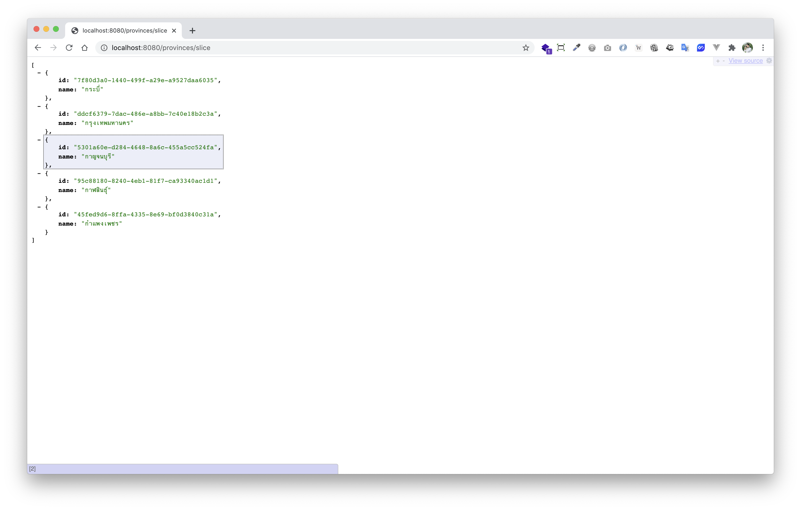

# spring-boot-reactive-r2dbc-pagination

> ตัวอย่างการทำ Pagination สำหรับ Spring-boot Reactive R2DBC (The Reactive Relational Database Connectivity) 


- R2DBC (The Reactive Relational Database Connectivity) เป็น Library/Dependency ฝั่งภาษา Java สำหรับการเขียน Code เพื่อเชื่อมต่อไปยัง Database แบบ Reactive (Non-Block I/O) 
- มี Spring-data รองรับ เพื่อให้สามารถเขียน CRUD และเขียน Query อื่น ๆ ได้ง่ายขึ้น     
- DatabaseClient เป็น Class/Component นึงของ R2DBC เพื่อใช้สำหรับ Query ข้อมูลจาก Database เองแบบ Manual   
- R2dbcEntityTemplate เป็น **Level Up ของ DatabaseClient** ทำให้การ Manual Query ทำได้ง่ายขึ้นไปอีก    
  
เว็บไซต์ 
- [https://r2dbc.io/](https://r2dbc.io/)
- [https://spring.io/projects/spring-data-r2dbc](https://spring.io/projects/spring-data-r2dbc)

# Prerequisites

- เตรียมฐานข้อมูล PostgreSQL ให้พร้อม
- สร้าง schema `app`
- สร้าง table `province` ที่ schema `app` โดยใช้ SQL นี้

```sql
CREATE TABLE "app"."province" (
    "id" UUID NOT NULL,
    "name" varchar(100) NOT NULL,
    PRIMARY KEY ("id")
);
```

จากนั้น Insert ตัวอย่าง Data ดังนี้

```sql
INSERT INTO "app"."province" ("id", "name") VALUES
('0cadedd6-7831-4532-918e-f478a6196cf8', 'ฉะเชิงเทรา'),
('0ea8c575-077d-48f9-9c38-e14e14d122ec', 'ตาก'),
('1568866d-b11a-4f17-8c31-8af0eedb69f8', 'ตรัง'),
('3a1d0094-eaf9-40b7-810f-28b307c4c124', 'ชัยนาท'),
('45d7e268-d497-4c6f-9d64-89e9e48b5cad', 'ชุมพร'),
('45fed9d6-8ffa-4335-8e69-bf0d3840c31a', 'กำแพงเพชร'),
('491adb17-be89-44b6-8ef5-572ef031a8b9', 'ตราด'),
('5301a60e-d284-4648-8a6c-455a5cc524fa', 'กาญจนบุรี'),
('7f80d3a0-1440-499f-a29e-a9527daa6035', 'กระบี่'),
('82e18397-169f-409d-99f0-ac578e210373', 'ชัยภูมิ'),
('8f99bb13-e7c2-426a-8762-f7557aa8f1a2', 'เชียงราย'),
('95c88180-8240-4eb1-81f7-ca93340ac1d1', 'กาฬสินธุ์'),
('a66c85b2-33cf-4b3b-83d1-6066d1c6bcae', 'ชลบุรี'),
('b0133c9e-cf22-49fe-aefa-c8ee0fd941df', 'นครนายก'),
('b2fcb22e-a840-4480-8200-490b5567bb58', 'จันทบุรี'),
('bd333e93-5cbc-47f3-957e-a94269b9451f', 'ขอนแก่น'),
('c6b4a08d-f063-4428-9626-f7f50975f201', 'นครพนม'),
('cb5838bc-9e06-4390-964d-c4ea2b81fc1e', 'เชียงใหม่'),
('d7852952-53bc-41f0-9db1-6a214857db4f', 'นครปฐม'),
('ddcf6379-7dac-486e-a8bb-7c40e18b2c3a', 'กรุงเทพมหานคร');
```

# 1. เพิ่ม Dependencies และ Plugins 

pom.xml 
``` xml
...
<parent>
    <groupId>org.springframework.boot</groupId>
    <artifactId>spring-boot-starter-parent</artifactId>
    <version>2.3.2.RELEASE</version>
</parent>

<dependencies>
    <dependency>
        <groupId>org.springframework.boot</groupId>
        <artifactId>spring-boot-starter-webflux</artifactId>
    </dependency>

    <dependency>
        <groupId>org.projectlombok</groupId>
        <artifactId>lombok</artifactId>
        <scope>provided</scope>
    </dependency>

    <!-- Database ****************************************************** -->
    <dependency>
        <groupId>org.springframework.boot</groupId>
        <artifactId>spring-boot-starter-data-r2dbc</artifactId>
    </dependency>

    <dependency>
        <groupId>io.r2dbc</groupId>
        <artifactId>r2dbc-postgresql</artifactId>
        <scope>runtime</scope>
    </dependency>
    <!-- Database ****************************************************** -->
</dependencies>

<build>
    <plugins>
        <plugin>
            <groupId>org.springframework.boot</groupId>
            <artifactId>spring-boot-maven-plugin</artifactId>
            <executions>        
                <execution>            
                    <id>build-info</id>            
                    <goals>                
                        <goal>build-info</goal>            
                    </goals>        
                    <configuration>                
                        <additionalProperties>                    
                            <java.version>${java.version}</java.version>                                   
                        </additionalProperties>            
                    </configuration>        
                </execution>    
            </executions>
        </plugin>
    </plugins>
</build>
...
```

**คำอธิบาย**

- `r2dbc-postgresql` เป็น dependency r2dbc สำหรับ postgresql 
- `spring-boot-starter-data-r2dbc` เป็น dependency สำหรับใช้ spring-data ร่วมกับ r2dbc 

# 2. เขียน Main Class 

``` java
@SpringBootApplication
@ComponentScan(basePackages = {"me.jittagornp"})
public class AppStarter {

    public static void main(String[] args) {
        SpringApplication.run(AppStarter.class, args);
    }

}
```

# 3. กำหนด Config

classpath:application.properties
```properties
#---------------------------------- Logging ------------------------------------
logging.level.me.jittagornp=DEBUG
logging.level.org.springframework.data.r2dbc=DEBUG

#---------------------------------- R2dbc --------------------------------------
spring.r2dbc.url=r2dbc:postgresql://<DATABASE_HOST_IP>/<DATA_BASE_NAME>?schema=app
spring.r2dbc.username=<DATABASE_USERNAME>
spring.r2dbc.password=<DATABASE_PASSWORD>
```

**หมายเหตุ**

- อย่าลืมแก้ `<DATABASE_HOST_IP>`, `<DATABASE_NAME>`, `<DATABASE_USERNAME>` และ `<DATABASE_PASSWORD>`

# 4. เขียน Config

```java
@Slf4j
@Configuration
public class R2dbcConfig {

    @Bean
    public R2dbcEntityTemplate r2dbcEntityTemplate(final DatabaseClient databaseClient){
        return new R2dbcEntityTemplate(databaseClient);
    }

}
```

# 5. เขียน Entity

> Entity จะเป็นตัว Map ไปยัง Table `app.province`

```java
@Data
@Builder
@Table("app.province")
public class ProvinceEntity {

    //Primary Key
    @Id
    private UUID id;

    private String name;
}
```

**คำอธิบาย**

- Annotation ต่าง ๆ ที่ใช้ ไม่ได้เป็นของ `javax.persistence.*` แต่เป็น Annotation ของ Spring-data เอง 
- ความสามารถของ Annotation จะไม่เท่ากับใน `javax.persistence.*` คือ ไม่สามารถกำหนด length, nullable ไม่สามาถทำ Join ต่าง ๆ ได้ ทำได้อย่างเดียวคือ Mapping Table/Column และกำหนด Primary Key ได้เท่านั้น
- ความสามารถเรื่องการ Join หรือ Constraint ต่าง ๆ จะใช้ Native SQL ทำเป็นหลัก 

เรื่อง Annotation ที่สามารถใช้ได้ ให้ดูจากเอกสารหน้านี้ [https://docs.spring.io/spring-data/r2dbc/docs/1.1.4.RELEASE/reference/html/#mapping.usage.annotations](https://docs.spring.io/spring-data/r2dbc/docs/1.1.4.RELEASE/reference/html/#mapping.usage.annotations)

# 6. เขียน Repository 

ในตัวอย่างนี้ เราจะ Manual Repository เอง
  
ประกาศ interface  
```java
public interface ProvinceRepository {

    Flux<ProvinceEntity> findAllAsSlice(final Query query, final Pageable pageable);

    Mono<Page<ProvinceEntity>> findAllAsPage(final Query query, final Pageable pageable);

}
```

implement interface

```java
@Repository
@RequiredArgsConstructor
public class ProvinceRepositoryImpl implements ProvinceRepository {

    private final R2dbcEntityTemplate r2dbcEntityTemplate;

    @Override
    public Flux<ProvinceEntity> findAllAsSlice(final Query query, final Pageable pageable) {
        final Query q = query
                .offset(pageable.getOffset())
                .limit(pageable.getPageSize())
                .sort(pageable.getSort());
        return r2dbcEntityTemplate.select(q, ProvinceEntity.class);
    }

    @Override
    public Mono<Page<ProvinceEntity>> findAllAsPage(final Query query, final Pageable pageable) {
        final Mono<Long> count = r2dbcEntityTemplate.count(query, ProvinceEntity.class);
        final Flux<ProvinceEntity> slice = findAllAsSlice(query, pageable);
        return Mono.zip(count, slice.buffer().next().defaultIfEmpty(Collections.emptyList()))
                .map(output -> new PageImpl<>(
                        output.getT2(),
                        pageable,
                        output.getT1()
                ));
    }
}
```

**หมายเหตุ**

- จากตัวอย่างด้านบน จะเห็นว่าเราใช้ `R2dbcEntityTemplate` Manual Query เองทั้งหมดเลย 
- บนหัว implmentation (class) แปะด้วย `@Repository` เพื่อบอกว่าอันนี้เป็น repository น่ะ 

# 7. เขียน Controller
``` java
@RestController
@RequestMapping("/provinces")
@RequiredArgsConstructor
public class ProvinceController {

    private final ProvinceRepository provinceRepository;

    @GetMapping("/slice")
    public Flux<ProvinceEntity> findAllAsSlice() {
        final Pageable pageable = SliceRequest.of(
                0,
                5,
                Sort.by(Sort.Order.by("name").with(Sort.Direction.ASC))
        );
        return provinceRepository.findAllAsSlice(Query.empty(), pageable);
    }

    @GetMapping("/page")
    public Mono<Page<ProvinceEntity>> findAllAsPage() {
        final Pageable pageable = PageRequest.of(
                0,
                5,
                Sort.by(Sort.Order.by("name").with(Sort.Direction.ASC))
        );
        return provinceRepository.findAllAsPage(Query.empty(), pageable);
    }

    ...
}
```

**คำอธิบาย**

- จากตัวอย่างเรา Fixed `Pageable` ขึ้นมา เพื่อลอง Query ข้อมูลดู 
- การใช้งานจริง ๆ ให้ส่ง `Pageable` มาจากด้านนอก โดยให้ดูตัวอย่างจาก [spring-boot-reactive-pagination](../spring-boot-reactive-pagination) แล้วประยุกต์ใช้งานเอง  

# 8. Build Code
cd ไปที่ root ของ project จากนั้น  
``` sh
$ mvn clean package
```

# 9. Run 
``` sh 
$ mvn spring-boot:run
```

# 10. ทดสอบด้วย Postman

### Slice

[http://localhost:8008/provinces/slice](http://localhost:8008/provinces/slice)



### Page

[http://localhost:8008/provinces/page](http://localhost:8008/provinces/page)

