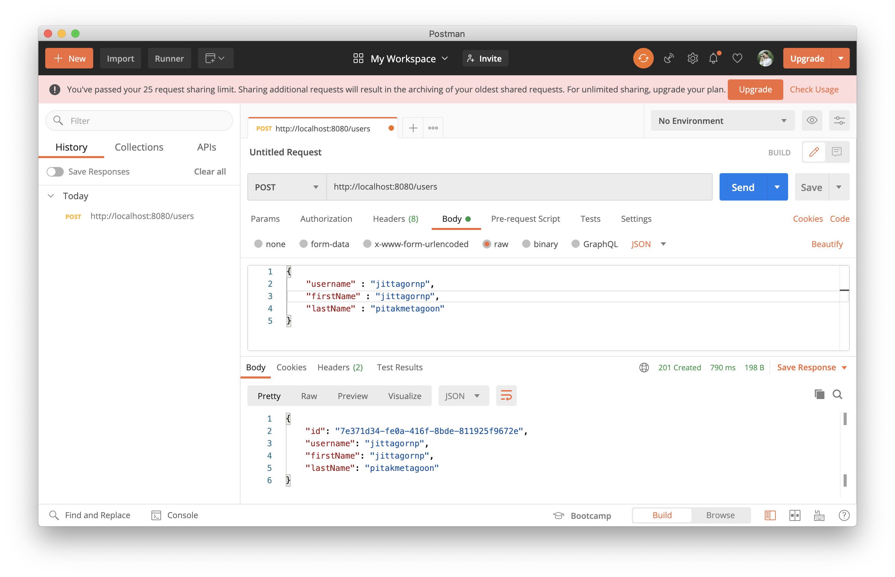
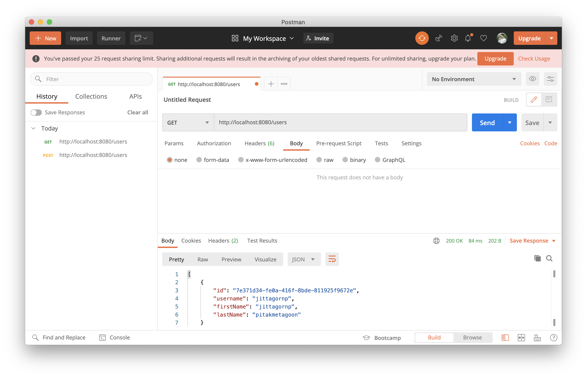
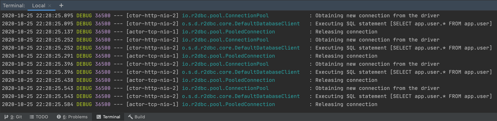
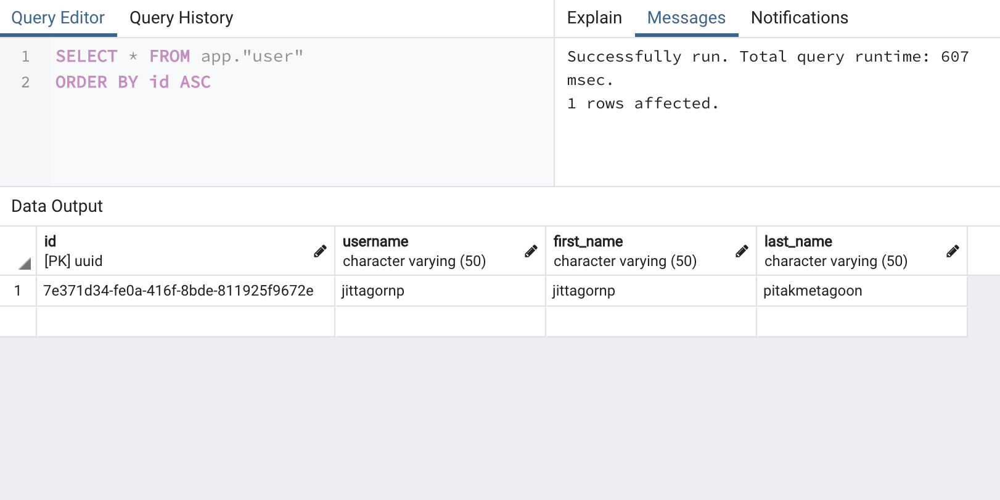

# spring-boot-reactive-r2dbc-pool-postgresql

> ตัวอย่างการเขียน Spring-boot Reactive R2DBC (The Reactive Relational Database Connectivity) Pool + Postgresql


- R2DBC (The Reactive Relational Database Connectivity) เป็น Library/Dependency ฝั่งภาษา Java สำหรับการเขียน Code เพื่อเชื่อมต่อไปยัง Database แบบ Reactive (Non-Block I/O) 
- มี Spring-data รองรับ เพื่อให้สามารถเขียน CRUD และเขียน Query อื่น ๆ ได้ง่ายขึ้น     
- R2DBC-Pool เป็น Dependency สำหรับทำ Connection Pool สำหรับ R2DBC 
- Connection Pool คือการสร้าง Connection ทิ้งไว้ตามจำนวนที่กำหนด แล้ว Reuse ใช้ซ้ำ เพื่อลด Cost ในการสร้าง/ทำลาย หรือ เปิด/ปิด Connection ทุกครั้งที่ใช้งาน เพื่อทำให้ Performance ดีขึ้น
  
เว็บไซต์ 
- [https://r2dbc.io/](https://r2dbc.io/)
- [https://spring.io/projects/spring-data-r2dbc](https://spring.io/projects/spring-data-r2dbc)

# Performance 

- [Performance of relational database drivers. R2DBC vs JDBC](https://technology.amis.nl/2020/03/27/performance-of-relational-database-drivers-r2dbc-vs-jdbc/)

# Prerequisites

- เตรียมฐานข้อมูล PostgreSQL ให้พร้อม
- สร้าง schema `app`
- สร้าง table `user` ที่ schema `app` โดยใช้ SQL นี้

```sql
CREATE TABLE "app"."user" (
    "id" UUID NOT NULL,
    "username" varchar(50) NOT NULL,
    "first_name" varchar(50) NOT NULL,
    "last_name" varchar(50) NOT NULL,
    PRIMARY KEY ("id")
);
```


# 1. เพิ่ม Dependencies และ Plugins 

pom.xml 
``` xml
...
<parent>
    <groupId>org.springframework.boot</groupId>
    <artifactId>spring-boot-starter-parent</artifactId>
    <version>2.3.3.RELEASE</version>
</parent>

<dependencies>
    <dependency>
        <groupId>org.springframework.boot</groupId>
        <artifactId>spring-boot-starter-webflux</artifactId>
    </dependency>

    <dependency>
        <groupId>org.projectlombok</groupId>
        <artifactId>lombok</artifactId>
        <scope>provided</scope>
    </dependency>

    <!-- Database ****************************************************** -->
    <dependency>
        <groupId>org.springframework.boot</groupId>
        <artifactId>spring-boot-starter-data-r2dbc</artifactId>
    </dependency>

    <dependency>
        <groupId>io.r2dbc</groupId>
        <artifactId>r2dbc-postgresql</artifactId>
        <scope>runtime</scope>
    </dependency>

    <dependency>
        <groupId>io.r2dbc</groupId>
        <artifactId>r2dbc-pool</artifactId>
        <version>0.8.5.RELEASE</version>
    </dependency>
    <!-- Database ****************************************************** -->
</dependencies>

<build>
    <plugins>
        <plugin>
            <groupId>org.springframework.boot</groupId>
            <artifactId>spring-boot-maven-plugin</artifactId>
            <executions>        
                <execution>            
                    <id>build-info</id>            
                    <goals>                
                        <goal>build-info</goal>            
                    </goals>        
                    <configuration>                
                        <additionalProperties>                    
                            <java.version>${java.version}</java.version>                                   
                        </additionalProperties>            
                    </configuration>        
                </execution>    
            </executions>
        </plugin>
    </plugins>
</build>
...
```

**คำอธิบาย**

- `r2dbc-postgresql` เป็น dependency r2dbc สำหรับ postgresql 
- `r2dbc-pool` เป็น dependency สำหรับทำ connection pool ให้ r2dbc
- `spring-boot-starter-data-r2dbc` เป็น dependency สำหรับใช้ spring-data ร่วมกับ r2dbc 

**หมายเหตุ**

- spring-boot ที่จะใช้ทำ r2dbc-pool แนะนำให้ใช้ version `2.3.3.RELEASE` เป็นต้นไป เนื่องจากมีการอัพเดทตัว `spring-boot-starter-data-r2dbc` ให้รองรับ configuration ต่าง ๆ ของ r2dbc มากขึ้น

# 2. เขียน Main Class 

``` java
@SpringBootApplication
@ComponentScan(basePackages = {"me.jittagornp"})
public class AppStarter {

    public static void main(String[] args) {
        SpringApplication.run(AppStarter.class, args);
    }

}
```

# 3. กำหนด Config

classpath:application.properties
```properties
#---------------------------------- Logging ------------------------------------
logging.level.me.jittagornp=DEBUG
logging.level.org.springframework.data.r2dbc=DEBUG
logging.level.io.r2dbc.pool=DEBUG

#---------------------------------- R2dbc --------------------------------------
spring.r2dbc.url=r2dbc:pool:postgresql://<DATABASE_HOST_IP>/<DATA_BASE_NAME>?schema=app
spring.r2dbc.username=<DATABASE_USERNAME>
spring.r2dbc.password=<DATABASE_PASSWORD>

# config from https://github.com/r2dbc/r2dbc-pool
spring.r2dbc.pool.initialSize=10
spring.r2dbc.pool.maxSize=100
#30 minutes
spring.r2dbc.pool.maxIdleTime=PT30M
spring.r2dbc.pool.validationQuery=SELECT 1
```

**หมายเหตุ**

- อย่าลืมแก้ `<DATABASE_HOST_IP>`, `<DATABASE_NAME>`, `<DATABASE_USERNAME>` และ `<DATABASE_PASSWORD>`
- สังเกตตรง `spring.r2dbc.url` จะเป็น pool คือ `r2dbc:pool:postgresql://`
- มีการ config pool เพิ่มเติมจาก r2dbc ธรรมดา ๆ

**คำอธิบาย Pool**

- `initialSize=10` คือ กำหนด Connection Pool ตั้งต้น 10 Connections
- `maxSize=100` คือ เมื่อ Connection มีการเพิ่มจำนวน ให้ Maximum สูงสุดได้ 100 Connections 
- `maxIdleTime=PT30M` คือ ถ้าไม่ได้ใช้ Connection ใด ๆ เกิน 30 นาที ให้ทำลาย หรือปิด Connection นั้นทิ้งไป
- `validationQuery=SELECT 1` คือ SQL ที่ใช้ในการ Polling เพื่อให้ Connection นั้นยังมีชีวิต (Alive) อยู่ โดยไม่ถูกปิดไปโดยอัตโนมัติ

Config อื่น ๆ ให้เรียนรู้จาก [https://github.com/r2dbc/r2dbc-pool](https://github.com/r2dbc/r2dbc-pool)

# 4. เขียน Entity

> Entity จะเป็นตัว Map ไปยัง Table `app.user`

```java
@Data
@Builder
@Table("app.user")
public class UserEntity {
    
    //Primary Key
    @Id
    private UUID id;

    private String username;

    @Column("first_name")
    private String firstName;

    @Column("last_name")
    private String lastName;
}
```

**คำอธิบาย**

- Annotation ต่าง ๆ ที่ใช้ ไม่ได้เป็นของ `javax.persistence.*` แต่เป็น Annotation ของ Spring-data เอง 
- ความสามารถของ Annotation จะไม่เท่ากับใน `javax.persistence.*` คือ ไม่สามารถกำหนด length, nullable ไม่สามาถทำ Join ต่าง ๆ ได้ ทำได้อย่างเดียวคือ Mapping Table/Column และกำหนด Primary Key ได้เท่านั้น
- ความสามารถเรื่องการ Join หรือ Constraint ต่าง ๆ จะใช้ Native SQL ทำเป็นหลัก 

เรื่อง Annotation ที่สามารถใช้ได้ ให้ดูจากเอกสารหน้านี้ [https://docs.spring.io/spring-data/r2dbc/docs/1.1.4.RELEASE/reference/html/#mapping.usage.annotations](https://docs.spring.io/spring-data/r2dbc/docs/1.1.4.RELEASE/reference/html/#mapping.usage.annotations)

# 5. เขียน Repository 

เพื่อทำ Default CRUD 
```java
public interface UserRepository extends ReactiveCrudRepository<UserEntity, UUID> {

}
```

# 6. เขียน Controller
``` java
@RestController
@RequestMapping("/users")
@RequiredArgsConstructor
public class UserController {

    private final DatabaseClient databaseClient;

    private final UserRepository userRepository;

    @GetMapping
    public Flux<UserEntity> findAll() {
        return userRepository.findAll();
    }

    @GetMapping("/{id}")
    public Mono<UserEntity> findById(@PathVariable("id") final UUID id) {
        return userRepository.findById(id)
                .switchIfEmpty(Mono.error(new NotFoundException("User id \"" + id.toString() + "\"not found")));
    }

    @ResponseStatus(HttpStatus.CREATED)
    @PostMapping
    public Mono<UserEntity> create(@RequestBody final UserEntity entity) {
        entity.setId(UUID.randomUUID());
        return databaseClient.insert()
                .into(UserEntity.class)
                .using(entity)
                .then()
                .thenReturn(entity);
    }

    @PutMapping("/{id}")
    public Mono<UserEntity> update(@PathVariable("id") final UUID id, @RequestBody final UserEntity entity) {
        return findById(id)
                .flatMap(dbEntity -> {
                    dbEntity.setFirstName(entity.getFirstName());
                    dbEntity.setLastName(entity.getLastName());
                    return userRepository.save(dbEntity);
                });
    }

    @ResponseStatus(HttpStatus.NO_CONTENT)
    @DeleteMapping("/{id}")
    public Mono<Void> deleteById(@PathVariable("id") final UUID id) {
        return findById(id)
                .flatMap(dbEntity -> {
                    return userRepository.deleteById(dbEntity.getId());
                });
    }
}
```

**หมายเหตุ**

- ตอน insert ใช้ `databaseClient` แทน repository เนื่องจาก repository จะไม่สามารถ insert entity ที่มีการ set id ตั้งต้นได้ 

# 7. Build Code
cd ไปที่ root ของ project จากนั้น  
``` sh
$ mvn clean package
```

# 8. Run 
``` sh 
$ mvn spring-boot:run
```

# 9. ทดสอบด้วย Postman

Create User



Get all Users



ตัวอย่าง Console Log ที่ใช้ Pool



Select Users from table 



