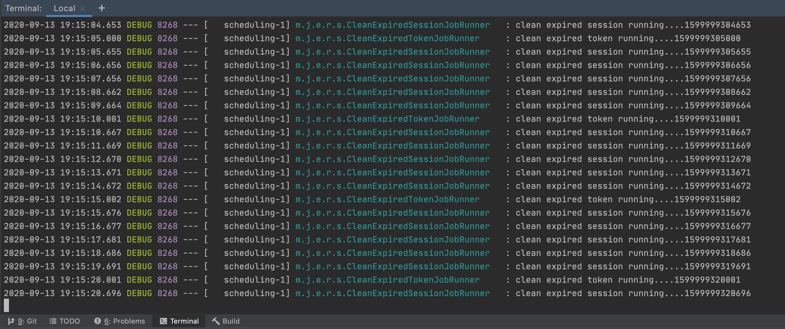

# spring-boot-reactive-scheduling

> ตัวอย่างการเขียน Spring-boot Reactive Scheduling

# 1. เพิ่ม Dependencies และ Plugins

pom.xml 
``` xml
...
<parent>
    <groupId>org.springframework.boot</groupId>
    <artifactId>spring-boot-starter-parent</artifactId>
    <version>2.3.2.RELEASE</version>
</parent>

<dependencies>
    <dependency>
        <groupId>org.springframework.boot</groupId>
        <artifactId>spring-boot-starter-webflux</artifactId>
    </dependency>

    <dependency>
        <groupId>org.projectlombok</groupId>
        <artifactId>lombok</artifactId>
        <scope>provided</scope>
    </dependency>
</dependencies>

<build>
    <plugins>
        <plugin>
            <groupId>org.springframework.boot</groupId>
            <artifactId>spring-boot-maven-plugin</artifactId>
            <executions>
                <execution>
                    <id>build-info</id>
                    <goals>
                        <goal>build-info</goal>
                    </goals>
                    <configuration>
                        <additionalProperties>
                            <java.version>${java.version}</java.version>
                        </additionalProperties>
                    </configuration>
                </execution>
            </executions>
        </plugin>
    </plugins>
</build>
...
```

# 2. เขียน Main Class 

``` java
@SpringBootApplication
@ComponentScan(basePackages = {"me.jittagornp"})
public class AppStarter {

    public static void main(String[] args) {
        SpringApplication.run(AppStarter.class, args);
    }

}
```

# 3. Config Scheduling 
```java 
@Configuration
@EnableScheduling
public class SchedulingConfig {
    
}
```

# 4. เขียน Scheduler หรือ Job Runner 
ประกาศ interface 
```java 
public interface JobRunner {

    void run();

}
```
implement interface
```java 
@Slf4j
@Component
public class CleanExpiredSessionJobRunner implements JobRunner {

    @Override
    @Scheduled(fixedDelay = 1000)
    public void run() {
        log.debug("clean expired session running...." + System.currentTimeMillis());
    }

}
```
หรือ 
```java
@Slf4j
@Component
public class CleanExpiredTokenJobRunner implements JobRunner {

    //cron format 
    //second, minute, hour, day of month, month, day(s) of week
    @Override
    @Scheduled(cron = "*/5 * * * * *") //every 5 seconds
    public void run() {
        log.debug("clean expired token running...." + System.currentTimeMillis());
    }

}
```

- `@Scheduled` เป็น annotation ที่บอกว่าให้ทำ scheduling ที่ method นี้ 
- `fixedDelay = 1000` คือ ให้ทำทุก 1000 millisecond หรือ 1 วินาที 
- `cron = "*/5 * * * * *"` เป็นการเขียน cron expression ให้ทำงานตามที่กำหนด เช่น ทุก 5 วินาที  

cron expressions สามารถอ่านเพิ่มเติมได้ที่ [A Guide To Cron Expressions](https://www.baeldung.com/cron-expressions)  

### ข้อควรระวัง
`fixedDelay` vs `fixedRate`
- fixedDelay ทำงานตามเวลาที่ตั้งไว้ เช่น ทุก 1 วินาที ทุก 5 วินาที หรือ ทุก 10 วินาที ถ้างานที่สั่งให้ทำ มันยังทำไม่เสร็จ  มันจะรอให้งานั้น ๆ เสร็จก่อน แล้วจึงค่อยทำงานถัดไป
- fixedRate จะทำงานคล้าย ๆ fixedDelay แต่จะทำตามเวลาเป๊ะ ๆ เรา fixed ไว้เท่าไหร่มันก็ทำเท่านั้น ไม่รอให้งานก่อนหน้าเสร็จ มันก็ทำต่อ 

# 5. Build
cd ไปที่ root ของ project จากนั้น  
``` shell 
$ mvn clean package
```

# 6. Run 
``` shell 
$ mvn spring-boot:run
```

# 7. ดูผลัพธ์ที่ Console 


