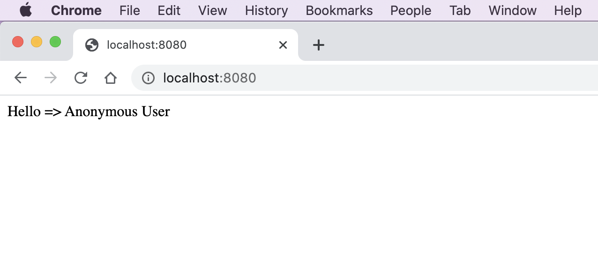
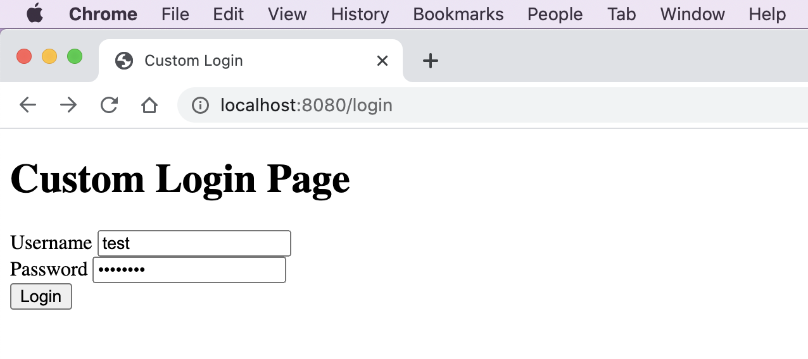
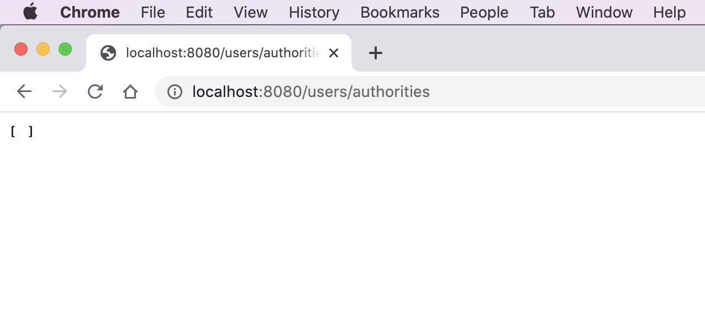
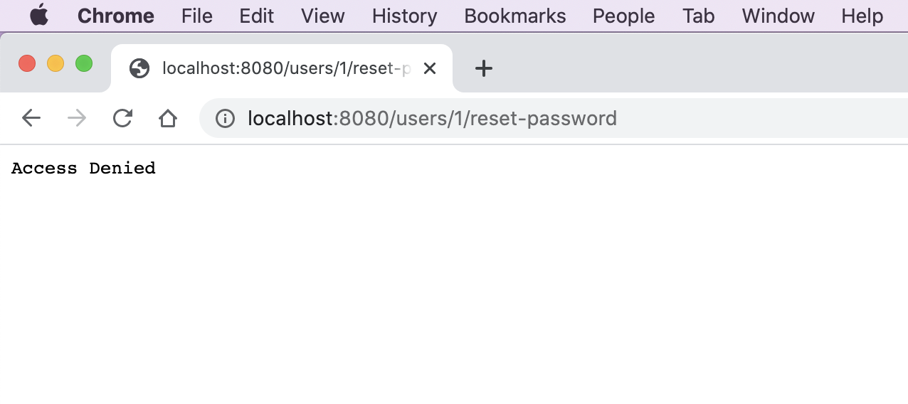
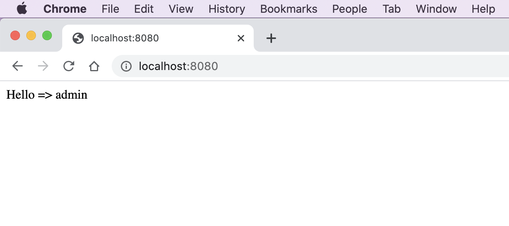
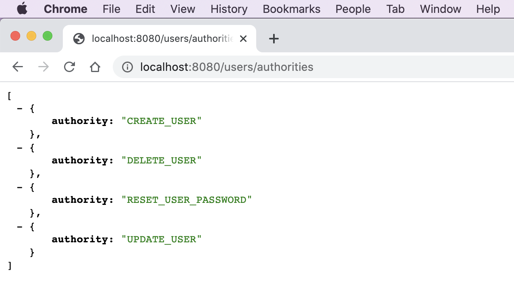
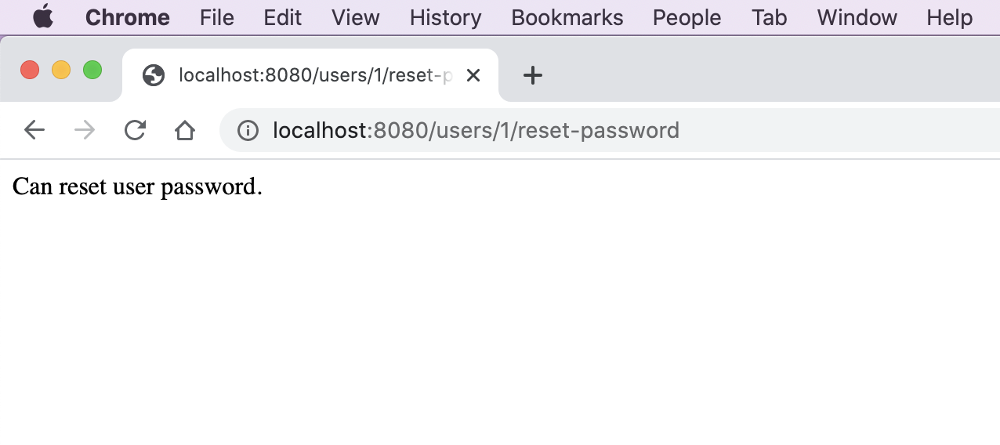

# spring-boot-reactive-security-authority

> ตัวอย่างการเขียน Spring-boot Reactive Security Authority 

# 1. เพิ่ม Dependencies และ Plugins

pom.xml 
``` xml
...
<parent>
    <groupId>org.springframework.boot</groupId>
    <artifactId>spring-boot-starter-parent</artifactId>
    <version>2.3.2.RELEASE</version>
</parent>

<dependencies>
    <dependency>
        <groupId>org.springframework.boot</groupId>
        <artifactId>spring-boot-starter-webflux</artifactId>
    </dependency>

    <dependency>
        <groupId>org.projectlombok</groupId>
        <artifactId>lombok</artifactId>
        <scope>provided</scope>
    </dependency>

    <dependency>
        <groupId>org.springframework.boot</groupId>
        <artifactId>spring-boot-starter-security</artifactId>
    </dependency>

    <dependency>
        <groupId>org.springframework.boot</groupId>
        <artifactId>spring-boot-starter-thymeleaf</artifactId>
    </dependency>
</dependencies>

<build>
    <plugins>
        <plugin>
            <groupId>org.springframework.boot</groupId>
            <artifactId>spring-boot-maven-plugin</artifactId>
            <executions>
                <execution>
                    <id>build-info</id>
                    <goals>
                        <goal>build-info</goal>
                    </goals>
                    <configuration>
                        <additionalProperties>
                            <java.version>${java.version}</java.version>
                        </additionalProperties>
                    </configuration>
                </execution>
            </executions>
        </plugin>
    </plugins>
</build>
...
```
- ในที่นี้เราจะใช้ Thymleaf ทำ View (Server Side) Rendering น่ะครับ  

# 2. เขียน Main Class 

``` java
@SpringBootApplication
@ComponentScan(basePackages = {"me.jittagornp"})
public class AppStarter {

    public static void main(String[] args) {
        SpringApplication.run(AppStarter.class, args);
    }

}
```

# 3. Config Spring-Security 

```java
@Slf4j
@EnableWebFluxSecurity
public class SecurityConfig {

    @Bean
    public SecurityWebFilterChain securityWebFilterChain(final ServerHttpSecurity http) {
        return http
                .csrf().disable()
                .authorizeExchange()
                .pathMatchers("/", "/login", "/logout").permitAll()
                .pathMatchers(HttpMethod.POST, "/users").hasAuthority("CREATE_USER")
                .pathMatchers(HttpMethod.PUT, "/users/{id}").hasAuthority("UPDATE_USER")
                .pathMatchers(HttpMethod.DELETE, "/users", "/users/{id}").hasAuthority("DELETE_USER")
                .pathMatchers(HttpMethod.GET, "/users/{id}/reset-password").hasAuthority("RESET_USER_PASSWORD")
                .anyExchange().authenticated()
                .and()
                .formLogin()
                .loginPage("/login")
                .and()
                .logout()
                .logoutUrl("/logout")
                .requiresLogout(ServerWebExchangeMatchers.pathMatchers(HttpMethod.GET, "/logout"))
                .and()
                .build();
    }

    @Bean
    public ReactiveUserDetailsService reactiveUserDetailsService(final PasswordEncoder passwordEncoder) {
        return username -> {
            log.debug("login with username => {}", username);

            UserDetails user;
            switch (username) {
                case "admin": {
                    user = User.withUsername(username)
                            .password(passwordEncoder.encode("password"))
                            .authorities(
                                    () -> "CREATE_USER",
                                    () -> "UPDATE_USER",
                                    () -> "DELETE_USER",
                                    () -> "RESET_USER_PASSWORD"
                            )
                            .build();
                    break;
                }

                case "supervisor": {
                    user = User.withUsername(username)
                            .password(passwordEncoder.encode("password"))
                            .authorities(
                                    () -> "RESET_USER_PASSWORD"
                            )
                            .build();
                    break;
                }

                default: {
                    user = User.withUsername(username)
                            .password(passwordEncoder.encode("password"))
                            .authorities(Collections.emptyList())
                            .build();
                }
            }

            return Mono.just(user);
        };
    }

    @Bean
    public PasswordEncoder passwordEncoder() {
        return new BCryptPasswordEncoder();
    }

}
```

- จะเหมือนหัวข้อ [spring-boot-reactive-security-custom-login](../spring-boot-reactive-security-custom-login) เพียงแต่มีการเพิ่ม configuration เกี่ยวกับการกำหนดสิทธิ์การเข้าถึง เข้ามา
- ตรง method `reactiveUserDetailsService()` มีการจำลอง user ขึ้นมาเช่น ถ้า login ด้วย username `admin` ให้มีสิทธิ์ `CREATE_USER`, `UPDATE_USER`, `DELETE_USER` และ `RESET_USER_PASSWORD`  

# 4. เขียน Controller
``` java
@RestController
public class HomeController {

    @GetMapping({"", "/"})
    public Mono<String> hello(final Authentication authentication) {
        return Mono.just("Hello => " + (authentication == null ? "Anonymous User" : authentication.getName()));
    }

    @GetMapping("/users/authorities")
    public Flux<GrantedAuthority> getUserAuthorities() {
        return ReactiveSecurityContextHolder.getContext()
                .map(SecurityContext::getAuthentication)
                .map(Authentication::getAuthorities)
                .flatMapMany(Flux::fromIterable);
    }

    @GetMapping("/users")
    public Mono<String> getAllUsers() {
        return Mono.just("Can get all users.");
    }

    @PostMapping("/users")
    public Mono<String> createUser() {
        return Mono.just("Can create user.");
    }

    @PutMapping("/users/{id}")
    public Mono<String> updateUser() {
        return Mono.just("Can update user.");
    }

    @DeleteMapping("/users/{id}")
    public Mono<String> deleteUser() {
        return Mono.just("Can delete user.");
    }

    @DeleteMapping("/users")
    public Mono<String> deleteAllUsers() {
        return Mono.just("Can delete all users.");
    }

    @GetMapping("/users/{id}/reset-password")
    public Mono<String> resetPassword() {
        return Mono.just("Can reset user password.");
    }
}
```

- ทดสอบ login ด้วย username ต่าง ๆ แล้วลองเข้าใช้งาน service ต่าง ๆ ดู หากเข้าไม่ได้ spring จะ return `Access Denied` ซึ่งตรงนี้เราสามารถ customer error เองได้ ให้ดูตัวอย่างจาก [spring-boot-reactive-custom-error-handler](../spring-boot-reactive-custom-error-handler)
- การ Get Current User Login เราสามารถใช้ `ReactiveSecurityContextHolder.getContext()` ได้  

# 5. เขียน Login Controller
```java
@Controller
public class LoginController {
    
    @GetMapping("/login")
    public Mono<String> login(){
        return Mono.just("custom-login");
    }
    
}
```

# 6. เขียน custom-login.html
```html
<!DOCTYPE html>
<html>
    <head>
        <title>Custom Login</title>
        <meta charset="UTF-8">
        <meta name="viewport" content="width=device-width, initial-scale=1.0">
    </head>
    <body>
        <h1>Custom Login Page</h1>
        <form method="post" action="/login">
            <label>Username</label>
            <input name="username" type="text"/>
            <br/>
            <label>Password</label>
            <input name="password" type="password" />
            <br/>
            <button type="submit">Login</button>
        </form>
    </body>
</html>
```

# 7. Config Thymleaf
classpath:application.properties
```properties
#--------------------------------- Thymleaf ------------------------------------
spring.thymeleaf.cache=false
spring.thymeleaf.check-template=true
spring.thymeleaf.check-template-location=true
spring.thymeleaf.content-type=text/html
spring.thymeleaf.enabled=true
spring.thymeleaf.encoding=UTF-8
spring.thymeleaf.mode=HTML5
spring.thymeleaf.prefix=classpath:/static/
spring.thymeleaf.suffix=.html
```

# 8. Build Code
cd ไปที่ root ของ project จากนั้น  
``` shell 
$ mvn clean package
```

# 9. Run 
``` shell 
$ mvn spring-boot:run
```

# 10. เข้าใช้งาน

เปิด browser แล้วเข้า [http://localhost:8080](http://localhost:8080)
  
Login url 
> [http://localhost:8080/login](http://localhost:8080/login)
  
Logout url 
> [http://localhost:8080/logout](http://localhost:8080/logout)
  

### Username/Password สำหรับเข้าใช้งาน

**Admin**    
มีสิทธิ์ทำได้ทุกอย่าง 

- username = admin  
- password = password  

**Supervisor**  
มีสิทธิ์แค่ reset user password

- username = supervisor  
- password = password  

**Other user**  
สิทธิ์ว่าง  
- username = test   
- password = password  

# ทดสอบ 

### ยังไม่ได้ Login 



### Login ด้วย User Test




ดูสิทธิ์การใช้งาน ([http://localhost:8080/users/authorities](http://localhost:8080/users/authorities))



ลอง Reset รหัสผ่าน ([http://localhost:8080/users/1/reset-password](http://localhost:8080/users/1/reset-password)) ปรากฏว่า `Access Denied`



### Login ด้วย User Admin




ดูสิทธิ์การใช้งาน ([http://localhost:8080/users/authorities](http://localhost:8080/users/authorities))



ลอง Reset รหัสผ่าน ([http://localhost:8080/users/1/reset-password](http://localhost:8080/users/1/reset-password)) ปรากฏว่าทำได้ เพราะมีสิทธิ์ `RESET_USER_PASSWORD`

