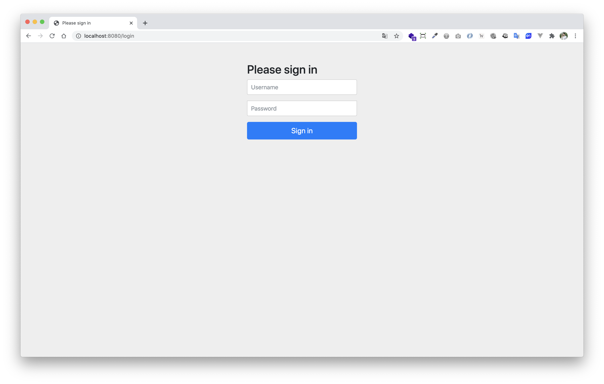
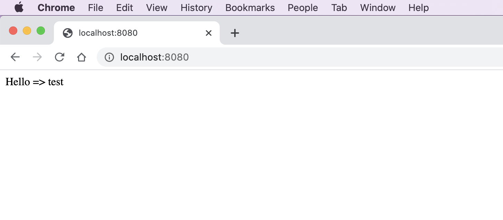

# spring-boot-reactive-security 

> ตัวอย่างการเขียน Spring-boot Reactive Security 


# 1. เพิ่ม Dependencies และ Plugins

pom.xml 
``` xml
...
<parent>
    <groupId>org.springframework.boot</groupId>
    <artifactId>spring-boot-starter-parent</artifactId>
    <version>2.3.2.RELEASE</version>
</parent>

<dependencies>
    <dependency>
        <groupId>org.springframework.boot</groupId>
        <artifactId>spring-boot-starter-webflux</artifactId>
    </dependency>
    
    <dependency>
        <groupId>org.projectlombok</groupId>
        <artifactId>lombok</artifactId>
        <scope>provided</scope>
    </dependency>
    
    <dependency>
        <groupId>org.springframework.boot</groupId>
        <artifactId>spring-boot-starter-security</artifactId>
    </dependency>
</dependencies>

<build>
    <plugins>
        <plugin>
            <groupId>org.springframework.boot</groupId>
            <artifactId>spring-boot-maven-plugin</artifactId>
            <executions>
                <execution>
                    <id>build-info</id>
                    <goals>
                        <goal>build-info</goal>
                    </goals>
                    <configuration>
                        <additionalProperties>
                            <java.version>${java.version}</java.version>
                        </additionalProperties>
                    </configuration>
                </execution>
            </executions>
        </plugin>
    </plugins>
</build>
...
```

**หมายเหตุ**

- `spring-boot-starter-security` เป็น Dependency สำหรับทำ Security เช่น การทำ Login การกำหนดสิทธิ์การเข้าใช้งานต่าง ๆ ในระบบ 

# 2. เขียน Main Class 

``` java
@SpringBootApplication
@ComponentScan(basePackages = {"me.jittagornp"})
public class AppStarter {

    public static void main(String[] args) {
        SpringApplication.run(AppStarter.class, args);
    }

}
```

# 3. Config Spring-Security 

```java
@Slf4j
@EnableWebFluxSecurity
public class SecurityConfig {

    @Bean
    public ReactiveUserDetailsService reactiveUserDetailsService(final PasswordEncoder passwordEncoder) {
        return username -> {
            log.debug("login with username => {}", username);
            return Mono.just(
                    User.withUsername(username)
                            .password(passwordEncoder.encode("password"))
                            .authorities(Collections.emptyList())
                            .build()
            );
        };
    }
    
    @Bean
    public PasswordEncoder passwordEncoder(){
        return new BCryptPasswordEncoder();
    }

}
```

- `@EnableWebFluxSecurity` เป็นการ enable Spring Security 
- Method `passwordEncoder()` เป็นการประกาศใช้ password encoder เป็น `BCryptPasswordEncoder`  
- Method `reactiveUserDetailsService()` เป็นการประกาศ login service ว่าถ้ามีการ login เข้ามาให้ find user จาก username ที่ส่งมาใน service นี้ ซึ่งปกติจะ find จาก database ถ้าไม่เจอ อาจจะ throw error `org.springframework.security.authentication.BadCredentialsException` ออกไป  
- เบื้องต้น สิทธิ์ หรือ authorities กำหนดเป็น empty ไปก่อน `authorities(Collections.emptyList())`

# 4. เขียน Controller
``` java
@RestController
public class HomeController {

    @GetMapping({"", "/"})
    public Mono<String> hello(final Authentication authentication) {
        return Mono.just("Hello => " + authentication.getName());
    }
}
```

**หมายเหตุ**

- `Authentication` คือ ข้อมูลคน Login 

# 5. Build Code 
cd ไปที่ root ของ project จากนั้น  
``` shell 
$ mvn clean package 
```

# 6. Run 
``` shell 
$ mvn spring-boot:run
```

# 7. เข้าใช้งาน

เปิด browser แล้วเข้า [http://localhost:8080](http://localhost:8080)
  
หลังจากนั้นมันจะเด้งเข้าหน้า login (default จาก Spring Security)  
 

 
### Username/Password สำหรับเข้าใช้งาน
- username = test
- password = password  


