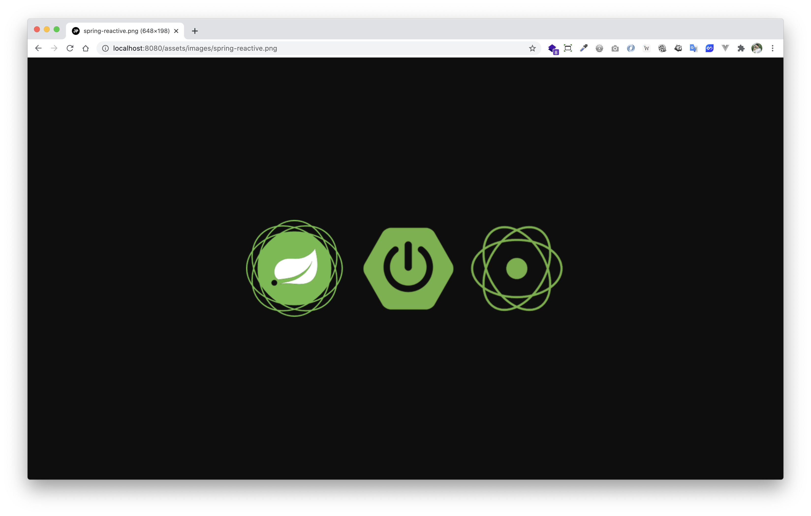

# spring-boot-reactive-static-resources-custom-path

> ตัวอย่างการ Custom Path เพื่อ Get Static Resources จาก Spring-boot Reactive 

# 1. เพิ่ม Dependencies และ Plugins 

pom.xml 
``` xml
...
<parent> 
    <groupId>org.springframework.boot</groupId>
    <artifactId>spring-boot-starter-parent</artifactId>
    <version>2.3.2.RELEASE</version>
</parent>

<dependencies>
    <dependency>
        <groupId>org.springframework.boot</groupId>
        <artifactId>spring-boot-starter-webflux</artifactId>
    </dependency>
</dependencies>

<build>
    <plugins>
        <plugin>
            <groupId>org.springframework.boot</groupId>
            <artifactId>spring-boot-maven-plugin</artifactId>
            <executions>        
                <execution>            
                    <id>build-info</id>            
                    <goals>                
                        <goal>build-info</goal>            
                    </goals>        
                    <configuration>                
                        <additionalProperties>                    
                            <java.version>${java.version}</java.version>                                   
                        </additionalProperties>            
                    </configuration>        
                </execution>    
            </executions>
        </plugin>
    </plugins>
</build>
...
```

# 2. เขียน Main Class 

``` java
@SpringBootApplication
@ComponentScan(basePackages = {"me.jittagornp"})
public class AppStarter {

    public static void main(String[] args) {
        SpringApplication.run(AppStarter.class, args);
    }

}
```

# 3. เขียน Controller (Optional)
``` java
@RestController
public class HomeController {

    @GetMapping({"", "/"})
    public Mono<String> hello() {
        return Mono.just("Hello world.");
    }
}
```

# 4. วาง Static Resource

เอา Static Resources ที่ต้องการไปวางไว้ใน Folder `/src/main/resources/static` เช่น 

```
/src/main/resources/static/images/spring-reactive.png
```

# 5. Config Location

classpath:application.properties

```properties
spring.webflux.static-path-pattern: /assets/**
spring.resources.static-locations: classpath:/static/
```

# 6. Build Code
cd ไปที่ root ของ project จากนั้น  
``` sh
$ mvn clean package
```

# 7. Run 
``` sh 
$ mvn spring-boot:run
```

# 8. เข้าใช้งาน

เปิด browser แล้วเข้า [http://localhost:8080/assets/images/spring-reactive.png](http://localhost:8080/assets/images/spring-reactive.png)

 
