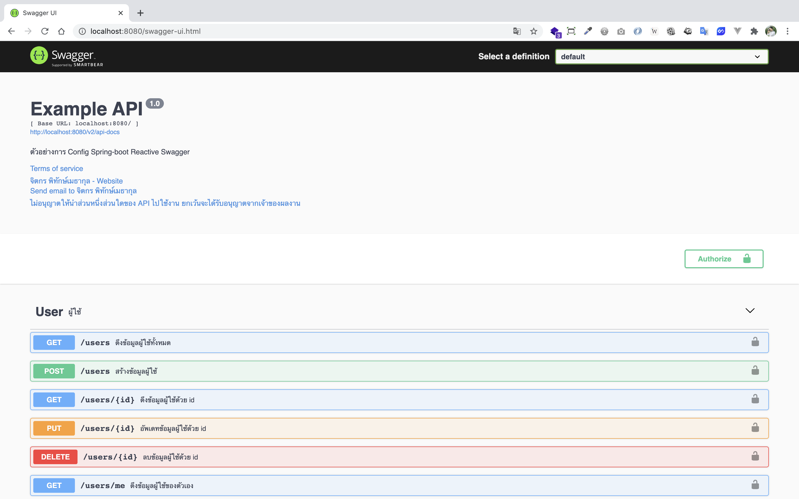

# spring-boot-reactive-swagger

> ตัวอย่างการเขียน Spring-boot Reactive Swagger 


Swagger เป็นเครื่องมือ (Tool) ตัวนึงที่เอามาใช้สำหรับสร้าง API Document 
  
Spring-boot มีความสามารถในการเอา Swagger มาใช้สร้าง Document แบบอัตโนมัติจากการ Scan Annotation ต่าง ๆ ที่เจอใน Project

# 1. เพิ่ม Dependencies และ Plugins

pom.xml 
``` xml
...
<parent>
    <groupId>org.springframework.boot</groupId>
    <artifactId>spring-boot-starter-parent</artifactId>
    <version>2.3.2.RELEASE</version>
</parent>

<dependencies>
    <dependency>
        <groupId>org.springframework.boot</groupId>
        <artifactId>spring-boot-starter-webflux</artifactId>
    </dependency>
    
    <dependency>
        <groupId>org.projectlombok</groupId>
        <artifactId>lombok</artifactId>
        <scope>provided</scope>
    </dependency>

    <!-- Swagger ******************************************************* -->
    <dependency>
        <groupId>io.springfox</groupId>
        <artifactId>springfox-swagger2</artifactId>
        <version>2.10.5</version>
    </dependency>

    <dependency>
        <groupId>io.springfox</groupId>
        <artifactId>springfox-spring-webflux</artifactId>
        <version>2.10.5</version>
    </dependency>

    <dependency>
        <groupId>io.springfox</groupId>
        <artifactId>springfox-swagger-ui</artifactId>
        <version>2.10.5</version>
    </dependency>
    <!-- Swagger ******************************************************* -->
</dependencies>

<build>
    <plugins>
        <plugin>
            <groupId>org.springframework.boot</groupId>
            <artifactId>spring-boot-maven-plugin</artifactId>
            <executions>        
                <execution>            
                    <id>build-info</id>            
                    <goals>                
                        <goal>build-info</goal>            
                    </goals>        
                    <configuration>                
                        <additionalProperties>                    
                            <java.version>${java.version}</java.version>                                   
                        </additionalProperties>            
                    </configuration>        
                </execution>    
            </executions>
        </plugin>
    </plugins>
</build>
...
```

**หมายเหตุ** 

- `lombox` เป็น annotation code generator ตัวนึง
- `springfox-swagger-ui` เป็น Dependency สำหรับสร้างหน้า UI ของ Swagger 
- `springfox-swagger2` เป็น Dependency สำหรับการใช้งาน Swagger (Version 2) ทำหน้าที่ในการแปลง Code ไปเป็น API เพื่อให้หน้า Swagger UI เรียกใช้งาน 
- `springfox-spring-webflux`เป็น Dependency Swagger สำหรับ WebFlux 

# 2. เขียน Main Class 

``` java
@SpringBootApplication
@ComponentScan(basePackages = {"me.jittagornp"})
public class AppStarter {

    public static void main(String[] args) {
        SpringApplication.run(AppStarter.class, args);
    }

}
```

# 3. กำหนด Config

เขียน Swagger Configuration 

```java
@Slf4j
@Configuration
@EnableSwagger2WebFlux
@RequiredArgsConstructor
public class SwaggerConfig {

    private static final String SECURITY_KEY_NAME = "Bearer";

    @Bean
    public Docket docket() {
        return new Docket(DocumentationType.SWAGGER_2)
                .select()
                .apis(RequestHandlerSelectors.any())
                .build()
                .genericModelSubstitutes(Mono.class, Flux.class)
                .useDefaultResponseMessages(false)
                .produces(Arrays.asList("application/json;charset=UTF-8").stream().collect(toSet()))
                .securitySchemes(singletonList(securityScheme()))
                .securityContexts(singletonList(securityContext()))
                .ignoredParameterTypes(ServerWebExchange.class, Resource.class, ResponseEntity.class)
                .apiInfo(apiInfo());
    }
    
    ...
}
```

# 4. เขียน Model 

```java
@Data
@Builder
@ApiModel(value = "User", description = "ผู้ใช้งาน")
public class User {

    @ApiModelProperty(value = "id ผู้ใช้งาน", position = 0)
    private String id;

    @ApiModelProperty(value = "บัญชีผู้ใช้งาน", position = 1)
    private String username;

    @ApiModelProperty(value = "รหัสผ่าน", position = 2)
    private String password;

    @ApiModelProperty(value = "อีเมล", position = 3)
    private String email;

}
```

# 5. เขียน Controller
``` java
@Slf4j
@RestController
@RequestMapping("/users")
@Api(tags = {"User"}, description = "ผู้ใช้")
public class UserController {

    @GetMapping
    @ApiOperation(value = "ดึงข้อมูลผู้ใช้ทั้งหมด")
    public Flux<User> findAll() {
        ...
    }

    @GetMapping("/{id}")
    @ApiOperation(value = "ดึงข้อมูลผู้ใช้ด้วย id")
    public Mono<User> findById(@PathVariable("id") final String id) {
        ...
    }
    
    @PostMapping
    @ResponseStatus(HttpStatus.CREATED)
    @ApiOperation(value = "สร้างข้อมูลผู้ใช้")
    public Mono<User> create(@RequestBody final User user){
        ...
    }
    
    @PutMapping("/{id}")
    @ApiOperation(value = "อัพเดทข้อมูลผู้ใช้ด้วย id")
    public Mono<User> update(@PathVariable("id") final String id, @RequestBody final User user){
        ...
    }

    @DeleteMapping("/{id}")
    @ApiOperation(value = "ลบข้อมูลผู้ใช้ด้วย id")
    @ResponseStatus(HttpStatus.NO_CONTENT)
    public Mono<Void> deleteById(@PathVariable("id") final String id) {
        ...
    }

    @GetMapping("/me")
    @ApiOperation(value = "ดึงข้อมูลผู้ใช้ของตัวเอง")
    public Mono<User> getUser() {
        ...
    }
}
```


# 6. Build Code
cd ไปที่ root ของ project จากนั้น  
``` shell 
$ mvn clean package
```

# 7. Run 
``` shell 
$ mvn spring-boot:run
```

# 8. เข้าใช้งาน

เปิด browser แล้วเข้า 

- [http://localhost:8080/swagger-ui.html](http://localhost:8080/swagger-ui.html)


