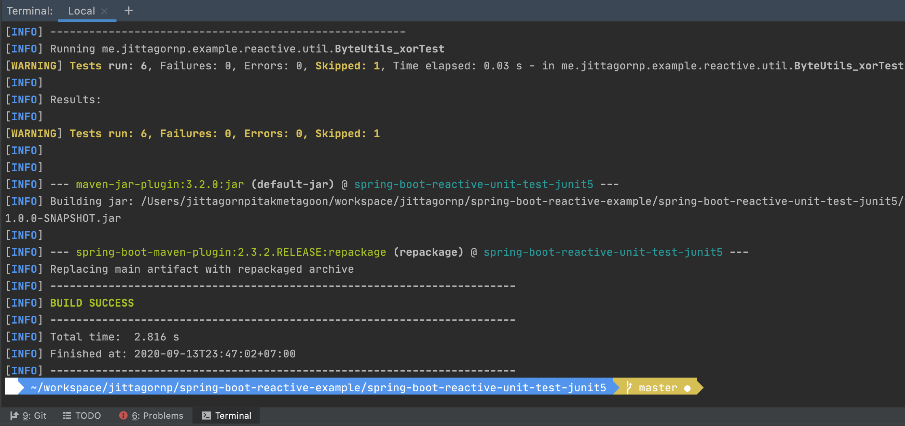

# spring-boot-reactive-unit-test-junit5

> ตัวอย่างการเขียน Spring-boot Reactive Unit Test ด้วย JUnit 5

# 1. เพิ่ม Dependencies และ Plugins

pom.xml 
``` xml
...
<parent>
    <groupId>org.springframework.boot</groupId>
    <artifactId>spring-boot-starter-parent</artifactId>
    <version>2.3.2.RELEASE</version>
</parent>

<dependencies>
    <dependency>
        <groupId>org.springframework.boot</groupId>
        <artifactId>spring-boot-starter-webflux</artifactId>
    </dependency>

    <dependency>
        <groupId>org.junit.jupiter</groupId>
        <artifactId>junit-jupiter</artifactId>
        <scope>test</scope>
    </dependency>

</dependencies>

<build>
    <plugins>
        <plugin>
            <groupId>org.springframework.boot</groupId>
            <artifactId>spring-boot-maven-plugin</artifactId>
            <executions>
                <execution>
                    <id>build-info</id>
                    <goals>
                        <goal>build-info</goal>
                    </goals>
                    <configuration>
                        <additionalProperties>
                            <java.version>${java.version}</java.version>
                        </additionalProperties>
                    </configuration>
                </execution>
            </executions>
        </plugin>
    </plugins>
</build>
...
```
- `junit-jupiter` (JUnit 5) เป็น Dependency สำหรับเขียน test ภาษา java  

# 2. เขียน Main Class 

``` java
@SpringBootApplication
@ComponentScan(basePackages = {"me.jittagornp"})
public class AppStarter {

    public static void main(String[] args) {
        SpringApplication.run(AppStarter.class, args);
    }

}
```

# 3. เขียน Logic 
``` java
public class ByteUtils {

    private ByteUtils() {
        
    }

    ...

}
```

# 4. เขียน Unit Test 
``` java 
public class ByteUtils_xorTest {
    
    /*
     * A | B | answer 
     * --------------
     * 0 | 0 | 0 
     * 0 | 1 | 1 
     * 1 | 0 | 1 
     * 1 | 1 | 0
     */
    @Test
    @DisplayName("Should be 00000000 when all 0")
    public void shouldBe00000000_whenAll0() {
        final byte[] input1 = new byte[]{0, 0, 0, 0, 0, 0, 0, 0};
        final byte[] input2 = new byte[]{0, 0, 0, 0, 0, 0, 0, 0};
        final byte[] output = ByteUtils.xor(input1, input2);
        final byte[] expected = new byte[]{0, 0, 0, 0, 0, 0, 0, 0};
        assertArrayEquals(expected, output);
    }
    
    ...
}
```
# 5. Build
cd ไปที่ root ของ project จากนั้น  
``` shell 
$ mvn clean package
```

# 6. ดูผลลัพธ์ที่ Console 



# อ่านเพิ่มเติม 

- [https://junit.org/junit5/docs/current/user-guide/](https://junit.org/junit5/docs/current/user-guide/)