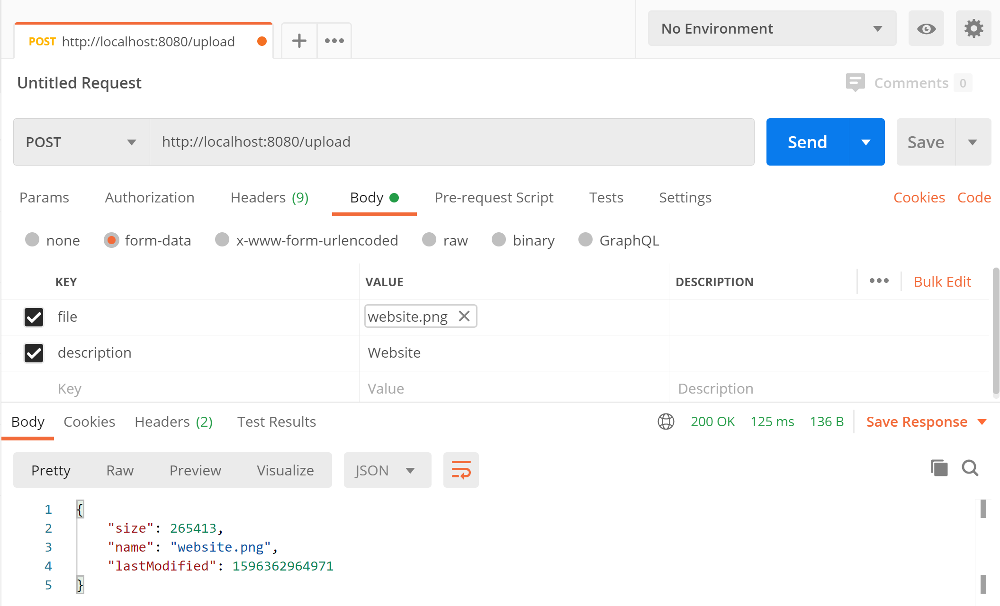

# spring-boot-reactive-upload-file

> ตัวอย่างการเขียน Spring-boot Reactive Upload File 

# 1. เพิ่ม Dependencies และ Plugins

pom.xml 
``` xml
...
<parent>
    <groupId>org.springframework.boot</groupId>
    <artifactId>spring-boot-starter-parent</artifactId>
    <version>2.3.2.RELEASE</version>
</parent>

<dependencies>
    <dependency>
        <groupId>org.springframework.boot</groupId>
        <artifactId>spring-boot-starter-webflux</artifactId>
    </dependency>
    
    <dependency>
        <groupId>org.projectlombok</groupId>
        <artifactId>lombok</artifactId>
        <scope>provided</scope>
    </dependency>
</dependencies>

<build>
    <plugins>
        <plugin>
            <groupId>org.springframework.boot</groupId>
            <artifactId>spring-boot-maven-plugin</artifactId>
            <executions>        
                <execution>            
                    <id>build-info</id>            
                    <goals>                
                        <goal>build-info</goal>            
                    </goals>        
                    <configuration>                
                        <additionalProperties>                    
                            <java.version>${java.version}</java.version>                                   
                        </additionalProperties>            
                    </configuration>        
                </execution>    
            </executions>
        </plugin>
    </plugins>
</build>
...
```

หมายเหตุ lombox เป็น annotation code generator ตัวนึงครับ  

# 2. เขียน Main Class 

``` java
@SpringBootApplication
@ComponentScan(basePackages = {"me.jittagornp"})
public class AppStarter {

    public static void main(String[] args) {
        SpringApplication.run(AppStarter.class, args);
    }

}
```

# 3. เขียน Controller
``` java
@Slf4j
@RestController
public class UploadController {

    private static final String UPLOAD_DIRECTORY = "/temp";

    @GetMapping({"", "/"})
    public Mono<String> hello() {
        return Mono.just("Hello world.");
    }

    @PostMapping(value = "/upload", consumes = MediaType.MULTIPART_FORM_DATA_VALUE)
    public Mono<Map> upload(
            @RequestPart("file") final FilePart filePart,
            final FormData formData
    ) {
        log.debug("formData => {}", formData);
        
        final File directory = new File(UPLOAD_DIRECTORY);
        if(!directory.exists()){
            directory.mkdirs();
        }

        final File file = new File(directory, filePart.filename());

        return filePart
                .transferTo(file)
                .then(Mono.fromCallable(() -> {
                    final Map<String, Object> map = new HashMap<>();
                    map.put("name", file.getName());
                    map.put("lastModified", file.lastModified());
                    map.put("size", file.length());
                    return map;
                }));
    }

    @Data
    public static class FormData {

        private String description;

    }
}
```

# 4. Build Code
cd ไปที่ root ของ project จากนั้น  
``` sh 
$ mvn clean package
```

# 5. Run 
``` sh 
$ mvn spring-boot:run
```

# 6. เข้าใช้งาน

เปิด browser แล้วเข้า [http://localhost:8080](http://localhost:8080)

# ทดสอบ
ทดลอง Upload ผ่าน Postman 


