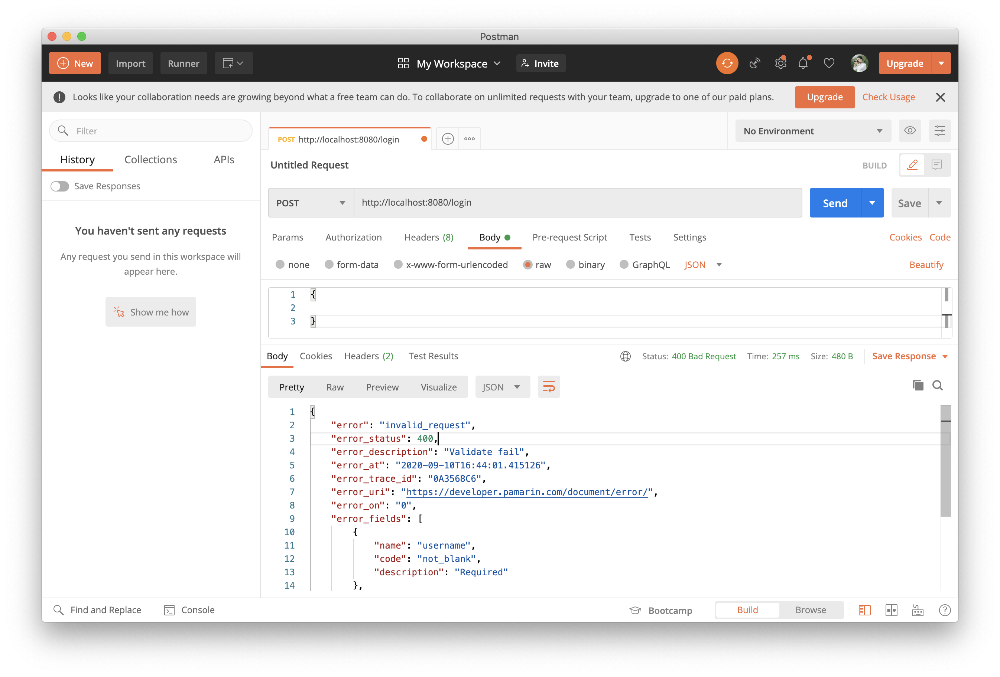

# spring-boot-reactive-validation

> ตัวอย่างการเขียน Spring-boot Reactive Validation 

# 1. เพิ่ม Dependencies และ Plugins

pom.xml 
``` xml
...
<parent>
    <groupId>org.springframework.boot</groupId>
    <artifactId>spring-boot-starter-parent</artifactId>
    <version>2.3.2.RELEASE</version>
</parent>

<dependencies>
    <dependency>
        <groupId>org.springframework.boot</groupId>
        <artifactId>spring-boot-starter-webflux</artifactId>
    </dependency>

    <dependency>
        <groupId>org.springframework.boot</groupId>
        <artifactId>spring-boot-starter-validation</artifactId>
    </dependency>

    <dependency>
        <groupId>org.projectlombok</groupId>
        <artifactId>lombok</artifactId>
        <scope>provided</scope>
    </dependency>

    <dependency>
        <groupId>com.google.guava</groupId>
        <artifactId>guava</artifactId>
        <version>21.0</version>
        <type>jar</type>
    </dependency>


</dependencies>

<build>
    <plugins>
        <plugin>
            <groupId>org.springframework.boot</groupId>
            <artifactId>spring-boot-maven-plugin</artifactId>
            <executions>
                <execution>
                    <id>build-info</id>
                    <goals>
                        <goal>build-info</goal>
                    </goals>
                    <configuration>
                        <additionalProperties>
                            <java.version>${java.version}</java.version>
                        </additionalProperties>
                    </configuration>
                </execution>
            </executions>
        </plugin>
    </plugins>
</build>
...
```

### หมายเหตุ

- `spring-boot-starter-validation` เป็น Dependency สำหรับการทำ Validation (ตั้งแต่ Spring-boot 2.3 RELEASE เป็นต้นไป มีการตัด Validation `javax.validation.*` ออก ต้อง Add Dependencies เข้าไปเอง อ้างอิงจาก [Spring Boot 2.3 Release Notes](https://github.com/spring-projects/spring-boot/wiki/Spring-Boot-2.3-Release-Notes#validation-starter-no-longer-included-in-web-starters))
- `com.google.guava` เป็น Dependency Utilities Codes ของ Google ชื่อ Guava

# 2. เขียน Main Class 

``` java
@SpringBootApplication
@ComponentScan(basePackages = {"me.jittagornp"})
public class AppStarter {

    public static void main(String[] args) {
        SpringApplication.run(AppStarter.class, args);
    }

}
```

# 3. เขียน Model & ใส่ Validator annotation
```java
@Data
public class LoginRequest {

    @NotBlank(message = "Required")
    @Length(max = 50, message = "More than {max} characters")
    private String username;

    @NotBlank(message = "Required")
    @Length(min = 8, max = 50, message = "Must between {min} to {max} characters")
    private String password;

}
```
- @NotBlank คือ ห้ามเป็น null หรือ ค่าว่าง 
- @Length คือ ต้องมีขนาดตามที่ระบุ  

อ่านเพิ่มเติม : [https://beanvalidation.org/](https://beanvalidation.org/)  

# 4. เขียน Controller
``` java
@Slf4j
@RestController
public class LoginController {

    @PostMapping("/login")
    public void login(@RequestBody @Validated LoginRequest req) {
        log.debug("username => {}", req.getUsername());
        log.debug("password => {}", req.getPassword());
    }

}
```
- สังเกตว่าตรง input method ใน controller มี @Validated เพื่อบอกว่าให้ validate input ที่เป็น request body (json) ด้วย   

# 5. เขียน error handler

ตัวจัดการ Error ให้เรียนรู้จากหัวข้อ [spring-boot-reactive-custom-error-handler](../spring-boot-reactive-custom-error-handler)

# 6. เพิ่มตัวจัดการ Error สำหรับ WebExchangeBindException
```java 
@Component
public class ErrorResponseWebExchangeBindExceptionHandler extends ErrorResponseExceptionHandlerAdapter<WebExchangeBindException> {

    private final List<String> standardCodes = Arrays.asList("not_null", "not_blank");

    @Override
    public Class<WebExchangeBindException> getTypeClass() {
        return WebExchangeBindException.class;
    }

    @Override
    protected Mono<ErrorResponse> buildError(final ServerWebExchange exchange, final WebExchangeBindException ex) {
        return Mono.fromCallable(() -> {
            return ErrorResponse.builder()
                    .error("invalid_request")
                    .errorDescription("Validate fail")
                    .errorStatus(HttpStatus.BAD_REQUEST.value())
                    .errorFields(
                            ex.getFieldErrors()
                                    .stream()
                                    .map(f -> {
                                        return ErrorResponse.Field.builder()
                                                .name(f.getField())
                                                .code(replace(f.getCode()))
                                                .description(f.getDefaultMessage())
                                                .build();
                                    })
                                    .collect(toList())
                    )
                    .build();
        });
    }

    private String replace(final String code) {
        final String underscoreCode = CaseFormat.UPPER_CAMEL.to(CaseFormat.LOWER_UNDERSCORE, code);
        for (String standardCode : standardCodes) {
            if (!underscoreCode.equals(standardCode) && underscoreCode.endsWith(standardCode)) {
                final int index = underscoreCode.indexOf(standardCode);
                return underscoreCode.substring(index);
            }
        }
        return underscoreCode;
    }

}
```

# 7. Build
cd ไปที่ root ของ project จากนั้น  
``` shell 
$ mvn clean package
```

# 8. Run 
``` shell 
$ mvn spring-boot:run
```

# 9. เข้าใช้งาน

เปิด browser แล้วเข้า [http://localhost:8080](http://localhost:8080)

# 10. ลองยิง request ทดสอบผ่าน postman
> POST : http://localhost:8080/login  
  
ได้ผลลัพธ์
```json
{
    "error": "invalid_request",
    "error_status": 400,
    "error_description": "Validate fail",
    "error_at": "2020-09-10T16:44:01.415126",
    "error_trace_id": "0A3568C6",
    "error_uri": "https://developer.pamarin.com/document/error/",
    "error_on": "0",
    "error_fields": [
        {
            "name": "username",
            "code": "not_blank",
            "description": "Required"
        },
        {
            "name": "password",
            "code": "not_blank",
            "description": "Required"
        }
    ],
    "error_data": {},
    "state": null
}
```


