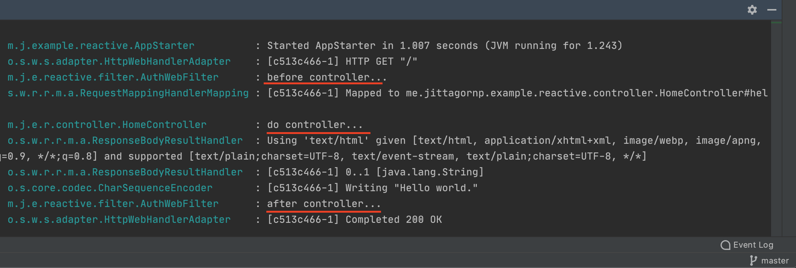

# spring-boot-reactive-web-filter
ตัวอย่างการเขียน Spring-boot Reactive Web Filter 

# 1. เพิ่ม Dependencies และ Plugins

pom.xml 
``` xml
...
<parent>
    <groupId>org.springframework.boot</groupId>
    <artifactId>spring-boot-starter-parent</artifactId>
    <version>2.3.2.RELEASE</version>
</parent>

<dependencies>
    <dependency>
        <groupId>org.springframework.boot</groupId>
        <artifactId>spring-boot-starter-webflux</artifactId>
    </dependency>

    <dependency>
        <groupId>org.projectlombok</groupId>
        <artifactId>lombok</artifactId>
        <scope>provided</scope>
    </dependency>
</dependencies>

<build>
    <plugins>
        <plugin>
            <groupId>org.springframework.boot</groupId>
            <artifactId>spring-boot-maven-plugin</artifactId>
            <executions>
                <execution>
                    <id>build-info</id>
                    <goals>
                        <goal>build-info</goal>
                    </goals>
                    <configuration>
                        <additionalProperties>
                            <java.version>${java.version}</java.version>
                        </additionalProperties>
                    </configuration>
                </execution>
            </executions>
        </plugin>
    </plugins>
</build>
...
```

# 2. เขียน Main Class 

``` java
@SpringBootApplication
@ComponentScan(basePackages = {"me.jittagornp"})
public class AppStarter {

    public static void main(String[] args) {
        SpringApplication.run(AppStarter.class, args);
    }

}
```

# 3. เขียน Controller
``` java
@Slf4j
@RestController
public class HomeController {

    @GetMapping({"", "/"})
    public Mono<String> hello() {
       log.debug("do controller...");
        return Mono.just("Hello world.");
    }

}
```

# 4. เขียน WebFilter   
``` java
@Slf4j
@Component
@Order(Ordered.HIGHEST_PRECEDENCE)
public class AuthWebFilter implements WebFilter {

    @Override
    public Mono<Void> filter(ServerWebExchange exchange, WebFilterChain chain) {
        log.debug("before controller...");
        return chain.filter(exchange)
                .then(Mono.fromRunnable(() -> {
                    log.debug("after controller...");
                }));
    }

}
```

# 5. Build
cd ไปที่ root ของ project จากนั้น  
``` shell 
$ mvn clean package
```

# 6. Run 
``` shell 
$ mvn spring-boot:run
```

# 7. เข้าใช้งาน

เปิด browser แล้วเข้า [http://localhost:8080](http://localhost:8080)

# ผลลัพธ์

