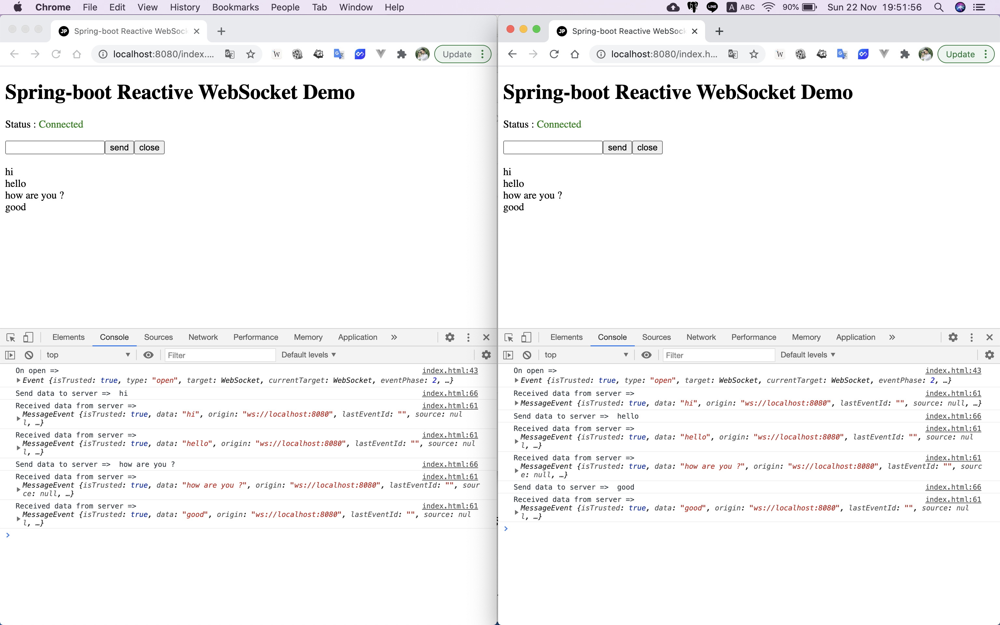
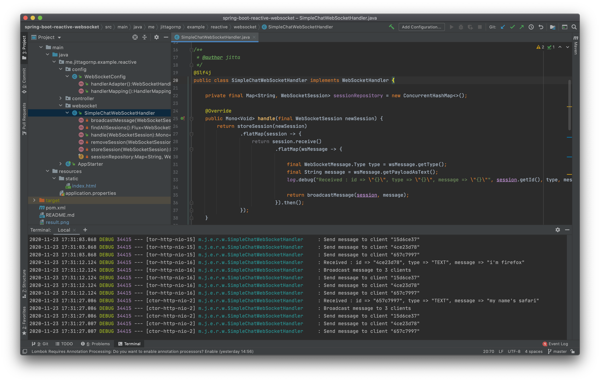

# spring-boot-reactive-websocket

> ตัวอย่างการเขียน Spring-boot Reactive WebSocket


# Prerequisites

- มีความรู้เรื่อง WebSocket เข้าใจการทำงานของ WebSocket ว่าทำงานยังไง ตั้งแต่การ Handshake เพื่อทำการ Upgrade Protocol ไปจนถึงการส่งข้อมูลระหว่าง Client และ Server 
- สามารถทำความเข้าใจการทำงานของ WebSocket ได้ที่ [WebSocket คืออะไร ทำงานยังไง (อธิบายแบบละเอียด)](https://www.jittagornp.me/blog/what-is-websocket/)

# 1. เพิ่ม Dependencies และ Plugins

```xml
...
<parent>
    <groupId>org.springframework.boot</groupId>
    <artifactId>spring-boot-starter-parent</artifactId>
    <version>2.3.2.RELEASE</version>
</parent>

<dependencies>
    <dependency>
        <groupId>org.springframework.boot</groupId>
        <artifactId>spring-boot-starter-webflux</artifactId>
    </dependency>

    <dependency>
        <groupId>org.projectlombok</groupId>
        <artifactId>lombok</artifactId>
        <scope>provided</scope>
    </dependency>
</dependencies>

<build>
    <plugins>
        <plugin>
            <groupId>org.springframework.boot</groupId>
            <artifactId>spring-boot-maven-plugin</artifactId>
            <executions>
                <execution>
                    <id>build-info</id>
                    <goals>
                        <goal>build-info</goal>
                    </goals>
                    <configuration>
                        <additionalProperties>
                            <java.version>${java.version}</java.version>
                        </additionalProperties>
                    </configuration>
                </execution>
            </executions>
        </plugin>
    </plugins>
</build>
...
```

# 2. เขียน Main Class

```java
@SpringBootApplication
@ComponentScan(basePackages = {"me.jittagornp"})
public class AppStarter {

    public static void main(String[] args) {
        SpringApplication.run(AppStarter.class, args);
    }

}
```

# 3. เขียน WebSocketHandler 

เพื่อใช้สำหรับจัดการ Session Request และ Response สำหรับ WebSocket  
   
ในที่นี้เราจะเขียนเป็น `SimpleChatWebSocketHandler` ง่าย ๆ คือ  
เมื่อมีคนส่ง Message เข้ามายัง Handler เราจะ Broadcast Message นั้น ๆ ไปให้ทุกคนที่ Connect เข้ามายัง Endpoint นี้ 

```java
@Slf4j
public class SimpleChatWebSocketHandler implements WebSocketHandler {

    private final Map<String, WebSocketSession> sessionRepository = new ConcurrentHashMap<>();

    @Override
    public Mono<Void> handle(final WebSocketSession newSession) {
        return storeSession(newSession)
                .flatMap(session -> {
                    return session.receive()
                            .flatMap(wsMessage -> {

                                final WebSocketMessage.Type type = wsMessage.getType();
                                final String message = wsMessage.getPayloadAsText();
                                log.debug("Received : id => \"{}\", type => \"{}\", message => \"{}\"", session.getId(), type, message);

                                return broadcastMessage(session, message);
                            }).then();
                });
    }
   
    ...
}
```

**คำอธิบาย**

- ถ้ามี Session ใหม่ Join เข้ามา จะมีการ Call method 

```java
public Mono<Void> handle(final WebSocketSession newSession)
```
- จากนั้นทำการจัดเก็บ `session` ไว้ ที่ method 

```java
return storeSession(newSession)
```

- เมื่อมีการส่ง Message เข้ามา จะมีการ Call method 

```java
return session.receive()
        .flatMap(wsMessage -> {

            ...
            
        })
```

- จากนั้นทำการ Broadcast Message ไปยังทุก ๆ session ที่ join เข้ามา

```java
final WebSocketMessage.Type type = wsMessage.getType();
final String message = wsMessage.getPayloadAsText();
log.debug("Received : id => \"{}\", type => \"{}\", message => \"{}\"", session.getId(), type, message);

return broadcastMessage(session, message);
```

# 4. เขียน WebSocket Config

เพื่อทำการ Map URL (Endpoint) และเรียกใช้งาน WebSocketHandler ที่เขียนไว้ 

```java
@Configuration
public class WebSocketConfig {

    @Bean
    public HandlerMapping handlerMapping() {
        final Map<String, WebSocketHandler> urlMap = new HashMap<>();
        urlMap.put("/chat", new SimpleChatWebSocketHandler());
        final int order = -1; // before annotated controllers
        return new SimpleUrlHandlerMapping(urlMap, order);
    }

    @Bean
    public WebSocketHandlerAdapter handlerAdapter() {
        return new WebSocketHandlerAdapter();
    }

}
```

# 5. เขียน WebSocket Client 

เป็น HTML ไฟล์ ที่ประกอบไปด้วย JavaScript ที่ทำงานเป็น WebSocket Client 
  
index.html
```js
...
const scheme = /^(https).*/ig.test(location.protocol) ? "wss" : "ws";
const host = location.host;
const url = scheme + "://" + host + "/chat";
const socket = new WebSocket(url);

socket.addEventListener("open", function (event) {
    console.log("On open => ", event);
    status.innerText = "Connected";
    status.className = "status status-connected";
});

socket.addEventListener("close", function (event) {
    console.log("On close => ", event);
    status.innerText = "Closed";
    status.className = "status status-closed";
});

socket.addEventListener("error", function (event) {
    console.log("On error => ", event);
    status.innerText = "Error";
    status.className = "status status-error";
});

socket.addEventListener("message", function (event) {
    console.log("Received data from server => ", event);
    output.innerHTML = output.innerHTML + "<br/>" + event.data;
});

sendButton.addEventListener("click", function () {
    console.log("Send data to server => ", input.value);
    socket.send(input.value);
    input.value = "";
});

closeButton.addEventListener("click", function () {
    console.log("Close connection");
    socket.close();
});
...
```

**คำอธิบาย**
  
- การเชื่อมต่อ 
```js
const scheme = /^(https).*/ig.test(location.protocol) ? "wss" : "ws";
const host = location.host;
const url = scheme + "://" + host + "/chat";
const socket = new WebSocket(url);
``` 
เป็นการเชื่อมต่อไปยัง Endpoint ที่กำหนดไว้ ในที่นี้จะใช้ scheme เป็น `ws` (Not Secure)   
ถ้ามีการปรับเป็นแบบ Secure จะใช้ `wss` อารมณ์คล้าย ๆ `http` กับ `https`

- เมื่อเชื่อมต่อสำเร็จ

จะมีการ Call มาที่ Function นี้
```js
socket.addEventListener("open", function (event) {
    ...
});
```

- เมื่อมีการปิด Connection

จะมีการ Call มาที่ Function นี้
```js
socket.addEventListener("close", function (event) {
    ...
});
```

- เมื่อ Error   

จะมีการ Call มาที่ Function นี้
```js
socket.addEventListener("error", function (event) {
    ...
});
```

- การส่งข้อมูลไปยัง Server

จะใช้

```js
socket.send(message);
```

- การปิด Connection 

จะใช้ 
 
```js
socket.close();
``` 
 
# 6. Build Code

cd ไปที่ root ของ project จากนั้น

```sh
$ mvn clean package
```

# 7. Run

```sh
$ mvn spring-boot:run
```

# 8. เข้าใช้งาน 

> http://localhost:8080/index.html 

ลองเปิดจากหลาย ๆ Browser แล้วลองส่งข้อความ (Chat) หากันดู  
ข้อความแต่ละ Browser จะขึ้นเป็น Realtime ตามการทำงานของ WebSocket  

Output



Console


