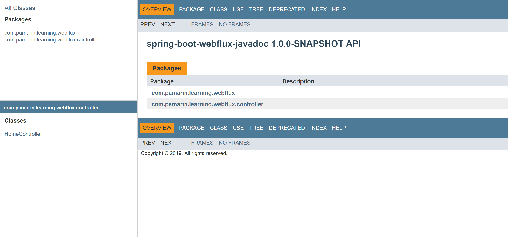

# spring-boot-webflux-javadoc
ตัวอย่างการเขียน Spring-boot WebFlux Java Document 

# เอกสารเพิ่มเติม
- [javadoc - The Java API Documentation Generator](https://docs.oracle.com/javase/7/docs/technotes/tools/windows/javadoc.html)
- [Apache Maven Javadoc Plugin](https://maven.apache.org/plugins/maven-javadoc-plugin/index.html)

ขั้นตอนสั้น ๆ เลย ให้

# 1.1 Generate Java Document 

ไปที่ root ของ project แล้ว run คำสั่ง  
```shell
$ mvn javadoc:javadoc 
```

แต่ถ้าต้องการ custom stylesheet (css) ด้วย ให้ทำดังนี้ 

# 2.1 Config Plugin

pom.xml 
``` xml
<build>
    <plugins>
        <plugin>
            <groupId>org.apache.maven.plugins</groupId>
            <artifactId>maven-javadoc-plugin</artifactId>
            <version>3.1.1</version>
            <configuration>
                <stylesheetfile>src/main/javadoc/stylesheet.css</stylesheetfile>
            </configuration>
        </plugin>
        ...
        ...
    </plugins>
</build>
```

# 2.2 Custom stylesheet.css 

วางไฟล์ไว้ที่ `src/main/javadoc/stylesheet.css`  

# 2.3 Generate Java Document 

ไปที่ root ของ project แล้ว run คำสั่ง  
```shell
$ mvn javadoc:javadoc 
```

# 2.4 ดูผลลัพธ์ 

ไฟล์ java doc จะเป็น /target/site/apidocs/index.html 

 
