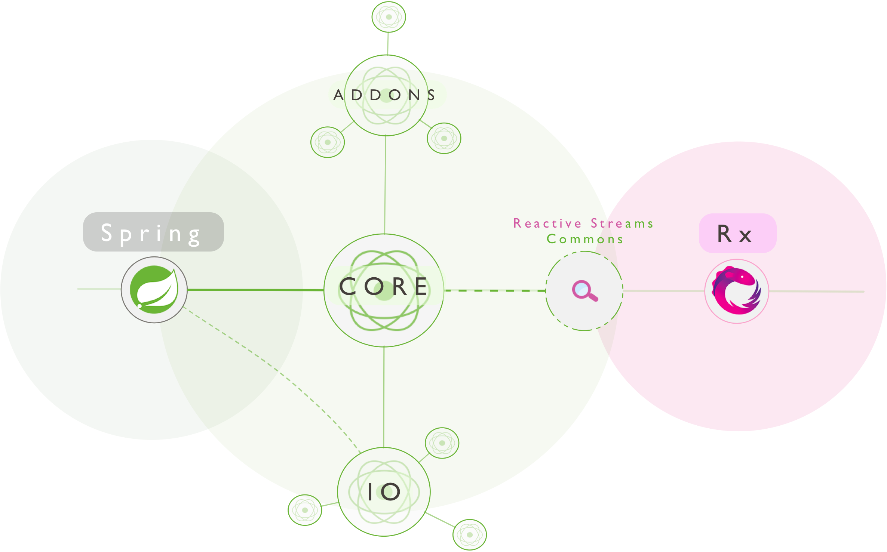

# ตัวอย่างการเขียน Reactor 

> [https://projectreactor.io](https://projectreactor.io)    

 
  
# API

> [https://projectreactor.io/docs/core/release/api/](https://projectreactor.io/docs/core/release/api/)

Reactor เป็น library สำหรับเขียน Reactive เหมือนกันกับ Rx (Reactive Extension) ที่ทาง Microsoft สร้างขึ้นมา [http://reactivex.io/](http://reactivex.io/)  
ซึ่ง implements  ตาม Spec ของ Reactive Streams [https://www.reactive-streams.org/](https://www.reactive-streams.org/)   
ใช้เป็น Core ในการเขียน Spring-boot WebFlux ซึ่งเป็นการเขียน Spring-boot แบบ Non-Blocking I/O   
การใช้ Reactor จะมี 2 ส่วนหลัก ๆ ที่ต้องทำความเข้าใจ คือ 
- `Mono` เป็น Publisher สำหรับปล่อย (publish) ข้อมูลตั้งแต่ 0 ถึง 1 element และ 
- `Flux` เป็น Publisher สำหรับปล่อย (publish) ข้อมูลตั้งแต่ 0 ถึง N elements 
  
พื้นฐานการใช้ Reactor จะเหมือนกันกับ RxJava ฉะนั้นสามารถอ่าน Concept ต่าง ๆ แทนกันได้ โดยอ่านได้จากบทความนี้ [RxJava series - part 1 - ตอน อะไรเอ่ย ReactiveX?](https://medium.com/@nutron/what-is-reactivex-38293abb81cb) ขอบคุณเจ้าของบทความครับ  

# บทความอื่น ๆ
- [https://projectreactor.io/learn](https://projectreactor.io/learn)
- [Reactive systems using Reactor](https://musigma.blog/2016/11/21/reactor.html)
- [Reactor by Example](https://www.infoq.com/articles/reactor-by-example/) 
- [ข้อควรระวังในการใช้งาน](#ข้อควรระวัง-warning)

# Flow

Reactor `Mono` และ `Flux` จะมี Flow การทำงานตามลำดับเป็นดังนี้ 

### Mono Flow

```java
@Slf4j
public class MonoFlowExample {

    public static void main(String[] args) {
        Mono.just("A")
                .doFirst(() -> log.debug("doFirst..."))
                .doOnRequest(value -> log.debug("doOnRequest... {}", value))
                .doOnEach(signal -> log.debug("doOnEach... {} : value => {}", signal.getType().name(), signal.get()))
                .doOnNext(value -> log.debug("doOnNext... {}", value))
                .doOnCancel(() -> log.debug("doOnCacel..."))
                .doOnError(e -> log.debug("doOnError... {}", e.getMessage()))
                .doOnSuccess(value -> log.debug("doOnSuccess... {}", value))
                .doOnSuccessOrError((value, e) -> log.debug("doOnSuccessOrError... {} or {}", value, (e == null ? null : e.getMessage())))
                .doAfterSuccessOrError((value, e) -> log.debug("doAfterSuccessOrError... {} or {}", value, (e == null ? null : e.getMessage())))
                .doAfterTerminate(() -> log.debug("doAfterTerminate..."))
                .doOnTerminate(() -> log.debug("doOnTerminate..."))
                .doOnSubscribe(subscription -> {
                    long id = 1234567890;
                    subscription.request(id);
                    log.debug("doOnSubscribe... {}", id);
                })
                .doFinally(signalType -> log.debug("doFinally... {}", signalType.toString()))
                .doOnDiscard(Object.class, value -> log.debug("doOnDiscard... {}", value))
                .subscribe();
    }

}
```
output  
```
- doFirst...  
- doOnRequest... 1234567890  
- doOnEach... ON_NEXT : value => A  
- doOnEach... ON_COMPLETE : value => null  
- doOnNext... A  
- doOnSuccess... A  
- doOnSuccessOrError... A or null  
- doAfterTerminate...  
- doAfterSuccessOrError... A or null  
- doOnTerminate...  
- doFinally... onComplete  
- doOnSubscribe... 1234567890  
- doOnCacel...  
```

### Flux Flow

```java
@Slf4j
public class FluxFlowExample {

    public static void main(String[] args) {
        Flux.just("A", "B", "C")
                .doFirst(() -> log.debug("doFirst..."))
                .doOnRequest(value -> log.debug("doOnRequest... {}", value))
                .doOnEach(signal -> log.debug("doOnEach... {} : value => {}", signal.getType().name(), signal.get()))
                .doOnNext(value -> log.debug("doOnNext... {}", value))
                .doOnCancel(() -> log.debug("doOnCacel..."))
                .doOnError(e -> log.debug("doOnError... {}", e.getMessage()))
                .doOnComplete(() -> log.debug("doOnComplete..."))
                .doAfterTerminate(() -> log.debug("doAfterTerminate..."))
                .doOnTerminate(() -> log.debug("doOnTerminate..."))
                .doOnSubscribe(subscription -> {
                    long id = 123456890;
                    subscription.request(id);
                    log.debug("doOnSubscribe... {}", id);
                })
                .doFinally(signalType -> log.debug("doFinally... {}", signalType.toString()))
                .doOnDiscard(Object.class, value -> log.debug("doOnDiscard... {}", value))
                .subscribe();
    }

}
```
output
```
- doFirst...  
- doOnRequest... 123456890  
- doOnNext... A  
- doOnEach... ON_NEXT : value => A  
- doOnNext... B  
- doOnEach... ON_NEXT : value => B  
- doOnNext... C  
- doOnEach... ON_NEXT : value => C  
- doOnEach... ON_COMPLETE : value => null  
- doOnComplete...  
- doOnTerminate...  
- doFinally... onComplete  
- doAfterTerminate...  
- doOnSubscribe... 123456890    
- doOnCacel...  
```

# Table of Content 
- [Mono](#mono)
  - [Mono.never](#mononever)
  - [Mono.empty](#monoempty)
  - [Mono.just](#monojust)
  - [Mono.log](#monolog)
  - [Mono.justOrEmpty](#monojustorempty)
  - [Mono.defaultIfEmpty](#monodefaultifempty)
  - [Mono.switchIfEmpty](#monoswitchifempty)
  - [Mono.error](#monoerror)
  - [Mono.map](#monomap)
  - [Mono.filter](#monofilter)
  - [Mono.fromCallable](#monofromcallable)
  - [Mono.defer](#monodefer)
  - [Mono.create](#monocreate)
  - [Mono.flatMap](#monoflatmap)
  - [Mono.zip](#monozip)
  - [Mono.block](#monoblock)
  - [Mono.cache](#monocache)
  - [Mono.flux](#monoflux)
  - [Mono.then](#monothen)
  - [Mono.concatWith](#monoconcatwith)
  - [Mono.timeout](#monotimeout)
  - [Mono.filterWhen](#monofilterwhen)
  - [Mono.onErrorResume](#monoonerrorresume)
- [Flux](#flux)
  - [Flux.just](#fluxjust)
  - [Flux.fromIterable](#fluxfromiterable)
  - [Flux.fromStream](#fluxfromstream)
  - [Flux.range](#fluxrange)
  - [Flux.defaultIfEmpty](#fluxdefaultifempty)
  - [Flux.switchIfEmpty](#fluxswitchifempty)
  - [Flux.error](#fluxerror)
  - [Flux.concat](#fluxconcat)
  - [Flux.create](#fluxcreate)
  - [Flux.generate](#fluxgenerate)
  - [Flux.count](#fluxcount)
  - [Flux.repeat](#fluxrepeat)
  - [Flux.collectList](#fluxcollectlist)
  - [Flux.collectMap](#fluxcollectmap)
  - [Flux.skip](#fluxskip)
  - [Flux.take](#fluxtake)
  - [Flux.all](#fluxall)
  - [Flux.any](#fluxany)
  - [Flux.filter](#fluxfilter)
  - [Flux.map](#fluxmap)
  - [Flux.buffer](#fluxbuffer)
  - [Flux.sample](#fluxsample)
  - [Flux.distinct](#fluxdistinct)
  - [Flux.sort](#fluxsort)
  - [Flux.zip](#fluxzip)
  - [Flux.zipWith](#fluxzipwith)
  - [Flux.concatWithValues](#fluxconcatwithvalues)
  - [Flux.groupBy](#fluxgroupby)
  - [Flux.hasElement](#fluxhaselement)
  - [Flux.flatMap](#fluxflatmap)
  - [Flux.mergeWith](#fluxmergewith)

# Mono
ตัวอย่างการใช้ Mono 

### Mono.never 
> Return a `Mono` that will never signal any data, error or completion signal, essentially running indefinitely.  
  
จะไม่มีการปล่อยข้อมูลออกมา 
```java
@Slf4j
public class MonoNeverExample {

    public static void main(String[] args) {
        Mono.never()
                .doOnNext(message -> {
                    log.debug("message => {}", message);
                })
                .subscribe();
    }

}
```
output
- ไม่มีข้อมูล 

[กลับไปข้างบน &#x2191;](#table-of-content)  

### Mono.empty
> Create a `Mono` that completes without emitting any item.  
  
เป็นการสร้าง empty mono ซึ่งจะไม่มีข้อมูลปล่อยออกมา 
```java 
@Slf4j
public class MonoEmptyExample {

    public static void main(String[] args) {
        Mono.empty()
                .doOnNext(message -> {
                    log.debug("message => {}", message);
                })
                .subscribe();
    }

}
```
output
- ไม่มีข้อมูล

[กลับไปข้างบน &#x2191;](#table-of-content)

### Mono.just 
> Create a new `Mono` that emits the specified item, which is captured at instantiation time.
  
การสร้าง Mono จากข้อมูลที่มีอยู่แล้ว (ข้อมูลต้องพร้อมแล้ว)
- ข้อมูลห้ามเป็น `null` ****  เพราะจะเกิด `java.lang.NullPointerException: value`
- จะ captured ข้อมูล ณ ตอนสร้าง `Mono`  

```java
@Slf4j
public class MonoJustExample {

    public static void main(String[] args) {
        Mono.just("Hello at " + LocalDateTime.now())
                .doOnNext(message -> {
                    log.debug("message => {}", message);
                })
                .subscribe();
    }

}
```
output
```
- message => Hello at 2019-07-22T16:07:03.309
```

[กลับไปข้างบน &#x2191;](#table-of-content)

### Mono.log
> Observe all Reactive Streams signals and trace them using `Logger` support.  
> Default will use `Level#INFO` and `java.util.logging`.  
> If `SLF4J` is available, it will be used instead.  
  
การ log ข้อมูลแต่ละ step ออกมาดู
```java
@Slf4j
public class MonoLogExample {

    public static void main(String[] args) {
        Mono.just("Hello at " + LocalDateTime.now())
                .log()
                .doOnNext(message -> {
                    log.debug("message => {}", message);
                })
                .subscribe();
    }

}
```
output
```
- | onSubscribe([Synchronous Fuseable] Operators.ScalarSubscription)  
- | request(unbounded)  
- | onNext(Hello at 2019-07-22T21:12:06.912)  
- message => Hello at 2019-07-22T21:12:06.912  
- | onComplete()  
```
[กลับไปข้างบน &#x2191;](#table-of-content)

### Mono.justOrEmpty
> Create a new `Mono` that emits the specified item if `Optional#isPresent()` otherwise only emits onComplete.
  
การสร้าง Mono จากข้อมูลที่มีอยู่แล้ว (ข้อมูลต้องพร้อมแล้ว)
- ข้อมูลเป็น `null` ได้

```java
@Slf4j
public class MonoJustOrEmptyExample {

    public static void main(String[] args) {
        Mono.justOrEmpty(null)
                .doOnNext(message -> {
                    log.debug("message => {}", message);
                })
                .subscribe();
    }

}
```
output
- จะไม่มีการเรียก `doOnNext` เนื่องจากไม่มีข้อมูลปล่อยออกมา  

[กลับไปข้างบน &#x2191;](#table-of-content)

### Mono.defaultIfEmpty
> Provide a default single value if this mono is completed without any data  
  
คืนค่า default กรณีที่ไม่มีข้อมูลปล่อยออกมา
```java
@Slf4j
public class MonoDefaultIfEmptyExample {

    public static void main(String[] args) {
        Mono.justOrEmpty(null)
                .defaultIfEmpty("Hello World")
                .doOnNext(message -> {
                    log.debug("message => {}", message);
                })
                .subscribe();
    }

}
```
output
```
- message => Hello World
```

[กลับไปข้างบน &#x2191;](#table-of-content)

### Mono.switchIfEmpty
> Fallback to an alternative `Mono` if this mono is completed without data
  
ทำการเปลี่ยน (switch) Mono ถ้าไม่มีข้อมูลถูกปล่อยออกมาจาก source 
```java 
@Slf4j
public class MonoSwithIfEmptyExample {

    public static void main(String[] args) {
        Mono.justOrEmpty(null)
                .switchIfEmpty(Mono.just("Hello at " + LocalDateTime.now()))
                .doOnNext(message -> {
                    log.debug("message => {}", message);
                })
                .subscribe();
    }

}
```
output
```
- message => Hello at 2019-07-22T16:35:16.656 
```

[กลับไปข้างบน &#x2191;](#table-of-content)

### Mono.error
> Create a `Mono` that terminates with the specified error immediately after
  
สำหรับปล่อยข้อมูล error หรือ Exception ออกมา 
```java
@Slf4j
public class MonoErrorExample {

    public static void main(String[] args) {
        Mono.justOrEmpty(null)
                .switchIfEmpty(Mono.error(new RuntimeException("Not found data")))
                .doOnNext(message -> {
                    log.debug("message => {}", message);
                })
                .doOnError(e -> {
                    log.debug("errror => {}", e.getMessage());
                })
                .subscribe();
    }

}
```
output
```
- errror => Not found data
```

[กลับไปข้างบน &#x2191;](#table-of-content)

### Mono.map
> Transform the item emitted by this `Mono` by applying a synchronous function to it.
  
ทำการแปลง (Transform) ข้อมูลก่อนส่งออกมา  
```java
@Slf4j
public class MonoMapExample {

    public static void main(String[] args) {
        Mono.just(1000)
                .map(number -> number * 2)
                .doOnNext(message -> {
                    log.debug("message => {}", message);
                })
                .subscribe();
    }

}
```
output
```
- message => 2000  
```

[กลับไปข้างบน &#x2191;](#table-of-content)

### Mono.filter
> If this `Mono` is valued, test the result and replay it if predicate returns true.  
> Otherwise complete without value.
  
ทำการกรอง (filter) ข้อมูลตามเงื่อนไขที่กำหนด  
- example 1   
```java
@Slf4j
public class MonoFilterExample1 {

    public static void main(String[] args) {
        Mono.just(2)
                .filter(number -> (number % 2 == 0))
                .doOnNext(message -> {
                    log.debug("message => {}", message);
                })
                .subscribe();
    }

}
```
output
```
- message => 2
```
- example 2   
```java
@Slf4j
public class MonoFilterExample1 {

    public static void main(String[] args) {
        Mono.just(3)
                .filter(number -> (number % 2 == 0))
                .doOnNext(message -> {
                    log.debug("message => {}", message);
                })
                .subscribe();
    }

}
```
output
- ไม่มีข้อมูล

[กลับไปข้างบน &#x2191;](#table-of-content)
 
 ### Mono.fromCallable 
 > Create a `Mono` producing its value using the provided `Callable`.    
 > If the Callable resolves to `null`, the resulting `Mono` completes empty.  
   
การสร้าง Mono แบบ Lazy Load  

```java 
@Slf4j
public class MonoFromCallableExample {
    
    public static void main(String[] args) {
        Mono.fromCallable(() -> "Hello at " + LocalDateTime.now())
                .doOnNext(message -> {
                    log.debug("message => {}", message);
                })
                .subscribe();
    }
    
}
```
output
```
- message => Hello at 2019-07-23T22:47:50.758
```

[กลับไปข้างบน &#x2191;](#table-of-content)
 
### Mono.defer
> Create a `Mono` provider that will `Supplier#get supply` a target `Mono` to subscribe to for each `Subscriber` downstream.
       
การสร้าง Mono แบบ Lazy Load 

```java 
@Slf4j
public class MonoDeferExample {

    public static void main(String[] args) {
        Mono.defer(() -> Mono.just("Hello at " + LocalDateTime.now()))
                .doOnNext(message -> {
                    log.debug("message => {}", message);
                })
                .subscribe();
    }

}
```
output
```
- message => Hello at 2019-07-22T16:09:45.886
```

[กลับไปข้างบน &#x2191;](#table-of-content)

### Mono.create
> Creates a deferred emitter that can be used with callback-based APIs to signal at most one value, a complete or an error signal.
  
การสร้าง Mono แบบ Asynchronous
```java
@Slf4j
public class MonoCreateExample {

    public static void main(String[] args) {
        Mono.create(callback -> {
            try {
                log.debug("wait 3 seconds... at " + LocalDateTime.now());
                Thread.sleep(3000L);
            } catch (InterruptedException ex) {
                //
            }
            callback.success("Hello at " + LocalDateTime.now());
        })
        .doOnNext(message -> {
            log.debug("message => {}", message);
        })
        .subscribe();
    }

}
```
output
```
- wait 3 seconds... at 2019-07-22T16:16:55.602  
- message => Hello at 2019-07-22T16:16:58.603
```

[กลับไปข้างบน &#x2191;](#table-of-content)

### Mono.flatMap
> Transform the item emitted by this `Mono` asynchronously, returning the value emitted by another `Mono` (possibly changing the value type).
  
คล้าย ๆ map คือ ทำการแปลง (Transform) ข้อมูลก่อนส่งออกมา แต่เป็นแบบ Asyncronous
```java
@Slf4j
public class MonoFlatMapExample {

    public static void main(String[] args) {
        Mono.just(100)
                .flatMap(number -> {
                    return Mono.create(callback -> {
                        try {
                            log.debug("wait 3 seconds... at " + LocalDateTime.now());
                            Thread.sleep(3000);
                        } catch (InterruptedException ex) {
                            
                        }
                        callback.success(number * 5);
                    });
                })
                .doOnNext(message -> {
                    log.debug("message => {}", message);
                })
                .subscribe();
    }

}
```
output
```
- wait 3 seconds... at 2019-07-22T16:54:23.923
- message => 500
```

[กลับไปข้างบน &#x2191;](#table-of-content)

### Mono.zip
> Merge given monos into a new `Mono` that will be fulfilled when all of the given `Monos`
> have produced an item, aggregating their values into a `Tuple2`.
> An error or **empty** completion of any source will cause other sources
> to be cancelled and the resulting Mono to immediately error or complete, respectively.
  
เป็นการรวม response จาก Mono ต่าง ๆ
- Sequencial 
```java
@Slf4j
public class MonoZipExample1 {

    private static void delay(String name, int seconds) {
        try {
            log.debug("{} wait {} seconds", name, seconds);
            Thread.sleep(seconds * 1000L);
        } catch (InterruptedException ex) {

        }
    }

    public static void main(String[] args) {
        
        Mono<String> task1 = Mono.create(callback -> {
            delay("task 1", 3);
            callback.success("Hello from Task 1");
        });
        
        Mono<String> task2 = Mono.create(callback -> {
            delay("task 2", 1);
            callback.success("Hello from Task 2");
        });
 
        log.debug("start at {}", LocalDateTime.now());
        
        Mono.zip(task1, task2)
                .doOnNext(response -> {
                    log.debug("task 1-> {}", response.getT1());
                    log.debug("task 2-> {}", response.getT2());
                })
                .doOnSuccess(response -> {
                    log.debug("end at {}", LocalDateTime.now());
                })
                .subscribe();
    }

}
```
output (ใช้เวลาทำงาน 3 + 1 = 4 วินาที)  
```
- start at 2019-07-22T18:42:30.950
- task 1 wait 3 seconds  
- task 2 wait 1 second  
- task 1-> Hello from Task 1  
- task 2-> Hello from Task 2   
- end at 2019-07-22T18:42:35.045
```

- Parallel (ใช้ `.subscribeOn(Schedulers.newElastic(name, ttlSeconds))`)
```java
@Slf4j
public class MonoZipExample2 {

    private static void delay(String name, int seconds) {
        try {
            log.debug("{} wait {} seconds", name, seconds);
            Thread.sleep(seconds * 1000L);
        } catch (InterruptedException ex) {

        }
    }

    public static void main(String[] args) {
        
        Mono<String> task1 = Mono.create((MonoSink<String> callback) -> {
            delay("task 1", 3);
            callback.success("Hello from Task 1");
        }).subscribeOn(Schedulers.newElastic("scheduler 1", 1));
        
        Mono<String> task2 = Mono.create((MonoSink<String> callback) -> {
            delay("task 2", 1);
            callback.success("Hello from Task 2");
        }).subscribeOn(Schedulers.newElastic("scheduler 2", 1));
        
        Mono<String> task3 = Mono.create((MonoSink<String> callback) -> {
            delay("task 3", 5);
            callback.success("Hello from Task 3");
        }).subscribeOn(Schedulers.newElastic("scheduler 3", 1));
        
        log.debug("start at {}", LocalDateTime.now());
        
        Mono.zip(task1, task2, task3)
                .doOnNext(response -> {
                    log.debug("task 1-> {}", response.getT1());
                    log.debug("task 2-> {}", response.getT2());
                    log.debug("task 3-> {}", response.getT3());
                })
                .doOnSuccess(response -> {
                    log.debug("end at {}", LocalDateTime.now());
                })
                .subscribe();
    }

}
```
output (ใช้เวลาทำงานมากที่สุดคือ 5 วินาที)    
```
- start at 2019-07-22T18:38:45.892
- task 1 wait 3 seconds  
- task 2 wait 1 seconds  
- task 3 wait 5 seconds  
- task 1-> Hello from Task 1  
- task 2-> Hello from Task 2  
- task 3-> Hello from Task 3  
- end at 2019-07-22T18:38:50.920
```

[กลับไปข้างบน &#x2191;](#table-of-content)

### Mono.block
> Subscribe to this `Mono` and **block indefinitely** until a next signal is
> received. Returns that value, or null if the Mono completes empty. In case the Mono
> errors, the original exception is thrown (wrapped in a `RuntimeException` if
> it was a checked exception).
  
การทำงานแบบ Blocking I/O หรือ Synchronous
```java
@Slf4j
public class MonoBlockExample {

    public static void main(String[] args) {
        String message = Mono.just("Hello World").block();
        log.debug("message => {}", message);
    }

}
```
output
```
- message => Hello World
```

[กลับไปข้างบน &#x2191;](#table-of-content)

### Mono.cache
> Turn this `Mono` into a hot source and cache last emitted signals for further
> `Subscriber`, with an expiry timeout.
  
สำหรับ Cache ข้อมูล ตามเวลาที่กำหนด  
- กรณีไม่ cache 
```java
@Slf4j
public class MonoCacheExample1 {

    public static void main(String[] args) {
        Mono<String> defer = Mono.defer(() -> {
            try {
                Thread.sleep(1000);
            } catch (InterruptedException ex) {

            }
            return Mono.just("Hello at " + LocalDateTime.now());
        });
        
        log.debug("message => {}", defer.block());
        log.debug("message => {}", defer.block());
        log.debug("message => {}", defer.block());
    }

}
```
output
```
- message => Hello at 2019-07-22T21:06:21.169  
- message => Hello at 2019-07-22T21:06:22.186  
- message => Hello at 2019-07-22T21:06:23.186  
```
สังเกตว่า ผลลัพธ์ (เวลาของแต่ละ message) ไม่เหมือนกัน  

- กรณี cache 
```java
@Slf4j
public class MonoCacheExample2 {

    public static void main(String[] args) {
        Mono<String> defer = Mono.defer(() -> {
            try {
                Thread.sleep(1000);
            } catch (InterruptedException ex) {

            }
            return Mono.just("Hello at " + LocalDateTime.now());
        }).cache(Duration.ofMinutes(5));
        
        log.debug("message => {}", defer.block());
        log.debug("message => {}", defer.block());
        log.debug("message => {}", defer.block());
    }

}
```
output
```
- message => Hello at 2019-07-22T21:08:31.852  
- message => Hello at 2019-07-22T21:08:31.852  
- message => Hello at 2019-07-22T21:08:31.852  
```
ข้อมูล message ที่ 2 และ 3 เหมือน message ที่ 1 เนื่องจากมีการ cache result ไว้ 5 นาที  

[กลับไปข้างบน &#x2191;](#table-of-content)

### Mono.flux
> Convert this `Mono` to a `Flux`  
  
การแปลงจาก Mono -> Flux 
```java 
@Slf4j
public class MonoFluxExample {

    public static void main(String[] args) {
        Flux<String> flux = Mono.just("Hello at " + LocalDateTime.now())
                .flux();

        flux.doOnNext(message -> {
            log.debug("message => {}", message);
        })
                .subscribe();
    }

}
```
output
```
- message => Hello at 2019-07-22T21:17:33.880  
```

[กลับไปข้างบน &#x2191;](#table-of-content)

### Mono.then
> Let this `Mono` complete then play another Mono.
>   
> In other words ignore element from this `Mono` and transform its completion signal into the
> emission and completion signal of a provided `Mono<V>`. Error signal is
> replayed in the resulting `Mono<V>`.
  
การทำงานตามลำดับด้วย `then`
```java
@Slf4j
public class MonoThenExample {

    private static Mono<String> task(final String message, int delay) {
        return Mono.defer(() -> {
            try {
                Thread.sleep(delay * 1000);
            } catch (InterruptedException ex) {

            }
            return Mono.just(message + " " + LocalDateTime.now());
        });
    }

    public static void main(String[] args) {

        Mono<String> task1 = task("Hello 1 at", 3);
        Mono<String> task2 = task("Hello 2 at", 1);
        Mono<String> task3 = task("Hello 3 at", 2);
        
        task1
                .doOnNext(message -> {
                    log.debug("message 1 => {}", message);
                })
                .then(task2)
                .doOnNext(message -> {
                    log.debug("message 2 => {}", message);
                })
                .then(task3)
                .doOnNext(message -> {
                    log.debug("message 3 => {}", message);
                })
                .subscribe();
    }

}
```
output
```
- message 1 => Hello 1 at 2019-07-22T21:28:56.144  
- message 2 => Hello 2 at 2019-07-22T21:28:57.146  
- message 3 => Hello 3 at 2019-07-22T21:28:59.147  
```

[กลับไปข้างบน &#x2191;](#table-of-content)

### Mono.concatWith
> Concatenate emissions of this `Mono` with the provided `Publisher`
> (no interleave).
  
เป็นการเชื่อม Mono 2 อันเข้าด้วยกัน กลายเป็น Flux 
```java
@Slf4j
public class MonoConcatWithExample {

    private static Mono<String> task(final String message, int delay) {
        return Mono.defer(() -> {
            try {
                Thread.sleep(delay * 1000);
            } catch (InterruptedException ex) {

            }
            return Mono.just(message + " " + LocalDateTime.now());
        });
    }

    public static void main(String[] args) {

        Mono<String> task1 = task("Hello 1 at", 3);
        Mono<String> task2 = task("Hello 2 at", 1);

        Flux<String> flux = task1.concatWith(task2);

        flux
                .doOnNext(message -> {
                    log.debug("message => {}", message);
                })
                .subscribe();
    }

}
```
output
```
- message => Hello 1 at 2019-07-22T21:41:58.132  
- message => Hello 2 at 2019-07-22T21:41:59.161  
```

[กลับไปข้างบน &#x2191;](#table-of-content)

### Mono.timeout
> Propagate a `TimeoutException` in case no item arrives within the given
> `Duration`.
  
ใช้สำหรับจำกัดเวลาในการตอบสนอง เช่น ถ้าไม่ตอบสนองภายใน 3 วินาที จะเกิด `java.util.concurrent.TimeoutException`  
```java
@Slf4j
public class MonoTimeoutExample {

    public static void main(String[] args) {
        Mono.create(callback -> {
            try {
                log.debug("wait 5 seconds... at " + LocalDateTime.now());
                Thread.sleep(5000L);
            } catch (InterruptedException ex) {
                //
            }
            callback.success("Hello at " + LocalDateTime.now());
        })
                .timeout(Duration.ofSeconds(3))
                .onErrorResume(TimeoutException.class, e -> Mono.just("Hello from timeout"))
                .doOnNext(message -> {
                    log.debug("message => {}", message);
                })
                .subscribe();
    }

}
```
output
```
- wait 5 seconds... at 2019-07-23T14:53:27.468  
- message => Hello from timeout  
```

[กลับไปข้างบน &#x2191;](#table-of-content)

### Mono.filterWhen
> If this `Mono` is valued, test the value asynchronously using a generated
> `Publisher<Boolean>` test. The value from the Mono is replayed if the
> first item emitted by the test is `true`. It is dropped if the test is
> either empty or its first emitted value is `false`.
>  
> Note that only the first value of the test publisher is considered, and unless it
> is a `Mono`, test will be cancelled after receiving that first value.
  
ทำการกรอง (filter) ข้อมูลตามเงื่อนไขที่กำหนด เหมือน `Mono.filter` แต่ทำงานแบบ Asynchronous 
```java
@Slf4j
public class MonoFilterWhenExample {

    public static void main(String[] args) {
        int randomNumber = (int) (Math.random() * 100); //0 to 100
        log.debug("random number => {}", randomNumber);
        Mono.just(randomNumber)
                .filterWhen(number -> {
                    return Mono.create(callback -> {
                        try {
                            log.debug("wait 3 seconds... at " + LocalDateTime.now());
                            Thread.sleep(3000L);
                        } catch (InterruptedException ex) {
                            //
                        }
                        callback.success(number % 2 == 0);
                    });
                })
                .doOnNext(message -> {
                    log.debug("message => {}", message);
                })
                .doOnSuccess(message -> {
                    log.debug("success at " + LocalDateTime.now());
                })
                .subscribe();
    }

}
```
output
- result 1 
```
- random number => 65  
- wait 3 seconds... at 2019-07-23T15:34:27.101  
- success at 2019-07-23T15:34:30.101  
```
- result 2 
```
- random number => 46  
- wait 3 seconds... at 2019-07-23T15:35:41.460  
- message => 46  
- success at 2019-07-23T15:35:44.462  
```

[กลับไปข้างบน &#x2191;](#table-of-content)

### Mono.onErrorResume
> Subscribe to a fallback publisher when an error matching the given type
> occurs, using a function to choose the fallback depending on the error.

สำหรับดักจับ error หรือ exception ที่เกิดขึ้น (อารมณ์เหมือน try/catch)
```java
@Slf4j
public class MonoOnErrorResumeExample {

    private static class NotFoundException extends RuntimeException {

        public NotFoundException(String message) {
            super(message);
        }

    }

    @Getter
    @Setter
    @Builder
    @NoArgsConstructor
    @AllArgsConstructor
    private static class User {

        private String username;
    }

    private static Mono<User> getUser() {
        return Mono.create((MonoSink<User> callbback) -> {
            final int randomNumber = (int) (Math.random() * 100);
            if (randomNumber % 2 == 0) {
                callbback.success(User.builder().username("jittagornp").build());
            } else {
                callbback.error(new NotFoundException("Not found user"));
            }
        });
    }

    public static void main(String[] args) {
        getUser()
                .onErrorResume(NotFoundException.class, e -> {
                    log.debug("error => {}", e.getMessage());
                    return Mono.just(User.builder().username("anonymous").build());
                })
                .doOnNext(user -> {
                    log.debug("username => {}", user.getUsername());
                })
                .subscribe();
    }

}
```
output
- result 1
```
- username => jittagornp  
```

- result 2 (เข้า `onErrorResume`) 
```
- error => Not found user
- username => anonymous
```

[กลับไปข้างบน &#x2191;](#table-of-content)

# Flux 
ตัวอย่างการใช้ Flux
### Flux.just 
> Create a `Flux` that emits the provided elements and then completes.
  
การสร้าง Flux จากข้อมูลที่มีอยู่แล้ว (ข้อมูลต้องพร้อมแล้ว)
- ข้อมูลห้ามเป็น `null` เพราะจะเกิด `java.lang.NullPointerException`  
```java
@Slf4j
public class FluxJustExample {

    public static void main(String[] args) {
        Flux.just("1", "2", "3", "4", "5")
                .doOnNext(message -> {
                    log.debug("message => {}", message);
                })
                .subscribe();
    }

}
```
output
```
- message => 1  
- message => 2  
- message => 3  
- message => 4  
- message => 5 
```

[กลับไปข้างบน &#x2191;](#table-of-content)

### Flux.fromIterable
> Create a `Flux` that emits the items contained in the provided `Iterable`.  
> A new iterator will be created for each subscriber.
  
การสร้าง Flux จาก Java Collections (Iterable)  
- ข้อมูลห้ามเป็น `null` เพราะจะเกิด `java.lang.NullPointerException: iterable` 
```java
@Slf4j
public class FluxFromIterableExample {

    public static void main(String[] args) {
        List<String> list = Arrays.asList("1", "2", "3", "4", "5");
        Flux.fromIterable(list)
                .doOnNext(message -> {
                    log.debug("message => {}", message);
                })
                .subscribe();
    }

}
```
output
```
- message => 1  
- message => 2  
- message => 3  
- message => 4  
- message => 5 
```

[กลับไปข้างบน &#x2191;](#table-of-content)

### Flux.fromStream
> Create a `Flux` that emits the items contained in the provided `Stream`.  
> Keep in mind that a `Stream` cannot be re-used, which can be problematic in
> case of multiple subscriptions or re-subscription (like with `#repeat()` or
> `#retry()`). The `Stream` is `Stream#close() closed` automatically
> by the operator on cancellation, error or completion.
  
การสร้าง Flux จาก Java 8 Stream 
- ข้อมูลห้ามเป็น `null` เพราะจะเกิด `java.lang.NullPointerException: Stream s must be provided` 
```java
@Slf4j
public class FluxFromStreamExample {

    public static void main(String[] args) {
        Stream<String> stream = Stream.of("1", "2", "3", "4", "5");
        Flux.fromStream(stream)
                .doOnNext(message -> {
                    log.debug("message => {}", message);
                })
                .subscribe();
    }

}
```
output
```
- message => 1  
- message => 2  
- message => 3  
- message => 4  
- message => 5 
```

[กลับไปข้างบน &#x2191;](#table-of-content)

### Flux.range 
> Build a `Flux` that will only emit a sequence of `count` incrementing integers,
> starting from `start`. That is, emit integers between `start` (included)
> and `start + count` (excluded) then complete.
  
การสร้าง Flux จากช่วงที่กำหนด (start จาก 3 ไป 5 จำนวน)   
```java
@Slf4j
public class FluxRangeExample {

    public static void main(String[] args) {
        int start = 3;
        int count = 5;
        Flux.range(start, count)
                .doOnNext(message -> {
                    log.debug("message => {}", message);
                })
                .subscribe();
    }

}
```
output
```
- message => 3  
- message => 4  
- message => 5  
- message => 6  
- message => 7 
```

[กลับไปข้างบน &#x2191;](#table-of-content)

### Flux.defaultIfEmpty
> Provide a default unique value if this sequence is completed without any data  
  
คืนค่า default กรณีที่ไม่มีข้อมูลปล่อยออกมา ทำงานเหมือน `Mono.defaultIfEmpty`
```java
@Slf4j
public class FluxDefaultIfEmptyExample {
    
    public static void main(String[] args) {
        Flux.fromIterable(Collections.emptyList())
                .defaultIfEmpty("0")
                .doOnNext(message -> {
                    log.debug("message => {}", message);
                })
                .subscribe();
    }
    
}
```
output
```
- message => 0
```

[กลับไปข้างบน &#x2191;](#table-of-content)

### Flux.switchIfEmpty
> Switch to an alternative `Publisher` if this sequence is completed without any data.  
  
ทำการเปลี่ยน (switch) `Flux` ถ้าไม่มีข้อมูลถูกปล่อยออกมา ทำงานเหมือน `Mono.switchIfEmpty`
```java
@Slf4j
public class FluxSwitchIfEmptyExample {
    
    public static void main(String[] args) {
        Flux.fromIterable(Collections.emptyList())
                .switchIfEmpty(Flux.just("1", "2", "3"))
                .doOnNext(message -> {
                    log.debug("message => {}", message);
                })
                .subscribe();
    }
    
}
```
output
```
- message => 1  
- message => 2  
- message => 3  
```

[กลับไปข้างบน &#x2191;](#table-of-content)

### Flux.error 
> Create a `Flux` that terminates with the specified error immediately after
> being subscribed to.

สำหรับปล่อยข้อมูล error หรือ Exception ออกมา เหมือน `Mono.error`

```java
@Slf4j
public class FluxErrorExample {
    
    public static void main(String[] args) {
        Flux.empty()
                .switchIfEmpty(Flux.error(new RuntimeException("Not found data")))
                .doOnNext(message -> {
                    log.debug("message => {}", message);
                })
                .doOnError(e -> {
                    log.debug("error => {}", e.getMessage());
                })
                .subscribe();
    }
    
}
```
output
```
- error => Not found data  
```

[กลับไปข้างบน &#x2191;](#table-of-content)

### Flux.concat
> Concatenate all sources provided as a vararg, forwarding elements emitted by the
> sources downstream.  
> Concatenation is achieved by sequentially subscribing to the first source then
> waiting for it to complete before subscribing to the next, and so on until the
> last source completes. Any error interrupts the sequence immediately and is
> forwarded downstream.
  
สำหรับ concat หรือ ต่อ Publisher ต่าง ๆ ให้เป็น Flux เดียว 
- example 1
```java
@Slf4j
public class FluxConcatExample1 {

    public static void main(String[] args) {
        Flux.concat(
                Mono.just("task 1"),
                Mono.just("task 2"),
                Mono.just("task 3"),
                Mono.just("task 4"),
                Mono.just("task 5")
        )
                .doOnNext(message -> {
                    log.debug("message => {}", message);
                })
                .subscribe();
    }

}
```
output
```
- message => task 1  
- message => task 2  
- message => task 3  
- message => task 4  
- message => task 5    
```
- example 2
```java
@Slf4j
public class FluxConcatExample2 {

    public static void main(String[] args) {
        Flux.concat(
                Mono.just("1"),
                Flux.just("2", "3"),
                Mono.just("4"),
                Flux.just("5", "6", "7"),
                Mono.just("8")
        )
                .doOnNext(message -> {
                    log.debug("message => {}", message);
                })
                .subscribe();
    }

}
```
output
```
- message => 1  
- message => 2  
- message => 3  
- message => 4  
- message => 5  
- message => 6  
- message => 7  
- message => 8    
``` 

[กลับไปข้างบน &#x2191;](#table-of-content)

### Flux.create
> Programmatically create a `Flux` with the capability of emitting multiple
> elements in a synchronous or asynchronous manner through the `FluxSink` API.  
> This includes emitting elements from multiple threads.
   
การสร้าง Flux แบบ Asynchronous เหมือน `Mono.create`  
```java
@Slf4j
public class FluxCreateExample {

    public static void main(String[] args) {
        Flux.create(callback -> {
            for (int i = 1; i <= 5; i++) {
                try {
                    Thread.sleep(1000L);
                } catch (InterruptedException ex) {
                   
                }
                callback.next("task " + i + " at " + LocalDateTime.now());
            }
            callback.complete();
            
        })
                .doOnNext(message -> {
                    log.debug("message => {}", message);
                })
                .subscribe();
    }

}
```
- หากหยุดปล่อยข้อมูลแล้ว อย่าลืม call `.complete()` ให้เป็นนิสัย เพื่อไม่ให้เกิด `Memory Leak`    
output
```
- message => task 1 at 2019-07-22T23:47:54.078  
- message => task 2 at 2019-07-22T23:47:55.079  
- message => task 3 at 2019-07-22T23:47:56.093  
- message => task 4 at 2019-07-22T23:47:57.106  
- message => task 5 at 2019-07-22T23:47:58.106  
```

[กลับไปข้างบน &#x2191;](#table-of-content)

### Flux.generate
> Programmatically create a `Flux` by generating signals one-by-one via a
> consumer callback and some state. The `stateSupplier` may return `null`.
   
สำหรับปล่อยข้อมูลออกมาเรื่อย ๆ จนกว่าจะสั่งหยุด หรือเรียก complete 

```java
@Slf4j
public class FluxGenerateExample {

    public static void main(String[] args) {
        Flux.generate(
                () -> 0, //initial value or state 
                (value, sink) -> {

                    if (value >= 5) {
                        sink.complete();
                    }

                    sink.next(value + " at " + LocalDateTime.now());

                    try {
                        Thread.sleep(1000L);
                    } catch (InterruptedException ex) {

                    }

                    return value + 1;
                })
                .doOnNext(message -> {
                    log.debug("message => {}", message);
                })
                .subscribe();
    }

}
```
output
```
- message => 0 at 2019-07-24T15:50:25.223  
- message => 1 at 2019-07-24T15:50:26.225  
- message => 2 at 2019-07-24T15:50:27.226  
- message => 3 at 2019-07-24T15:50:28.227  
- message => 4 at 2019-07-24T15:50:29.227  
```

[กลับไปข้างบน &#x2191;](#table-of-content)

### Flux.count
> Counts the number of values in this `Flux`.  
> The count will be emitted when onComplete is observed.
  
การนับจำนวน elements 
```java 
@Slf4j
public class FluxCountExample {

    public static void main(String[] args) {
        Flux.just("1", "2", "3", "4", "5")
                .count()
                .doOnNext(message -> {
                    log.debug("message => {}", message);
                })
                .subscribe();
    }

}
```
output
```
- message => 5  
```

[กลับไปข้างบน &#x2191;](#table-of-content)

### Flux.repeat 
> Repeatedly subscribe to the source `numRepeat` times. This results in
> `numRepeat + 1` total subscriptions to the original source. As a consequence,
> using 0 plays the original sequence once.
  
การทำซ้ำ
```java
@Slf4j
public class FluxRepeatExample {

    public static void main(String[] args) {
        Flux.just("1", "2", "3")
                .repeat(1)
                .doOnNext(message -> {
                    log.debug("message => {}", message);
                })
                .subscribe();
    }

}
```
output
```
- message => 1  
- message => 2  
- message => 3  
- message => 1  
- message => 2  
- message => 3  
```

[กลับไปข้างบน &#x2191;](#table-of-content)

### Flux.collectList 
> Collect all elements emitted by this `Flux` into a `List` that is
> emitted by the resulting `Mono` when this sequence completes.
  
การแปลงจาก `Flux<?>` ไปเป็น `Mono<List<?>>`   
```java 
@Slf4j
public class FluxCollectListExample {

    public static void main(String[] args) {
        Mono<List<String>> list = Flux.just("1", "2", "3", "4", "5")
                .collectList();
        
                list.doOnNext(message -> {
                    log.debug("message => {}", message);
                })
                .subscribe();
    }

}
```
output
```
- message => [1, 2, 3, 4, 5]  
```

[กลับไปข้างบน &#x2191;](#table-of-content)


### Flux.collectMap  
> Collect all elements emitted by this `Flux` into a hashed `Map` that is
> emitted by the resulting `Mono` when this sequence completes.
> The key is extracted from each element by applying the `keyExtractor`
> `Function`. In case several elements map to the same key, the associated value
> will be the most recently emitted element.
  
การเก็บลง map

```java 
@Slf4j
public class FluxTodoExample {

    public static void main(String[] args) {
        Flux.just(
                "Sunday",
                "Monday",
                "Tuesday",
                "Wednesday",
                "Thursday",
                "Friday",
                "Saturday"
        )
                .collectMap(value -> value.substring(0, 3))
                .doOnNext(map -> {
                    log.debug("size => {}", map.size());
                    log.debug("map => {}", map);
                    log.debug("day => {}", map.get("Sun"));
                    log.debug("day => {}", map.get("Mon"));
                    log.debug("day => {}", map.get("Tue"));
                    log.debug("day => {}", map.get("Wed"));
                    log.debug("day => {}", map.get("Thu"));
                    log.debug("day => {}", map.get("Fri"));
                    log.debug("day => {}", map.get("Sat"));
                })
                .subscribe();
    }

}
```
output
```
- size => 7  
- map => {Thu=Thursday, Tue=Tuesday, Wed=Wednesday, Sat=Saturday, Fri=Friday, Sun=Sunday, Mon=Monday}  
- day => Sunday  
- day => Monday  
- day => Tuesday  
- day => Wednesday  
- day => Thursday  
- day => Friday  
- day => Saturday  
```

[กลับไปข้างบน &#x2191;](#table-of-content)

### Flux.skip
> Skip the specified number of elements from the beginning of this `Flux` then
> emit the remaining elements.
  
สำหรับกระโดดข้ามข้อมูลตามจำนวนที่กำหนด    
```java
@Slf4j
public class FluxSkipExample {
    
    public static void main(String[] args) {
        Flux.just("A", "B", "C", "D", "E", "F", "G", "H")
                .skip(2)
                .doOnNext(message -> {
                    log.debug("message => {}", message);
                })
                .subscribe();
    }
    
}
```
output
```
- message => C  
- message => D  
- message => E   
- message => F   
- message => G   
- message => H   
```
[กลับไปข้างบน &#x2191;](#table-of-content)  

### Flux.take
> Take only the first N values from this `Flux`, if available.
>  
> If N is zero, the resulting `Flux` completes as soon as this `Flux`
> signals its first value (which is not not relayed, though).
  
สำหรับเลือกข้อมูลตามจำนวนที่กำหนด   
```java 
@Slf4j
public class FluxTakeExample {

    public static void main(String[] args) {
        Flux.just("A", "B", "C", "D", "E", "F", "G", "H")
                .skip(2)
                .take(3)
                .doOnNext(message -> {
                    log.debug("message => {}", message);
                })
                .subscribe();
    }

}
```
output
```
- message => C  
- message => D  
- message => E    
```

[กลับไปข้างบน &#x2191;](#table-of-content)

### Flux.all
> Emit a single boolean true if all values of this sequence match
> the `Predicate`.
>  
> The implementation uses short-circuit logic and completes with false if
> the predicate doesn't match a value.
  
สำหรับเช็คว่าข้อมูล `ทั้งหมด` match กับเงื่อนไขที่ตั้งไว้หรือไม่ 
```java
@Slf4j
public class FluxAllExample {

    public static void main(String[] args) {
        Flux.just(
                "Sunday",
                "Monday",
                "Tuesday",
                "Wednesday",
                "Thursday",
                "Friday",
                "Saturday"
        )
                .all(day -> day.endsWith("day"))
                .doOnNext(message -> {
                    log.debug("message => {}", message);
                })
                .subscribe();
    }

}
```
output
```
- message => true
```

[กลับไปข้างบน &#x2191;](#table-of-content)

### Flux.any
> Emit a single boolean true if any of the values of this `Flux` sequence match
> the predicate.
>  
> The implementation uses short-circuit logic and completes with false if any value
> doesn't match the predicate.
  
สำหรับเช็คว่าข้อมูล `บางตัว` match กับเงื่อนไขที่ตั้งไว้หรือไม่ 
```java
@Slf4j
public class FluxAnyExample {

    public static void main(String[] args) {
        Flux.just(
                "Sunday",
                "Monday",
                "Tuesday",
                "Wednesday",
                "Thursday",
                "Friday",
                "Saturday"
        )
                .any(day -> day.startsWith("Mon"))
                .doOnNext(message -> {
                    log.debug("message => {}", message);
                })
                .subscribe();
    }

}
```
output
```
- message => true
```

[กลับไปข้างบน &#x2191;](#table-of-content)

### Flux.filter
> Evaluate each source value against the given `Predicate`. If the predicate test succeeds, the value is
> emitted. If the predicate test fails, the value is ignored and a request of 1 is made upstream.
  
ทำการกรอง (filter) ข้อมูลตามเงื่อนไขที่กำหนด เหมือน `Mono.filter` 

```java
@Slf4j
public class FluxFilterExample {
    
    public static void main(String[] args) {
        Flux.just(1, 2, 3, 4, 5)
                .filter(number -> (number % 2 == 0))
                .doOnNext(message -> {
                    log.debug("message => {}", message);
                })
                .subscribe();
    }
    
}
```
output
```
- message => 2  
- message => 4  
```

[กลับไปข้างบน &#x2191;](#table-of-content)  

### Flux.map 
> Transform the items emitted by this `Flux` by applying a synchronous function
> to each item.
  
ทำการแปลง (Transform) ข้อมูลก่อนส่งออกมา เหมือน `Mono.map`   
```java
@Slf4j
public class FluxMapExample {
    
    public static void main(String[] args) {
        Flux.just(1, 2, 3, 4, 5)
                .map(number -> number * 2)
                .doOnNext(message -> {
                    log.debug("message => {}", message);
                })
                .subscribe();
    }
    
}
```
output
```
- message => 2  
- message => 4 
- message => 6  
- message => 8 
- message => 10 
```

[กลับไปข้างบน &#x2191;](#table-of-content)    

### Flux.buffer
> Collect incoming values into multiple `List` buffers that will be emitted
> by the returned `Flux` each time the given max size is reached or once this
> Flux completes.
  
เก็บข้อมูลลง buffer ตามจำนวนที่กำหนด แล้วค่อยปล่อยออกมาเป็นชุด  
```java
@Slf4j
public class FluxBufferExample {

    public static void main(String[] args) {
        Flux.create(callback -> {
            for (int i = 0; i < 15; i++) {
                try {
                    Thread.sleep(1000L);
                } catch (InterruptedException ex) {

                }
                callback.next(i);
            }
            callback.complete();

        })
                .buffer(5)
                .doOnNext(message -> {
                    log.debug("message => {}", message);
                })
                .subscribe();
    }

}
```
- การใช้ `Flux.create` อย่าลืม call `.complete()` ด้วยเสมอ เพื่อป้องกัน `Memory Leak`  
output
```
- message => [0, 1, 2, 3, 4]  
- message => [5, 6, 7, 8, 9]  
- message => [10, 11, 12, 13, 14]  
```

[กลับไปข้างบน &#x2191;](#table-of-content)    

### Flux.sample
> Sample this `Flux` by periodically emitting an item corresponding to that
> `Flux` latest emitted value within the periodical time window.
> Note that if some elements are emitted quicker than the timespan just before source
> completion, the last of these elements will be emitted along with the onComplete
> signal.
  
สำหรับชะลอการรับข้อมูลตามเวลาที่กำหนด (บางครั้งข้อมูลปล่อยออกมาเร็วเกินไป)
- เช่น การพิมพ์ keyboard 
```java
@Slf4j
public class FluxSampleExample {

    public static void main(String[] args) {
        Flux.create(callback -> {
            for (int i = 0; i < 15; i++) {
                try {
                    Thread.sleep(100L);
                } catch (InterruptedException ex) {

                }
                callback.next(i);
            }
            callback.complete();

        })
                .sample(Duration.ofMillis(300))
                .doOnNext(message -> {
                    log.debug("message => {}", message);
                })
                .subscribe();
    }

}
```
output
```
- message => 1  
- message => 4  
- message => 7  
- message => 10  
- message => 12  
- message => 14  
```
- การใช้ `Flux.create` อย่าลืม call `.complete()` ด้วยเสมอ เพื่อป้องกัน `Memory Leak`    

[กลับไปข้างบน &#x2191;](#table-of-content)  

### Flux.distinct
> For each `Subscriber`, track elements from this `Flux` that have been
> seen and filter out duplicates.
  
> The values themselves are recorded into a `HashSet` for distinct detection.
> Use `distinct(Object::hashcode)` if you want a more lightweight approach that
> doesn't retain all the objects, but is more susceptible to falsely considering two
> elements as distinct due to a hashcode collision.
  
การจำแนกข้อมูลที่แตกต่างกัน

```java
@Slf4j
public class FluxDistinctExample {
    
    public static void main(String[] args) {
        Flux.just("A", "B", "C", "A", "A", "B", "D")
                .distinct()
                .doOnNext(message -> {
                    log.debug("message => {}", message);
                })
                .subscribe();
    }
    
}
```
output
```
- message => A  
- message => B  
- message => C  
- message => D  
```

[กลับไปข้างบน &#x2191;](#table-of-content)  
 
### Flux.sort 
> Sort elements from this `Flux` using a `Comparator` function, by
> collecting and sorting elements in the background then emitting the sorted sequence
> once this sequence completes.
  
> **Note** that calling `sort` with long, non-terminating or infinite sources
> might cause `OutOfMemoryError`  
  
สำหรับจัดเรียงข้อมูล
```java
@Slf4j
public class FluxTodoExample {

    public static void main(String[] args) {
        Flux.just(2, 3, 5, 4, 1, 9, 7, 6, 8, 0)
                .doOnNext(message -> {
                    log.debug("before sort => {}", message);
                })
                .sort((numb1, numb2) -> numb1 - numb2)
                .doOnNext(message -> {
                    log.debug("sorted => {}", message);
                })
                .subscribe();
    }

}
```
output
```
- before sort => 2  
- before sort => 3  
- before sort => 5  
- before sort => 4  
- before sort => 1  
- before sort => 9  
- before sort => 7  
- before sort => 6  
- before sort => 8  
- before sort => 0  
- sorted => 0  
- sorted => 1  
- sorted => 2  
- sorted => 3  
- sorted => 4  
- sorted => 5  
- sorted => 6  
- sorted => 7   
- sorted => 8   
- sorted => 9  
```
[กลับไปข้างบน &#x2191;](#table-of-content)  
 
### Flux.zip  
> Zip two sources together, that is to say wait for all the sources to emit one
> element and combine these elements once into a `Tuple2`.  
> The operator will continue doing so until any of the sources completes.  
> Errors will immediately be forwarded.  
> This "Step-Merge" processing is especially useful in Scatter-Gather scenarios.  
  
เป็นการผสาน/รวม ข้อมูลแต่ละกลุ่มหรือคู่ flux เข้าด้วยกัน  
- example 1
```java
@Slf4j
public class FluxZipExample1 {
    
    public static void main(String[] args) {
        
        Flux<String> flux1 = Flux.just("1", "2", "3", "4", "5");
        Flux<String> flux2 = Flux.just("6", "7", "8");
        
        Flux.zip(flux1, flux2)
                .doOnNext(message -> {
                    log.debug("message => {}", message);
                })
                .subscribe();
    }
    
}
```
output
```
- message => [1,6]  
- message => [2,7]  
- message => [3,8]  
```
- example 2
```java
@Slf4j
public class FluxZipExample2 {
    
    public static void main(String[] args) {
        
        Flux<String> flux1 = Flux.just("1", "2", "3", "4", "5");
        Flux<String> flux2 = Flux.just("6", "7", "8");
        Flux<String> flux3 = Flux.just("9", "10", "11", "12");
        
        Flux.zip(flux1, flux2, flux3)
                .doOnNext(message -> {
                    log.debug("message => {}", message);
                })
                .subscribe();
    }
    
}
```
output
```
- message => [1,6,9]  
- message => [2,7,10]  
- message => [3,8,11]  
```
- example 3 (ทดลองหน่วงเวลาแต่ละ Flux ไม่เท่ากัน) 
```java
@Slf4j
public class FluxZipExample3 {

    private static Flux<String> create(int start, int to, long delayMillsec) {
        return Flux.create(callback -> {
            for (int i = start; i <= to; i++) {
                try {
                    Thread.sleep(delayMillsec);
                } catch (InterruptedException ex) {
                   
                }
                callback.next("" + i);
            }
            callback.complete();

        });
    }

    public static void main(String[] args) {

        Flux<String> flux1 = create(1, 5, 1000L);
        Flux<String> flux2 = create(6, 8, 3000L);
        Flux<String> flux3 = create(9, 12, 2000L);

        Flux.zip(flux1, flux2, flux3)
                .doOnNext(message -> {
                    log.debug("message => {}", message);
                })
                .subscribe();
    }

}
```
output 
```
- message => [1,6,9]  
- message => [2,7,10]  
- message => [3,8,11]  
```
- แสดงว่า `.zip()` ไม่ได้ขึ้นอยู่กับเวลา   

[กลับไปข้างบน &#x2191;](#table-of-content)    

### Flux.zipWith
> Zip this `Flux` with another `Publisher` source, that is to say wait
> for both to emit one element and combine these elements once into a `Tuple2`.  
> The operator will continue doing so until any of the sources completes.  
> Errors will immediately be forwarded.  
> This "Step-Merge" processing is especially useful in Scatter-Gather scenarios.  
  
เป็นการผสาน/รวม ข้อมูลแต่ละคู่ flux เข้าด้วยกัน คล้าย ๆ `Flux.zip`  
```java
@Slf4j
public class FluxZipWithExample {
    
    public static void main(String[] args) {
        Flux.just("1", "2", "3")
                .zipWith(Flux.just("4", "5", "6", "7", "8"))
                .doOnNext(message -> {
                    log.debug("message => {}", message);
                })
                .subscribe();
    }
    
}
```
output
```
- message => [1,4]  
- message => [2,5]  
- message => [3,6]  
```

[กลับไปข้างบน &#x2191;](#table-of-content)  

### Flux.concatWithValues
> Concatenates the values to the end of the `Flux`  
  
สำหรับเชื่อมต่อข้อมูลต่าง ๆ เข้าไปใน `Flux`

```java
@Slf4j
public class FluxConcatWithValuesExample {
    
    public static void main(String[] args) {
        Flux.just("1", "2", "3")
                .concatWithValues("4", "5", "6")
                .doOnNext(message -> {
                    log.debug("message => {}", message);
                })
                .subscribe();
    }
    
}
```
output
```
- message => 1  
- message => 2  
- message => 3  
- message => 4  
- message => 5  
- message => 6  
```

[กลับไปข้างบน &#x2191;](#table-of-content)    

### Flux.groupBy
> Divide this sequence into dynamically created `Flux` (or groups) for each
> unique key, as produced by the provided keyMapper `Function`. Note that
> groupBy works best with a low cardinality of groups, so chose your keyMapper
> function accordingly.
  
สำหรับจัดกลุ่มข้อมูลเข้าด้วยกัน 

```java
@Slf4j
public class FluxGroupByExample {

    public static void main(String[] args) {
        Flux.just("A", "A", "B", "C", "D", "B", "F", "C", "A")
                .groupBy(value -> value)
                .flatMap(flux -> flux.count().map(count -> flux.key() + ":" + count))
                .doOnNext(message -> {
                    log.debug("message => {}", message);
                })
                .subscribe();
    }

}
```
output
```
- message => A:3  
- message => B:2  
- message => C:2  
- message => D:1  
- message => F:1  
```

[กลับไปข้างบน &#x2191;](#table-of-content)    

### Flux.hasElement
> Emit a single boolean true if any of the elements of this `Flux` sequence is
> equal to the provided value.
>  
> The implementation uses short-circuit logic and completes with true if
> an element matches the value.
  
เช็คว่ามีข้อมูลนี้อยู่หรือไม่ 

- example 1 
```java
@Slf4j
public class FluxHasElementExample1 {
    
    public static void main(String[] args) {
        Flux.just("A", "B", "C", "D", "F")
                .hasElement("A")
                .doOnNext(message -> {
                    log.debug("message => {}", message);
                })
                .subscribe();
    }
    
}
```
output
```
- message => true
```
- example 2
```java
@Slf4j
public class FluxHasElementExample2 {
    
    public static void main(String[] args) {
        Flux.just("A", "B", "C", "D", "F")
                .hasElement("Z")
                .doOnNext(message -> {
                    log.debug("message => {}", message);
                })
                .subscribe();
    }
    
}
```
output
```
- message => false 
```

[กลับไปข้างบน &#x2191;](#table-of-content)    

### Flux.flatMap
> Transform the elements emitted by this `Flux` asynchronously into Publishers,
> then flatten these inner publishers into a single `Flux` through merging,
> which allow them to interleave.
>  
> There are three dimensions to this operator that can be compared with
> `#flatMapSequential(Function) flatMapSequential` and `#concatMap(Function) concatMap`:  
> - **Generation of inners and subscription**: this operator is eagerly
> subscribing to its inners.  
> - **Ordering of the flattened values**: this operator does not necessarily preserve
> original ordering, as inner element are flattened as they arrive.  
> - **Interleaving**: this operator lets values from different inners interleave
> (similar to merging the inner sequences).  
  
คล้าย ๆ map คือ ทำการแปลง (Transform) ข้อมูลก่อนส่งออกมา แต่เป็นแบบ Asyncronous  

```java
@Slf4j
public class FluxFlatMapExample {
    
    public static void main(String[] args) {
        Flux.just(1, 2, 3, 4, 5)
                .flatMap(number -> {
                    return Flux.create(callback -> {
                        try {
                            log.debug("wait 3 seconds... at " + LocalDateTime.now());
                            Thread.sleep(3000);
                        } catch (InterruptedException ex) {
                            
                        }
                        callback.next(number * 10);
                        callback.complete();
                    });
                })
                .doOnNext(message -> {
                    log.debug("message => {}", message);
                })
                .subscribe();
    }
    
}
```
output
```
- wait 3 seconds... at 2019-07-25T18:19:24.491  
- message => 10  
- wait 3 seconds... at 2019-07-25T18:19:27.495  
- message => 20  
- wait 3 seconds... at 2019-07-25T18:19:30.496  
- message => 30  
- wait 3 seconds... at 2019-07-25T18:19:33.498  
- message => 40  
- wait 3 seconds... at 2019-07-25T18:19:36.499  
- message => 50  
```

[กลับไปข้างบน &#x2191;](#table-of-content)   

### Flux.mergeWith
> Merge data from this `Flux` and a `Publisher` into an interleaved merged
> sequence. Unlike `#concatWith(Publisher) concat`, inner sources are subscribed
> to eagerly.
  
ทำการ merge 2 `Publisher` (ได้ทั้ง `Flux` และ `Mono`) เข้าด้วยกัน 

- example 1 
```java
@Slf4j
public class FluxMergeWithExample1 {
    
    public static void main(String[] args) {
        Flux<String> flux1 = Flux.just("1", "2", "3");
        Flux<String> flux2 = Flux.just("A", "B", "C", "D");
        flux1.mergeWith(flux2)
                .doOnNext(message -> {
                    log.debug("message => {}", message);
                })
                .subscribe();
    }
    
}
```
output
```
- message => 1  
- message => 2  
- message => 3  
- message => A  
- message => B  
- message => C  
- message => D  
```
- example 2
```java
@Slf4j
public class FluxMergeWithExample2 {
    
    public static void main(String[] args) {
        Flux<String> flux = Flux.just("1", "2", "3");
        Mono<String> mono = Mono.just("A");
        flux.mergeWith(mono)
                .doOnNext(message -> {
                    log.debug("message => {}", message);
                })
                .subscribe();
    }
    
}
```
output
```
- message => 1  
- message => 2  
- message => 3  
- message => A 
```
[กลับไปข้างบน &#x2191;](#table-of-content)   

# ข้อควรระวัง (Warning)  

### 1. การใช้ `Mono<Void>`
หากมีการเรียก `.map()` หรือ `.flatMap()` หรือ `.doOnNext()` ต่อจาก `Mono<Void>` คำสั่งนั้น ๆ จะไม่ทำงาน   
ให้ใช้ `.then()` หรือ `.doOnSuccess()` แทน  
```java
@Slf4j
public class MonoVoidWarningExample {

    private static Mono<Void> doSomething() {
        return Mono.fromRunnable(() -> {
            log.debug("do something...");
        });
    }

    public static void main(String[] args) {
        doSomething()
                .flatMap(value -> {
                    log.debug("flatMap :: value => {}", value);
                    return Mono.just(value);
                })
                .map(value -> {
                    log.debug("map :: value => {}", value);
                    return value;
                })
                .doOnNext(value -> {
                    log.debug("doOnNext :: value => {}", value);
                })
                .then(Mono.fromRunnable(() -> {
                    log.debug("then do something ...");
                }))
                .doOnSuccess(value -> {
                    log.debug("doOnSuccess :: value => {}", value);
                })
                .subscribe();
    }

}
```
output
```
- do something...  
- then do something ...  
- doOnSuccess :: value => null  
```

[กลับไปข้างบน &#x2191;](#ตัวอย่างการเขียน-reactor)
