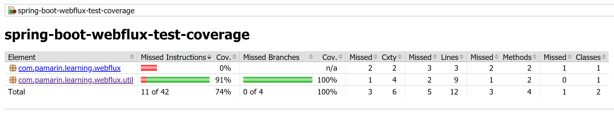

# spring-boot-webflux-test-coverage
ตัวอย่างการเขียน Spring-boot WebFlux Test Coverage  

# 1. เพิ่ม Dependencies

pom.xml 
``` xml
...
<parent>
    <groupId>org.springframework.boot</groupId>
    <artifactId>spring-boot-starter-parent</artifactId>
    <version>2.1.5.RELEASE</version>
</parent>

<dependencies>
    <dependency>
        <groupId>org.springframework.boot</groupId>
        <artifactId>spring-boot-starter-webflux</artifactId>
    </dependency>
    
    <dependency>
        <groupId>org.projectlombok</groupId>
        <artifactId>lombok</artifactId>
        <scope>provided</scope>
    </dependency>
    
    <dependency>
        <groupId>junit</groupId>
        <artifactId>junit</artifactId>
        <version>4.12</version>
        <scope>test</scope>
    </dependency>
        
    <dependency>
        <groupId>org.assertj</groupId>
        <artifactId>assertj-core</artifactId>
        <version>3.12.2</version>
        <scope>test</scope>
        <type>jar</type>
    </dependency>
</dependencies>

...
```
- junit เป็น dependency สำหรับเขียน test ภาษา java  
- assertj เป็น dependency สำหรับทำ assert (support junit ซึ่งจริง ๆ ใช้แค่ junit ก็ได้)

# 2. เพิ่ม JaCoCo Plugins 
pom.xml
```xml
...

<plugin>
    <groupId>org.jacoco</groupId>
    <artifactId>jacoco-maven-plugin</artifactId>
    <version>0.7.6.201602180812</version>
    <executions>
        <execution>
            <id>prepare-agent</id>
            <goals>
                <goal>prepare-agent</goal>
            </goals>
        </execution>
        <execution>
            <id>report</id>
            <phase>prepare-package</phase>
            <goals>
                <goal>report</goal>
            </goals>
        </execution>
        <execution>
            <id>post-unit-test</id>
            <phase>test</phase>
            <goals>
                <goal>report</goal>
            </goals>
            <configuration>
                <dataFile>target/jacoco.exec</dataFile>
                <outputDirectory>target/jacoco-ut</outputDirectory>
            </configuration>
        </execution>
    </executions>
    <configuration>
        <systemPropertyVariables>
            <jacoco-agent.destfile>target/jacoco.exec</jacoco-agent.destfile>
        </systemPropertyVariables>
    </configuration>
</plugin>
```

# 3. เขียน Main Class 

``` java
@SpringBootApplication
@ComponentScan(basePackages = {"com.pamarin"}) 
public class AppStarter {

    public static void main(String[] args) {
        SpringApplication.run(AppStarter.class, args);
    }

}
```

# 4. เขียน Logic 
``` java
public class ByteUtils {

    private ByteUtils() {
        
    }

    ...

}
```

# 5. เขียน Unit Test 
``` java 
public class ByteUtils_xorTest {
    
    /*
     * A | B | answer 
     * --------------
     * 0 | 0 | 0 
     * 0 | 1 | 1 
     * 1 | 0 | 1 
     * 1 | 1 | 0
     */
    @Test
    public void shouldBe00000000() {
        byte[] input1 = new byte[]{0, 0, 0, 0, 0, 0, 0, 0};
        byte[] input2 = new byte[]{0, 0, 0, 0, 0, 0, 0, 0};
        byte[] output = ByteUtils.xor(input1, input2);
        byte[] expected = new byte[]{0, 0, 0, 0, 0, 0, 0, 0};
        assertThat(output).isEqualTo(expected);
    }
    
    ...
```
# 6. Build
cd ไปที่ root ของ project จากนั้น  
``` shell 
$ mvn clean install
```

# 7. ดูผลลัพธ์ที่ Console 

# 8. ดู Test Coverage Result 

โดยไปที่ root project จากนั้นเปิดไฟล์ `target/jacoco-ut/index.html` ขึ้นมาดู จะได้ผลลัพธ์เป็น  

  

# อ่านเพิ่มเติม 

- [https://junit.org](https://junit.org)  
- [https://joel-costigliola.github.io/assertj/](https://joel-costigliola.github.io/assertj/) 
- [JaCoCo](https://www.jacoco.org/jacoco/trunk/index.html)  
- [รูปแบบการเขียน Java Unit Test ของผม](https://medium.com/@jittagornp/%E0%B8%A3%E0%B8%B9%E0%B8%9B%E0%B9%81%E0%B8%9A%E0%B8%9A%E0%B8%81%E0%B8%B2%E0%B8%A3%E0%B9%80%E0%B8%82%E0%B8%B5%E0%B8%A2%E0%B8%99-java-unit-test-%E0%B8%82%E0%B8%AD%E0%B8%87%E0%B8%9C%E0%B8%A1-8408b6b27a7b)
